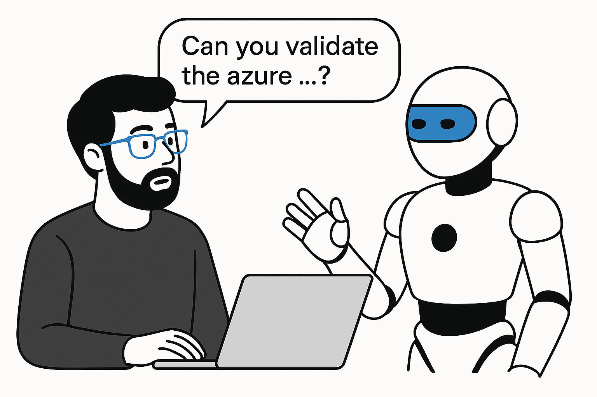

Title: AI Assisted Development – Taming Azure Pipeline YAML
Date: 2025-12-17
Category: Posts 
Tags: ai, engineering
Slug: ai-assisted-dev-taming-azdo-yaml
Author: Willy-Peter Schaub
Summary: Artificial Intelligence has touched down with the thunderous impact of an asteroid colliding with our moon … 

Our organization and teams are enthusiastically engaging with developments in Copilots Generative AI, AI Agents, Agentic AI, and Vibe Coding. To promote clear communication, I would like to outline my perspective on the distinctions between these evolving technologies.

- **Generative AI (GenAI)**: Models that generate content based on patterns in response to a prompt, based on training delivered. Generative AI is **reactive**.
- **AI Agents**: Autonomous software entities (agents) that can act on your behalf, make decisions, and assist you to complete often manual and mind-numbing tasks. An AI Agent is **autonomous**.
- **Agentic AI**: When you move to multiple collaborative agents, you get goal oriented, proactive, and autonomous software entities that can be proactive and collaborative orchestrators. Agentic AI is based on **multi-agents**.
- **Vibe Coding**: A prompt first, intent driven development workflow. Using prompts, patterns, and AI suggestions, rather than manually hand crafting every line, we can speed up the generation of code and reduce the development cycle time. But … we often forget that coding is just one piece of the software lifecycle and often get bogged down in governance and operational processes.

>
> Adopt new technologies where they are beneficial, ensuring your engineers, governance, processes, and products are ready and able to keep up. Also, I recommend that you always keep an eye on where the technologies are on the technology maturity curve - I, for one, have been burnt many times getting excited about stuff that is in the `emerging` and `crawl` phase of the curve.
>

# Back to Azure Pipeline YAML

I have just finished updating our Azure DevOps CI/CD Pipeline Blueprints in [WorkSafeBC-Common-Engineering](https://github.com/WorkSafeBC-Common-Engineering) to enhance how Agent Pools and related Virtual Machines are defined with better conditional logic. GitHub Copilot's suggestions made it quick to implement these changes, and I gained valuable insights from interacting with it. I am now convinced of the power of `Generative AI` and highly encourage all engineers to explore its capabilities as well as recognize its potential pitfalls.

My next step with AI had an even greater impact. I asked Copilot: “_Can you validate the azure pipeline YAML code in the `__101__` folder? Focus on the conditional logic, especially when calling the pool._”

>  

Here is the copilot’s response – verbatim:

```
Optimizing tool selection...

Plan: I’ll scan the 101 YAMLs, analyze conditional `pool` usage and logic, and summarize any issues with clear recommendations.

Progress: I’ve listed and read the 101 CI/CD YAML files. Next, I’ll report pool conditional logic findings and fixes.

Findings

• CI stage `pool` logic: Correctly conditional.
    o In azure-pipeline-__101__-ci.yml, the stage-level `pool` uses:
      - `${{ if ne(parameters.vmImage, '') }}:` sets name and `vmImage` for 
         Microsoft-hosted agents.
      - `${{ else }}:` sets only name for self-hosted agents (no `vmImage`).
    o This is valid Azure DevOps template expression usage and correctly handles 
      self-hosted agents (which must not specify `vmImage`).

• CD stage template `pool `logic: Correctly conditional.
    o In `azure-pipeline-__101__-cd-stage.yml`, the stage-level pool uses:
      - `${{ if ne(parameters.config.nameVM, '') }}:` sets `name` and `vmImage`.
      - `${{ else }}:` sets only `name`.
    o Works well for self-hosted pools when `nameVM` is empty.

• Control wiring of pool parameters: Sound defaults with `coalesce`.
    o In azure-pipeline-__101__-control.yml, CI template gets `jobPool` and `vmImage` 
      from config variables with defaults:
      - `jobPool: ${{ coalesce(variables.ciStagePool, 'Azure Pipelines') }}`
      - `vmImage: ${{ coalesce(variables.ciStageVmImage, 'ubuntu-latest') }}`
    o CD stage template receives `namePool` and `nameVM` similarly for each 
      environment, ensuring hosted agents get an image and self-hosted can omit it 
      by setting the corresponding `*StageVmImage` to empty.

• Branch/depends conditionals: No issues found related to `pool`.
    o All `${{ if ... }}` expressions are compile-time template expressions, 
      correctly placed at stage/template levels.

Notable inconsistencies (not breaking pool logic, but good to fix)

• Misnamed variables in security review section of config:
    o In azure-pipeline-__101__-config.yml, under “Security Review Stage #910188”,
      it defines:
      - `productionCanadaEastStagePool` and `productionCanadaEastStageVmImage` 
         rather than `securityReviewStagePool` and `securityReviewStageVmImage`.
    o Impact: `securityReviewStagePool/securityReviewStageVmImage` resolve via 
      coalesce to defaults, so pipelines still work, but the configuration file is 
      misleading.
    o Recommendation: Rename these entries to match control usage:
      - `securityReviewStagePool: 'Azure Pipelines'`
      - `securityReviewStageVmImage: 'ubuntu-latest'`

• Env names for Security/QA/PreProd automation:
    o All set to `'<portfolio>-security-review-sr'`. If intentional, fine; 
      otherwise set distinct `*-EnvName` per stage for clarity. This does not 
      affect pool logic.

Validation summary

• Conditional `pool` usage is correct in CI and CD stage templates:
    o Hosted agents: both `name` and `vmImage` provided.
    o Self-hosted agents: only `name` provided.

• Controls and config pass values appropriately with safe defaults.

• No syntactic issues detected with Azure DevOps template expressions in 
  `pool` conditionals.

Recommendations

• Fix misnamed variables in the config for Security Review to avoid 
  confusion and ensure explicit control over pool/image.

• If targeting self-hosted agents, set the `*StageVmImage` for the stage 
  to empty ('') in the config; the current logic will correctly omit 
  `vmImage`.

Would you like me to patch the config variable names in azure-pipeline-__101__-config.yml to align with the control template? I can update only those entries and leave everything else unchanged.
```

# Why am I excited?

I am not excited by the concatenations used by the copilot - but that is a chat for another day.

If you have used Azure Pipelines with YAML, you know how tricky syntax and spacing can be, and how challenging it is to troubleshoot errors. Reviewing the copilot response for **Notable inconsistencies (not breaking pool logic, but good to fix)**, I found actionable suggestions that helped me address issues I might have missed. After updating the code as advised, I re-validated with copilot and completed the changes confidently, ready for regression testing.

>
> Thank you Copilot, you rock!
>

>  