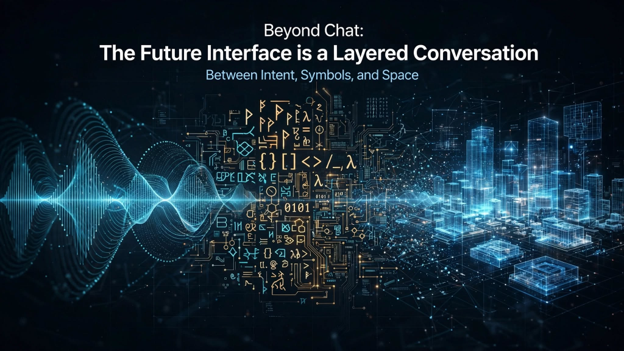
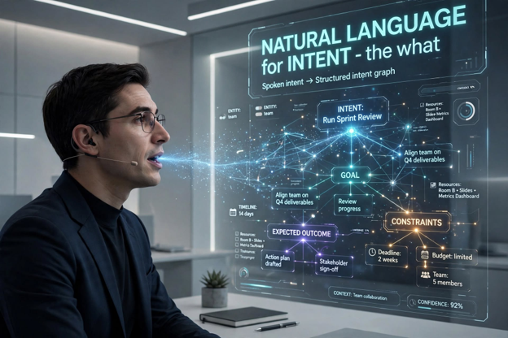
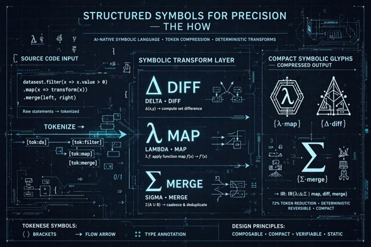
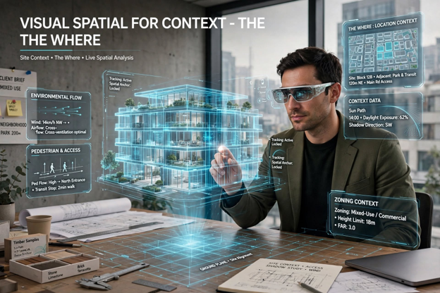

Title: Beyond Chat - The Future Interface is a Layered Conversation
Date: 2026-09-14
Category: Posts 
Tags: ai, engineering, journal
Slug: ai-chatter-will-we-speak-in-hieroglyphs-again
Author: Vis Naidu
Summary: An essay around AI, augmented reality, symbolic languages, and the future of computing interfaces.

### Background

This blog is an outcome of some feedback we received from one of our recent interviewees, discussing the possible introduction of a new language from advancements in AI and prompting methodologies. What followed was intriguing discussion, amongst fellow team members about the resurgence of the use of symbols or hieroglyphs to communicate and interact with the new interfaces of tomorrow.  This sparked the idea of planting a seed, such as this article, to carry on this conversation.

The article takes the key concepts and first pulls from a variety of sources both AI-based and input from thought leaders, then ends with my personal take on where we are trending towards. I hope you enjoy reading and can share some constructive feedback and your own take on this subject. Let’s begin.

### Introduction

>  
 
Over 4 decades we have organized computing around applications. For example, you open Figma to design, Visual Studio to code, Azure DevOps to ship. The interface is a place you go to. Although, this paradigm is starting to collapse.

Across several independent analyses — from research surveys to frontier model reports — three trends converge: 
- Natural language is becoming an executable protocol
- Interfaces are becoming multimodal and agentic
- Augmented reality is becoming an executable canvas.

The result is not a single new device or a new Esperanto of symbols. It is a layered interaction model that finally compresses ideation to implementation.

### From Apps to Intent: The Orchestration Layer

The most profound shift is the end of the app paradigm. Future systems operate as orchestration layers rather than tools. You no longer need to know which application handles which task; you express intent.

>
> Create a customer onboarding portal, integrate Entra authentication, generate React components, expose secure .NET APIs, and prepare Azure pipelines.
>

This future was described in one of our sources, and it captures the pattern every model identified. AI becomes the operating system, and traditional applications recede into infrastructure - agents summoned and dismissed as needed.

This is what researchers now call **intent-based computing**. The cognitive load shifts from _how_ to _what_. As **Consensus** research on multimodal agents notes, interaction changes from command issuance to delegation plus supervision - systems that perceive GUI state, enter queries, click, scroll, and integrate evidence across apps before responding (Xie et al., 2024; Yin et al., 2023). Early productivity data from Weber et al., 2024 shows significant gains when developers can fluidly switch between chat and autocomplete modes, supporting different strategies for the same goal.

### Natural Language is the Protocol, But Not the Whole Language

>  
 
Andrej Karpathy's 2023 provocation:

> **The hottest new programming language is English**

Has become the shorthand for _Software 3.0_. In that framing, _Software 1.0_ was code, _2.0_ was neural network weights, and _3.0_ is natural language instructing AI to generate the other two.

It is undeniably happening. Don Syme, creator of F#, argues we must replace **"Symbolic Supremacy"** with **"Clarity Supremacy"**. Whatever medium - code, language, or hybrid - achieves clarity of intent is valid programming.

But every source agrees: natural language alone is not enough. It is ambiguous, underspecified, and hard to verify. The most credible advances hybridize conversation with formal structure:

>
> Planning and test-driven clarification improves pass@1[^1] by up to 25.4% over direct generation, and by 45.97% within five interactions (Jiang et al., 2023; Fakhoury et al., 2024).
>

New AI-native symbolic protocols have emerged underneath the English surface: 

-	[I-Lang](https://huggingface.co/i-Lang) - Σ for MERGE, Δ for DIFF, λ for MAP
-	[Tokenese](https://tokenese.org/)
-	[Glyph](https://github.com/thu-coai/Glyph) - a model that speaks one glyph per operation and achieves 98.8% fewer bytes than English on coding tasks.

In other words, you will speak intent in English, but the system will compress it into a precise, verifiable symbolic layer. You become an architect of intent; the model becomes the builder.

### The Perceptual Layer: Multimodal and Context-Aware

The strongest empirical trend is the move from text-only assistants to large multimodal agents that perceive and generate across text, images, video, audio, charts, forms, and GUI state (Joty et al., 2026; Huang et al., 2024).

This matters because real work is not linguistic in a narrow sense. It is visual, spatial, and procedural. A designer might sketch roughly on a tablet while saying, "This section needs to expand like an accordion." The system interprets the sketch, the metaphor, generates a 3D model, simulates mechanics, and produces manufacturable specs - in one session.

The literature stresses that this layer must be context-aware and inclusive multilingual, memory-augmented, explainable, and accessible — not just multimodal. Latency and edge-compute remain the primary scalability constraint (Lin, 2025).

### Space as Interface: AR as Executable Prototyping

While language captures attention, spatial computing is the other half of the future.

Bret Victor, former Apple Human Interface inventor, has argued for a decade that computers are still **"pictures under glass."** His vision at Dynamicland - and echoed by the **Jony Ive + Sam Altman** collaboration on a new OpenAI hardware device - is that the next interface has tactile richness and spatial presence.

Research bears this out: head-mounted AR can elicit similar user requirements as conventional prototyping with higher engagement and deeper implicit requirement information (Kang et al., 2023). Tools like [ProtoAR](https://dl.acm.org/doi/10.1145/3173574.3173927) enabled mobile AR prototypes in under 90 minutes. The new direction is **LLM + generative AI + mixed reality** as a collaborative design stack that aligns stakeholder understanding and reduces communication barriers (Xu et al., 2024).

In this world, you don't consult a manual. You wear the guidance. Documentation and execution merge.

### Will We Speak in Hieroglyphs?

>  
 
Will symbols or hieroglyphs replace text? Projects like:

- [IKON](https://www.komunikon.com/about-us/)
- [Body Oracle](https://dl.acm.org/doi/10.1145/3689050.3707688)[^2]
- [NIM](https://arxiv.org/abs/2510.10459)[^3]

Show symbolic systems flourishing for specific domains: 

- Cross-cultural exchange
- Bodily awareness
- Spatial communication

But the expert consensus from Sayers et al.'s [LITHME](https://jyx.jyu.fi/jyx/Record/jyx_123456789_75737) forecast, which frames the coming decade as the **"human-machine era"** - technology integrating with our senses comparable to writing or the telephone - is clear: symbols will enrich, not replace.

As Stanislas Dehaene proposes, humans possess multiple internal **"languages of thought"** using discrete symbols and recursive composition. Writing persists because it is a meta-code that encodes natural language itself (Morin et al., 2018). In VR studies, when verbal language was removed, improvised semiotic[^4] forms proved **"unpractical for expressing complex and meaningful sentences"** (Giuliana, 2022).

The future is **hybrid**:

- Natural language for intent (the what)
- Structured symbols for precision (the how)
- Visual/spatial for context (the where)

>  

### What This Means for Technical Leaders

The next interface is not one thing. It is a layered model where you specify goals in natural language, demonstrate intent with visuals or examples, refine through dialogue and tests, and inspect results inside spatial environments.

The bottleneck is no longer model capability. It is workflow design, ambiguity resolution, transition costs between modes, and human-centered governance. The winners will not automate the ideation-to-implementation path. They will accelerate it — by building systems that understand richer signals, operate across interfaces, and make prototyping itself interactive.

Language did not die when GUIs arrived. GUIs did not die when touch arrived. Text will not die now. It will be joined by a conversation that you can speak, sketch, point at, and walk through — until the artifact builds itself.

### Personal Thoughts

As someone who has seen and experienced the evolution of computing technology for over a generation, I want to share some of my own thoughts about where we are trending. I will admit, I do have a bit of old-school thinking influencing my opinions, so will apologize in advance for that. 

Firstly, I am a bit skeptical of a considerable shift away from the mouse, keyboard or touchscreen interactions we enjoy today. I believe most humans need to physically feel contact with the devices, accompanied by some feedback (like a sound or vibration) as a confirmation the system recognizes their input. Spatial computing and virtual reality take away from that intimacy and create a bit of vulnerability to the end user. I know I personally felt this way using Meta Quest 2, playing a fishing simulation or exploring an adventure in some far-off location. It was immersive, but the constant adjustment and lack of awareness of my real-world surroundings, coupled with lightheadedness from the artificial motion, did not convince me this is what the future holds. 

I think of the scene in Spielberg’s movie “Player One” where all the players are almost standing shoulder to shoulder in the real world in a massive effort to take over OASIS. Although the intent is humor, the underlying message is pretty resounding. How long would you continue to use this technology when your own personal space was at stake? I prefer the cozy, independent surroundings of my cubicle at work or my closet/office space at home. Keyboards and mice are here to stay, at least for the foreseeable future.  This resonates with the last statement in the previous section (_What This Means for Technical Leaders_).

>  
 
As it relates to language, I am a bit on the fence. I think about my own personal experience, where English has dominated how I interact with both people and technology so far, and most likely will continue for the rest of my time on planet Earth. With LLMs becoming increasingly advanced, in learning both pure **grammar** and the **slang** that has evolved from one generation to the next, including the addition of **emoji** and **chat abbreviations**, we don't need to learn a new language. I believe only our grammar and how we **construct** our communications will change. With voice interaction, and some gesture support thrown into the mix, that is likely as far as we need to go, based on our own physical limitations. The return to hieroglyphs would only be necessary if we truly faced a major communication barrier with a new civilization or **alien** species. Until that **“close encounter of the third kind”** takes place, I’m not convinced this will be added to our school curriculum anytime soon.

Now, the user interface is experiencing and will continue to experience the greatest shift, from a flat screen to AR/VR, to something more identical to a human being, through AI and advancements in robotics and automation. I think of recent cinematic depictions of androids that look, feel and sound like humans but are still recognizably synthetic. I think this will be a positive shift to help us re-engage with the real world and not be stuck in front of one or several screens at a time. Those androids will talk and walk beside us, keeping us on our feet, enjoying the great outdoors. It will also eliminate loneliness and isolation that many of us feel, struggling to build social connections with others – in a world that has become so fixated on personal image, style and wealth. Of course, as with any emerging technology there will be the dark side, which is very worrying, especially being a parent. The more we introduce technology into our lives, the more we are sharing intimate details about ourselves, our family and friends. Whatever user interface we develop will need guardrails and heightened security to protect from those that would do us harm.  Nonetheless, the future is very exciting, and I can't wait for what comes next.

>  

### Behind-the-scenes

This blog is the culmination of AI-assisted research across these notable AI Chat services:

-	ChatGPT
-	Claude AI
-	Consensus
-	Microsoft Copilot
-	Google Gemini
-	Grok
-	HuggingChat
-	Mistral Vibe
-	Perplexity AI
-	Meta AI

I prompted these services to capture trends in AI, and how these change the way we interact with technology, such as a new language, interface or augmented reality to accelerate the ideation to implementation process. A secondary prompt requested data on what experts or thought leaders were saying about new programming languages or use of symbols or hieroglyphs.

To put the research together I summarized all those sources to find some common ground and patterns, highlighting some key elements and statements. As with any form of research, there can be unintended biases as each source pulls from its own limited library of information, which in turn can be a combination of “expert opinions” and summarizations based on sample data. The key to reading this article with an open mind is to accept it is a **prediction** based on where, _observably_, we are trending. As you form your own opinions and provide your comments (**please**), consider these factors.

Thank you!

[^1]: The probability that a model solves a task correctly on a single, independent attempt.
[^2]: AI-generated "somatic hieroglyphs" for proprioceptive states.
[^3]: A neuro-symbolic ideographic metalanguage that achieved 80% comprehensibility with semi-literate participants.
[^4]: The way we create, share and understand messages using signs, symbols and words.
