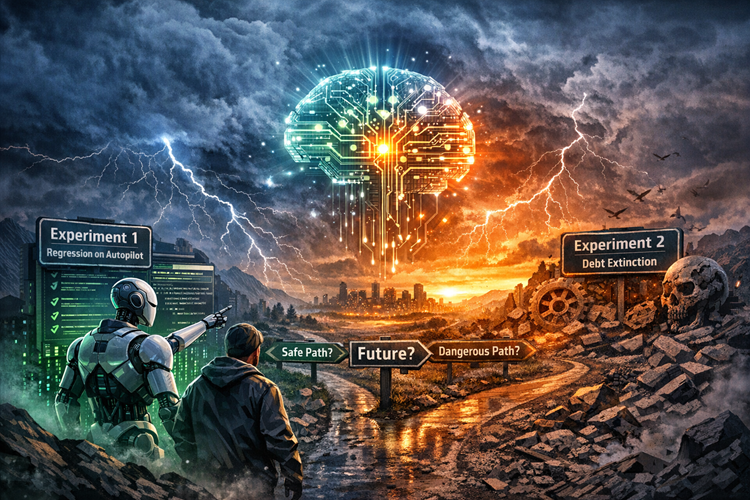

Title: Dancing With Agents in a Thunderstorm
Date: 2026005-TBD
Category: Posts 
Tags: ai, engineering
Slug: ai-experiments-danding-ith-agents-in-a-thunderstorm
Author: Willy-Peter Schaub
Summary: Two Experiments. One Bet on the Future. Are We Brave, Naïve, or Exactly on Time?

- What if we stopped optimising yesterday and deliberately stepped into tomorrow?
- What if we treated Artificial Intelligence not as a productivity toy, but as an execution layer under strong human accountability?
- What if we decided that technology debt, regression testing, and end‑of‑life remediation should no longer dominate engineering calendars, budgets, and energy?

That is the provocation behind our latest experiments. These experiments are not incremental improvements. They are deliberate boundary tests. They ask uncomfortable questions about how software is built, validated, governed, and sustained. And yes, they intentionally invite debate.

>  

# The North Star: Agent Ubuntu

[Our direction is clear.](/zero-or-one-not-fault-lines-2029-ubuntu-vision.html)

By 2029, each engineer should effectively operate as a small, accountable team: `orchestrating automation, managing Artificial Intelligence agents, and stewarding platforms, while remaining deeply connected to one another through shared outcomes and governance.`

This is not about replacing engineers. It is about elevating human judgement and delegating execution where it no longer differentiates.

Ubuntu remains the anchor: `I am, because we are.`
Artificial Intelligence executes.
Humans remain accountable.

# Experiment 1: Regression on Autopilot

A pragmatic move. Low friction. Immediate value.

Manual Quality Assurance does not scale. It constrains speed, inflates cost, and shifts focus from assurance to activity.
In this experiment, we use GitHub Copilot in real engineering environments to generate, maintain, and execute application‑level regression coverage, with rigorous human verification.
The intent is explicit:

- Shift quality engineering from manual execution to assurance and risk stewardship
- Reduce delivery risk through predictable, continuously maintained regression coverage
- Improve stakeholder experience through faster, more reliable feedback loops
- Avoid cost by reducing dependency on repeated manual and vendor-driven testing

This experiment strengthens existing practices. It does not disrupt them. Engineers remain responsible. Artificial Intelligence accelerates execution.

>
> **If this feels safe, that is intentional.**
>

# Experiment 2: Debt Extinction

This one is not safe. It is necessary.

End‑of‑life remediation, upgrades, and vulnerability management consume enormous capacity while adding little differentiated business value. They persist because we treat them as projects instead of background hygiene.

This experiment explores an Artificial Intelligence–first operating model by delegating defined parts of the Software Development Life Cycle to agentic Artificial Intelligence, under strict human supervision and outcome verification.

The hypothesis is bold:

- Angular, .NET end‑of‑life, and vulnerability remediation should become background noise
- Human effort should move from execution to judgement, validation, and governance
- Organisational risk should drop by design, not heroics
- Future cost escalation should be avoided by preventing technology debt accumulation at scale

This is not a commitment to an end‑state. It is a bounded exploration of the extreme edge, designed to inform governance, operating models, and investment decisions.

>
> **If this makes you uneasy, it should.**
>

# Why Share This Now?

Because the most dangerous outcome is quiet agreement.

These experiments intentionally trade focus, capacity, and short‑term comfort for learning. They pause familiar roadmaps to test whether a fundamentally different model delivers better stakeholder experience, lower risk, and sustained cost avoidance.

>
> **That deserves scrutiny.**
>

Your Turn:

- Are we on the right track, or are we optimising the wrong thing?
- Are we being visionary, or irresponsibly bold?
- Are we stepping into a storm, or finally sailing with the wind?
- What fault lines do you see that we are ignoring?
- What recipes have you learned that could strengthen this direction?

Share your learnings. Challenge the assumptions. Pressure‑test the hypotheses.
Progress does not come from certainty.
It comes from disciplined experimentation, shared truth, and collective accountability.
`Ubuntu` demands nothing less.

