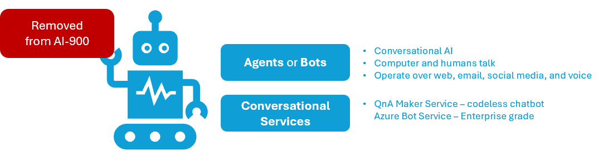

Title: Artificial Intelligence - AI-900 - Bots
Date: 2024-09-27
Category: Posts 
Tags: ai, learning
Slug: ai-fundamentals-ai900-bots
Author: Willy-Peter Schaub
Summary: Conversational AI workloads - no longer part of AI-900 certification!

>
>
>These are my living **personal** study notes. Use them at your own **risk**!
>

>  

Even though conversational AI is no longer part of the AI-900 certification and has been replaced by generative AI, I will still share my notes for nostalgia.

## Notes

- **QnA Maker** Service can populate a knowledgebase using a question&answer (Q&A) document. Being retired in March 2025.

---

You perused:

- **this->**[bots](/ai-fundamentals-ai900-bots.html)

Enjoy other learning notes:

- [common-machine-learning-types](/ai-fundamentals-ai900-common-machine-learning-types.html)
- [common-workloads](/ai-fundamentals-ai900-common-workloads.html)
- [generative-ai](/ai-fundamentals-ai900-generative-ai.html)
- [guiding-principles](/ai-fundamentals-ai900-ai-guiding-principles.html)
- [natural-language-processing](/ai-fundamentals-ai900-natural-language-processing.html)
- [vision-workloads](/ai-fundamentals-ai900-vision-workloads.html)

Coming soon:

> 
 
