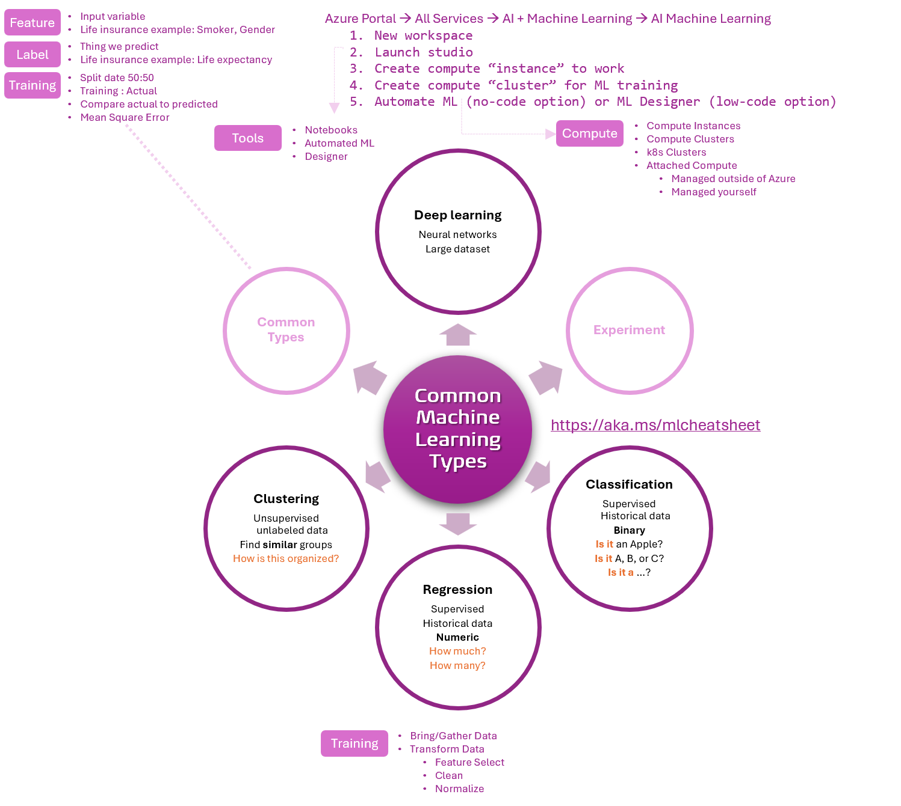

Title: Artificial Intelligence - AI-900 - Common Machine Learning Types
Date: 2024-09-27
Category: Posts 
Tags: ai, learning
Slug: ai-fundamentals-ai900-common-machine-learning-types
Author: Willy-Peter Schaub
Summary: "AI machine learning (ML) refers to the subset of artificial intelligence focused on developing algorithms and models that enable computers to learn from data and improve their performance over time without being explicitly programmed." - ChatGPT GPT-4o

>
>
>These are my **personal** study notes. Use them at your own **risk**!

>  

## Notes

- **Feature engineering** is the method of creating new features, based on existing features.
- **Feature selection** allows us to narrow down the features that are important for **label** predictions.
- Training a **Regression** model involves data gathering and transformation: **Feature selection** --> **Finding and Cleaning** outliers --> **Impute** missing values --> **Normalization** or **Feature engineering**.

## Metrics

>
> Classification model
>

- **Accuracy** - the ratio of predictions that exactly match the true class labels. Closer to 1 the better. Range: [0, 1].
- **Area Under Curve (AUC)** reflects the model's performance - AUC=**1** is best fitted model and AUC<**0.5** is worse than random. Range: [0, 1].
- **Precision** - the ability of a model to avoid labeling negative samples as positive. Closer to 1 the better. Range: [0, 1].
- **Recall** - the ability of a model to detect all positive samples. Closer to 1 the better. Range: [0, 1]
- **Weighted accuracy** is accuracy where each sample is weighted by the total number of samples belonging to the same class. Closer to 1 the better. Range: [0, 1].

>
> Regression Model
>

- **Coefficient of determination**, often referred to as R2, represents the predictive power of the model. Closer to 1 the better. Range: [0, 1].
- **Mean absolute error (MAE)** measures how close the predictions are to the actual outcomes. A lower score is better.
- **Root mean squared error (RMSE)** creates a single value that summarizes the error in the model. By squaring the difference, the metric disregards the difference between over-prediction and under-prediction.
- **Relative absolute error (RAE)** is the relative absolute difference between expected and actual values. The mean difference is divided by the arithmetic mean.
- **Relative squared error (RSE)** similarly normalizes the total squared error of the predicted values by dividing by the total squared error of the actual values.

>
> Clustering Model
>

- **Average Distance to Other Center** represent how close, on average, each point in the cluster is to the centroids of all other clusters.
- **Average Distance to Cluster Center** represent the closeness of all points in a cluster to the centroid of that cluster.
- **Combined Evaluation** score at the bottom of each section of results lists the averaged scores for the clusters created in that particular model.
- **Maximal Distance to Cluster Center** represent the max of the distances between each point and the centroid of that point's cluster. High = dispersed.
- **Number of Points** shows how many data points were assigned to each cluster, along with the total overall number of data points in any cluster.

## Example

>
> You need to examine historical data to forecast price ranges for your product. Label = prediction = price range.
>

- The **classification** model is ``suitable`` for supervised learning to determine ``is it`` a low, medium, high, or very high price.
- The **regression** model is ``inappropriate`` because it forecasts numerical values rather than determining whether something belongs to the "is it" class.
- The **clustering** model is ``inappropriate`` because it clusters unlabeled data into similar groups.

---

You perused:

- **this->**[common-machine-learning-types](/ai-fundamentals-ai900-common-machine-learning-types.html) 

Enjoy other learning notes:

- [bots](/ai-fundamentals-ai900-bots.html)
- [common-workloads](/ai-fundamentals-ai900-common-workloads.html)
- [generative-ai](/ai-fundamentals-ai900-generative-ai.html)
- [guiding-principles](/ai-fundamentals-ai900-guiding-principles.html)
- [natural-language-processing](/ai-fundamentals-ai900-natural-language-processing.html)
- [vision-workloads](/ai-fundamentals-ai900-vision-workloads.html)

Coming soon:

> 

