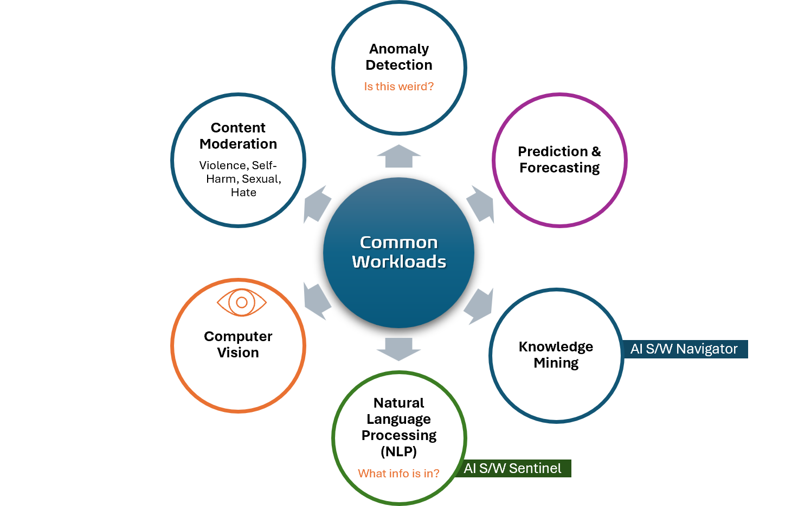

Title: Artificial Intelligence - AI-900 - Common Workloads
Date: 2024-09-27
Category: Posts 
Tags: ai, learning
Slug: ai-fundamentals-ai900-common-workloads
Author: Willy-Peter Schaub
Summary: "Common workloads in AI and machine learning include data processing, model training, inference, natural language processing, computer vision, recommendation systems, time series forecasting, and robotics/automation tasks." - ChatGPT GPT-4o

>
>
>These are my **personal** study notes. Use them at your own **risk**!

>  

- X
- X

---

You perused:

- **this->**[common-workloads](/ai-fundamentals-ai900-common-workloads.html) 

Enjoy other learning notes:

- [bots](/ai-fundamentals-ai900-bots.html)
- [common-machine-learning-types](/ai-fundamentals-ai900-common-machine-learning-types.html)
- [generative-ai](/ai-fundamentals-ai900-generative-ai.html)
- [guiding-principles](/ai-fundamentals-ai900-guiding-principles.html)
- [natural-language-processing](/ai-fundamentals-ai900-natural-language-processing.html)
- [vision-workloads](/ai-fundamentals-ai900-vision-workloads.html)

Coming soon:

> 

