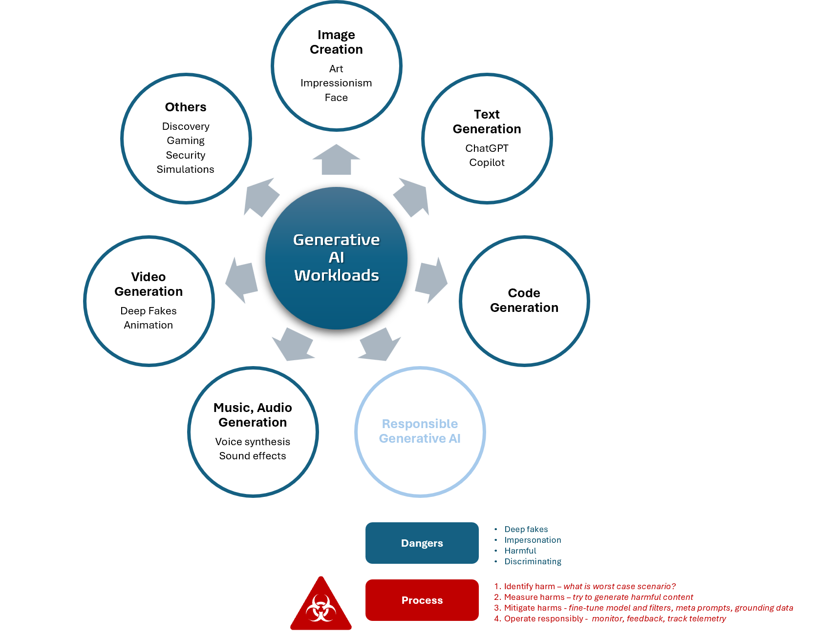

Title: Artificial Intelligence - AI-900 - Generative AI
Date: 2024-09-27
Category: Posts 
Tags: ai, learning
Slug: ai-fundamentals-ai900-generative-ai
Author: Willy-Peter Schaub
Summary: "Generative AI refers to a subset of artificial intelligence that creates new content—such as text, images, audio, or video." - ChatGPT GPT-4o

>
>
>These are my living **personal** study notes. Use them at your own **risk**!
>

>  

- **Copilots** are generative AI assistants that are integrated into applications often as chat interfaces. development potal. 
- **Copilot Studio** is designed to work well with low-code development scenarios, whereas **Azure AI Studio** is a PaaS.
- **Natural language** generation - images and code.
- **OpenAI** avails **small** and **large** language models.

---

You perused:

- **this->**[generative-ai](/ai-fundamentals-ai900-generative-ai.html)

Enjoy other learning notes:

- [bots](/ai-fundamentals-ai900-bots.html)
- [common-machine-learning-types](/ai-fundamentals-ai900-common-machine-learning-types.html)
- [common-workloads](/ai-fundamentals-ai900-common-workloads.html)
- [guiding-principles](/ai-fundamentals-ai900-ai-guiding-principles.html)
- [natural-language-processing](/ai-fundamentals-ai900-natural-language-processing.html)
- [vision-workloads](/ai-fundamentals-ai900-vision-workloads.html)

Coming soon:

> 

