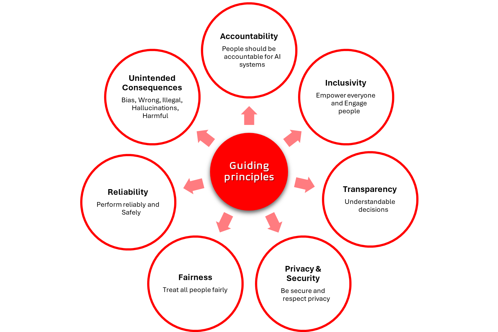

Title: Artificial Intelligence - AI-900 - Guiding Principles
Date: 2024-09-27
Category: Posts 
Tags: ai, learning
Slug: ai-fundamentals-ai900-ai-guiding-principles
Author: Willy-Peter Schaub
Summary: "Guiding principles aim to ensure responsible and ethical AI development and deployment." - ChatGPT GPT-4o

>
>
>These are my **personal** study notes. Use them at your own **risk**!

>  

## Examples

Here are a few examples of solutions that adhere to guiding principles:

- **Accountability** - _Solutions designed to conform to governance frameworks and organizational standards, ensuring compliance with established legal and ethical principles._
- **Inclusivity** - _Solutions created to support individuals who are visually impaired or blind._
- **Transparency** - _Share details on a solution's features, possibilities, and constraints._
- **Privacy & Security** - _Solutions that safeguard user data while still gathering valuable insights for enhancing services._
- **Fairness** - _Solutions that yield the same outcomes for individuals residing in both urban and rural areas._
- **Reliability & Safety** - _Solutions designed to include resistance to harmful manipulation._
- **Unintended Consequences** - _Solutions designed to identify and reduce the spread of harmful content, such as misinformation, hate speech, and fake news on its platform._

---

## Help around the corner

- Microsoft's [AI Fairness Checklist](https://www.microsoft.com/en-us/research/project/ai-fairness-checklist/?msockid=00c538c26eda63c107f52ca16fce622e) encourages engineers to evaluate bias risks throughout every phase of the model lifecycle.
- Microsoft’s [Seeing AI](https://www.microsoft.com/en-us/garage/wall-of-fame/seeing-ai/?msockid=00c538c26eda63c107f52ca16fce622e) solution helps visually impaired people by describing their surroundings, recognizing people, and reading text aloud, promoting inclusivity and access to technology for everyone.
- Microsoft's [AI for Earth](https://news.microsoft.com/apac/features/ai-for-earth-helping-save-the-planet-with-data-science/?msockid=00c538c26eda63c107f52ca16fce622e) uses AI to address environmental challenges, from climate change to biodiversity loss, ensuring AI contributes positively to the planet’s sustainability.

## FRAUPIT

Not ideal, but I use the FRAUPIT catch phrase to remember: **F**airness, **R**eliability & Safety, **A**ccountability, **U**nintended Consequences, **P**rivacy & Security, **I**nclusivity, and **T**ransparency.

---

You perused:

- **this->**[guiding-principles](/ai-fundamentals-ai900-guiding-principles.html)

Enjoy other learning notes:

- [bots](/ai-fundamentals-ai900-bots.html)
- [common-machine-learning-types](/ai-fundamentals-ai900-common-machine-learning-types.html)
- [common-workloads](/ai-fundamentals-ai900-common-workloads.html)
- [generative-ai](/ai-fundamentals-ai900-generative-ai.html)
- [natural-language-processing](/ai-fundamentals-ai900-natural-language-processing.html)
- [vision-workloads](/ai-fundamentals-ai900-vision-workloads.html)

Coming soon:

> 

