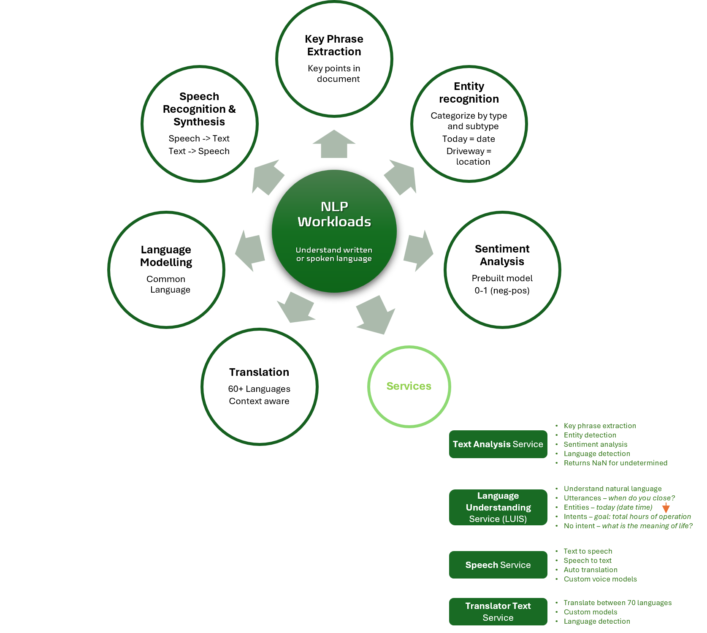

Title: Artificial Intelligence - AI-900 - Natural Language Processing
Date: 2024-09-27
Category: Posts 
Tags: ai, learning
Slug: ai-fundamentals-ai900-natural-language-processing
Author: Willy-Peter Schaub
Summary: "Natural Language Processing (NLP) is a branch of AI that enables computers to understand, interpret, and generate human language." - ChatGPT GPT-4o

>
>
>These are my living **personal** study notes. Use them at your own **risk**!
>

>  

**NOTES**

- **Azure AI Language Service** provides the **entity linking**, **PII detection**, and Sentiment analysis.
- **Azure AI Service** provides direct access to bot Az AI Translator and Az AI Speech services.
- **Azure AI Speech Service** provides **Language identification**, **speaker recognition**, and **voice assistants**.
- **Entity recognition** returns links to exterbal webstes to disambiguate terms (entities) in a text.
- **Language training** requires us to provide **Entities**, **Utterances**, and **Intents**, using LUIS.
- Language training: **Entities** - The word "light" in "turn the light on."
- Language training: **Intents** - "Turn On".
- Language training: **Utterances** - "Turn on the lights" or "Turn the lights on."
- **Language Understanding Intelligent Service (LUIS)** understands voice or text commands.
- **Text Analysis** service helps to analyse documents, detect documents' **language**, extract **key phrases**, determine **entities**, and provide **sentiment analysis** (postive = 1, neutral/undefined = 0.5, negative = 0).
- **Vectorization** represents the semantic connections between words by placing them in an n-dimensional space.

---

You perused:

- **this->**[natural-language-processing](/ai-fundamentals-ai900-natural-language-processing.html)

Enjoy other learning notes:

- [bots](/ai-fundamentals-ai900-bots.html)
- [common-machine-learning-types](/ai-fundamentals-ai900-common-machine-learning-types.html)
- [common-workloads](/ai-fundamentals-ai900-common-workloads.html)
- [generative-ai](/ai-fundamentals-ai900-generative-ai.html)
- [guiding-principles](/ai-fundamentals-ai900-guiding-principles.html)
- [natural-language-processing](/ai-fundamentals-ai900-natural-language-processing.html)
- [vision-workloads](/ai-fundamentals-ai900-vision-workloads.html)

Coming soon:

> 

