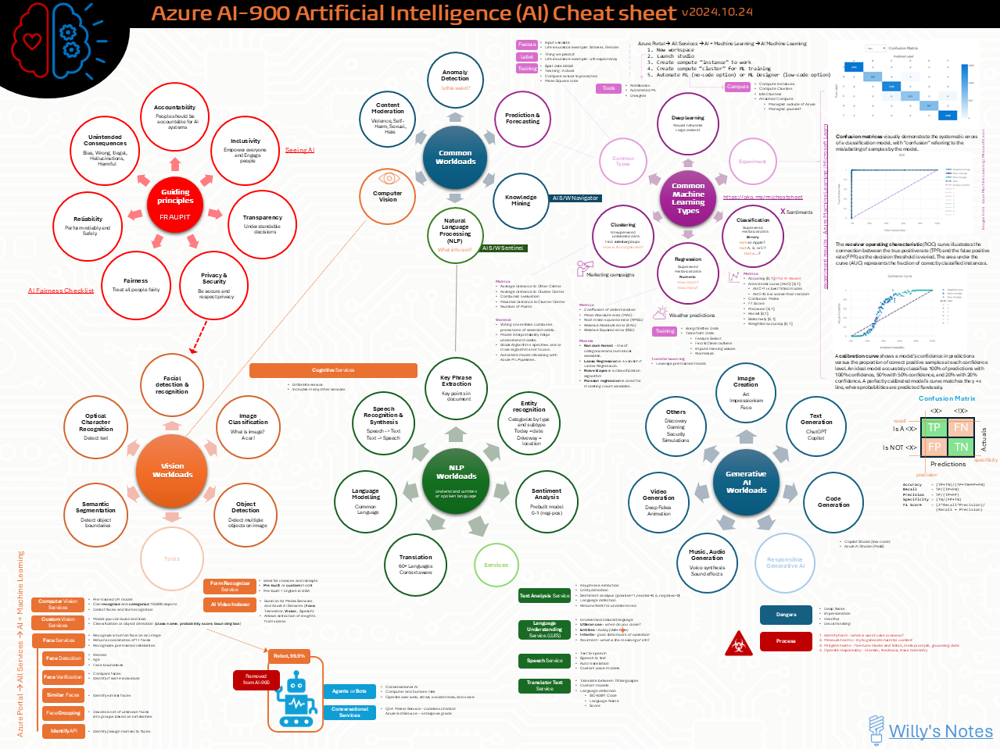

Title: Artificial Intelligence - AI-900 - Quick Reference Poster
Date: 2024-09-30
Category: Posts 
Tags: ai, learning
Slug: ai-fundamentals-ai900-poster
Author: Willy-Peter Schaub
Summary:  A consolidated poster / cheat sheet of my AI-900 study notes.

>
>
>These are my **personal** study notes. Use them at your own **risk**!

Here is an aggregated view of my personal [bots](/ai-fundamentals-ai900-bots.html), [common-machine-learning-types](/ai-fundamentals-ai900-common-machine-learning-types.html), [common-workloads](/ai-fundamentals-ai900-common-workloads.html), [generative-ai](/ai-fundamentals-ai900-generative-ai.html), [guiding-principles](/ai-fundamentals-ai900-ai-guiding-principles.html.html), [natural-language-processing](/ai-fundamentals-ai900-natural-language-processing.html), and [vision-workloads](/ai-fundamentals-ai900-vision-workloads.html) study notes, with report images from the Microsoft Learning site.

>  
>
> DOWNLOAD >> [PDF](/documents/ai-fundamentals-cheatsheet.pdf)

---

Enjoy!

