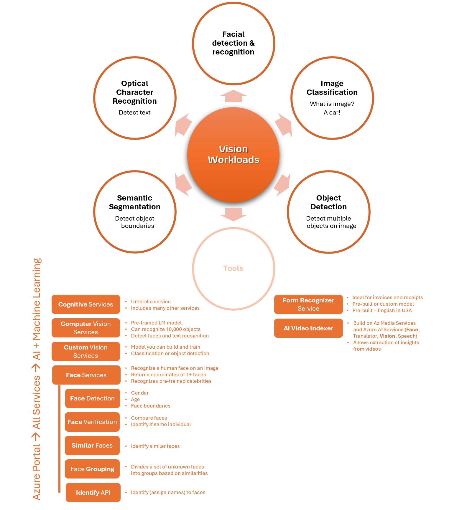

Title: Artificial Intelligence - AI-900 - Vision Workloads
Date: 2024-09-27
Category: Posts 
Tags: ai, learning
Slug: ai-fundamentals-ai900-vision-workloads
Author: Willy-Peter Schaub
Summary: "Vision workloads in AI refer to tasks that involve processing and analyzing visual data, such as images and videos." - ChatGPT GPT-4o

>
>
>These are my living **personal** study notes. Use them at your own **risk**!
>

>  

## Notes

- **Custom Vision** service has a model you can build and train for classification or object detection (class name, probability score, bounding box).
- **Computer Vision** detects faces, **Face Service** finds and recognizes similar faces.
- **Face Detection** helps detect and recognize people's faces.
- **Form Recognizer** service has a custom model users can train, or a pre-built receipt model trained to work with receipts.
- **Image Analysis** helps extract information from the images, tag them, and create descriptive image summary.
- **Image Classification** classifies objects based on their content to answer the "what is the image?" question.
- **Semantic Segmentation** classifies pixels that belong to objects (detects) and highlights the object boundaries.

---

You perused:

- **this->**[vision-workloads](/ai-fundamentals-ai900-vision-workloads.html)

Enjoy other learning notes:

- [bots](/ai-fundamentals-ai900-bots.html)
- [common-machine-learning-types](/ai-fundamentals-ai900-common-machine-learning-types.html)
- [common-workloads](/ai-fundamentals-ai900-common-workloads.html)
- [generative-ai](/ai-fundamentals-ai900-generative-ai.html)
- [guiding-principles](/ai-fundamentals-ai900-guiding-principles.html)
- [natural-language-processing](/ai-fundamentals-ai900-natural-language-processing.html)

Coming soon:

> 

