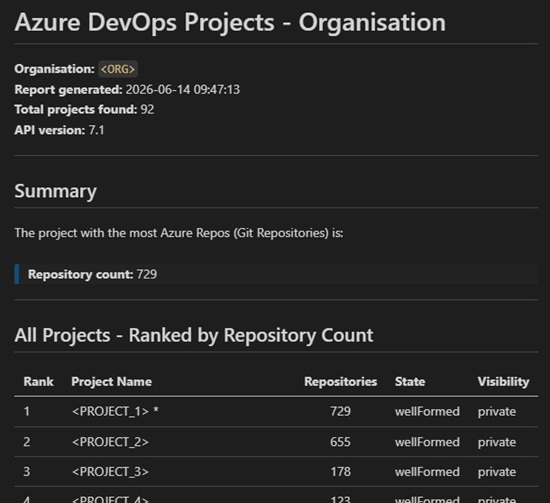
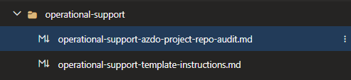

Title: Humanoid #13 and the Instruction-First Experiment for Operational Support
Date: 2026-06-18
Category: Posts 
Tags: ai, learning
Slug: ai-fundamentals-operational-support
Author: Willy-Peter Schaub
Summary: What began as a simple support task, became a small but meaningful pivot: stop obsessing over how the work is done, and start preserving the context and intent that make the work repeatable.

I spend a fair amount of time with [agent ubuntu](/zero-or-one-not-fault-lines-2029-ubuntu-vision.html), but the latest experiment felt different from the start. The idea sounded deceptively ordinary ... standardise operational support tasks. Naturally, the opening move involved a careful explanation of context, expectations, and the simple-but-sacred rules of engagement, such as no contractions, no vague shorthand, and no acronym left wandering around without an introduction. To be honest, I am getting tired of reminding agent ubuntu, copilot, and all its companions about the importance of clarity and avoiding acronymns and contractions at all cost, but I am not giving up on it. Clarity is the foundation of trust, and trust is the foundation of value.
>
> Organisation and Project names replaces with <> placeholders for privacy and security reasons.
>
>  

Then something more interesting happened. Instead of treating the support task as a one-time transaction, we shaped a reusable operating pattern and defined it in the `operational-support-template-instructions.md` file. The instruction-first approach captured the guidelines and expectations, asked the user to elaborate on the INTENT, collaborated on the intent until it was clear and bounded, executed the work with the user, and then asked whether the session should be preserved as a new instruction file for future reuse. That workflow is visible throughout the document: 

- intent first,
- actions second,
- satisfaction check third,
- and persistence only after approval.

The test case itself was practical and gloriously operational. Enumerate all Azure DevOps projects in our Azure DevOps organisation, count the Git repositories in each project, and produce a ranked Markdown report highlighting the project with the highest repository count. The session captured the assumptions, risks, dependencies, and expected output up front. It then proposed actions before processing anything, created the local output folder, generated a PowerShell script, corrected an encoding issue when the first script run failed, reran the script, and produced a ranked report showing 90+ projects, with our I-A-T Azure DevOps project leading on repository count as expected.

> 

That alone would have made this a useful support session. But the real experiment was not the report. The experiment was the shift in emphasis. The document shows that the durable artefact was not the generated PowerShell script. The durable artefact was the new instruction file `instructions/operational-support/operational-support-azdo-project-repo-audit.md`. The PowerShell script was saved locally as a reference and execution aid. The instruction file was the item created in the repository, staged, and committed on a feature branch with an associated work item. That is a subtle but important move.


> 

- preserve the context, 
- the boundaries, 
- the quality gate, 
- and the repeatable intent. 

>
> Treat the implementation as disposable when appropriate.
>

This is why I find the experiment so interesting. It is an early step toward caring more about context and outcome than about the exact mechanics of implementation. The new instruction file codifies the operational objective, the safe handling of the Personal Access Token (PAT), the local output expectations, the repeat process, the quality gate, and the governance around secrets and review. It even makes room for a modest amount of humour, which I wholeheartedly LOVE when it does not interfere with the work. The associated copilot session shows a branch was created, the instruction file was added, and a commit was made, while the script remained a local aid rather than a version-controlled product.

There is also something quietly important here for operational support at scale. A recipe like this reduces repeated explanation, improves consistency, and lowers the cost of future support work. It transforms a support conversation from “please do this task again” into “here is the pattern, here is the intent, now let us execute cleanly.” The new instruction file explicitly documents how to repeat the process, the required permission scopes, the expected outputs, and the quality checks before closure. That is not just convenience. That is operational memory with guardrails.

And now, a direct callout to Andre Kaminski: Are we on track with your vision for the future horizon? If the horizon includes preserving institutional knowledge as executable guidance, reducing friction through reusable instructions, and enabling engineers to focus on outcomes rather than ceremony, this experiment feels like a meaningful step in that direction. That question is mine, but the evidence for why I am asking it is sitting plainly in the copilot's session record.

In short, I approached [agent ubuntu](/zero-or-one-not-fault-lines-2029-ubuntu-vision.html) for support with a task. We left behind something better. A reusable operational support recipe, an instruction-file pattern that starts with intent and ends with traceable value, and a gentle reminder that sometimes the most strategic artefact is not the script you ran, but the instruction that teaches others how to think and act next time. That is a good day’s work for a humanoid and an android.

---

>
> **Instruction first. Outcome always. Implementation when needed.** The latest experiment suggests that the future of operational support may not be a library of scripts, but a library of well-crafted intent patterns.
>

Here is the full `operational-support-azdo-project-repo-audit.md` file from the experiment:

```markdown
Operational Support - Azure DevOps Project and Repository Audit
Description

Use this instruction file for the following operational support task in the inno-tech-ai.prompts repository within the Azure DevOps (ADO) Project:
Common Engineering System

Copy this file into GitHub Copilot chat in Visual Studio Code and collaborate until the intended output is complete, reviewed, and approved.

Intent

Enumerate all Azure DevOps (ADO) projects in the XYZ organisation, retrieve the Git repository count for each project, and produce a ranked Markdown report that highlights the project with the most repositories.

Scope

- Repository: inno-tech-ai.prompts
- Area: instructions/operational-support
- Related work item:908961EDO Ce would like to deliver exceptional operational support for Azure DevOps Services to enable all users and reduce bugs and WASTE (2026)

Active

Execution rules

- Follow all rules in the operational support template instruction file.
- Never expose or store secrets, including Personal Access Tokens (PATs).
- Propose changes before processing any action.
- Save generated outputs locally to c:\_T\ for user review.
- Prefer Markdown and comma-separated values (CSV) outputs.
Deliverables
- c:\_T\Get-AzDoProjects.ps1 — PowerShell script that queries the ADO REST Application Programming Interface (API) and generates the report.
- c:\_T\azdo-projects-ORG-YYYY-MM-DD.md — Ranked Markdown report of all projects and their repository counts.

How to repeat this process

1. Open Visual Studio Code and start a new GitHub Copilot chat.
2. Paste the contents of operational-support/operational-support-template-instructions.md into the chat.
3. When prompted for intent, state: "Enumerate all Azure DevOps projects in the XYZ organisation, count Git repositories per project, and produce a ranked Markdown report highlighting the project with the most repositories."
4. Review the proposed actions presented by GitHub Copilot before approving.
5. When prompted to enter your Personal Access Token (PAT), type it directly into the terminal. The PAT will not be echoed, stored, or logged.
6. Review the generated report at c:\_T\azdo-projects-XYZ-YYYY-MM-DD.md.
7. Alternatively, run the previously generated script directly:
8. powershell.exe -ExecutionPolicy Bypass -File "c:\_T\Get-AzDoProjects.ps1"

Update the $OutputFile parameter in the script to reflect the current date before re-running.

Script summary

The PowerShell script Get-AzDoProjects.ps1 performs the following steps:

1. Prompts for a PAT using Read-Host -AsSecureString — the value is never echoed or stored.
2. Calls GET https://dev.azure.com/{org}/_apis/projects?$top=500&api-version=7.1 to retrieve all projects.
3. For each project, calls GET https://dev.azure.com/{org}/{project}/_apis/git/repositories?api-version=7.1 to count repositories.
4. Sorts projects by repository count in descending order.
5. Writes a Markdown report to c:\_T\azdo-projects-XYZ-YYYY-MM-DD.md.
6. Prints a ranked console summary.

PAT permission requirements

The PAT must have at minimum the following scope granted:
- Project and Team — Read — to list projects.
- Code — Read — to list repositories within each project.

Projects for which the PAT lacks permission will appear in the report with a count of N/A (restricted).

Notes

- The script was validated against 92 projects in the XYZ organisation on 2026-06-14.
- Projects prefixed with ZDEPRECATE, zDEPRECATE, xREADONLY, or yBLACKHOLE are administrative or deprecated projects and may be excluded from future audits if desired.
- The $top=500 parameter in the projects query is a safe upper bound; adjust if the organisation grows beyond 500 projects.
- Repository counts reflect only Git repositories; Team Foundation Version Control (TFVC) repositories are not included in the ADO REST API git/repositories endpoint.

Quality gate checklist

Before closing this instruction file, verify that:
- No contractions were used.
- No acronym was left undefined.
- All outputs are professional.
- Comments are light-touch and humorous only where appropriate.
- The change list was shown before action.
- Outputs were saved locally for review.
- Secrets were not stored or displayed.
- Branch, file name, and commit message follow the agreed conventions.
- The user confirmed satisfaction with the outputs.

```

And for those who want to see interim PowerShell script that was generated during the copilot session:

```powershell
# Get-AzDoProjects.ps1
# Lists all Azure DevOps projects in the {org} organisation,
# counts Git repositories per project, and produces a ranked Markdown report.
# The PAT never leaves your keyboard -- we pinky-promise.

[CmdletBinding()]
param(
    [string]$Organisation = "{org}",
    [string]$ApiVersion   = "7.1",
    [string]$OutputFile   = "c:\_T\azdo-projects-{org}-2026-06-14.md"
)

# Securely prompt for the Personal Access Token (PAT)
$securePat = Read-Host -Prompt "Enter your Azure DevOps PAT (input is hidden)" -AsSecureString
$bstr      = [System.Runtime.InteropServices.Marshal]::SecureStringToBSTR($securePat)
$pat       = [System.Runtime.InteropServices.Marshal]::PtrToStringBSTR($bstr)
[System.Runtime.InteropServices.Marshal]::ZeroFreeBSTR($bstr)

# Build the Basic authorisation header
$encodedPat = [Convert]::ToBase64String([Text.Encoding]::ASCII.GetBytes(":$pat"))
$headers    = @{ Authorization = "Basic $encodedPat" }
$pat        = $null

$baseUrl = "https://dev.azure.com/$Organisation"

# Step 1: Retrieve all projects
Write-Host "`nRetrieving projects from $baseUrl ..." -ForegroundColor Cyan

try {
    $projectsResponse = Invoke-RestMethod `
        -Uri     "$baseUrl/_apis/projects?`$top=500&api-version=$ApiVersion" `
        -Headers $headers `
        -Method  Get
} catch {
    Write-Error "Failed to retrieve projects. Verify that your PAT has the Read scope for the Project and Team permission. Error: $_"
    exit 1
}

$projects = $projectsResponse.value
Write-Host "Found $($projects.Count) project(s)." -ForegroundColor Green

# Step 2: Count repositories per project
$results = [System.Collections.Generic.List[PSCustomObject]]::new()

foreach ($project in $projects) {
    Write-Host "  Counting repos in: $($project.name)" -ForegroundColor Gray
    try {
        $reposResponse = Invoke-RestMethod `
            -Uri     "$baseUrl/$([uri]::EscapeDataString($project.name))/_apis/git/repositories?api-version=$ApiVersion" `
            -Headers $headers `
            -Method  Get
        $repoCount = $reposResponse.count
    } catch {
        $repoCount = -1
        Write-Warning "  Could not retrieve repositories for project '$($project.name)'. It may be restricted."
    }

    $results.Add([PSCustomObject]@{
        ProjectName     = $project.name
        ProjectState    = $project.state
        Visibility      = $project.visibility
        RepositoryCount = $repoCount
        ProjectId       = $project.id
    })
}

# Step 3: Sort descending by repository count
$ranked = $results | Sort-Object -Property RepositoryCount -Descending
$leader = $ranked | Select-Object -First 1

# Step 4: Build Markdown report
$timestamp = Get-Date -Format "yyyy-MM-dd HH:mm:ss"
$reportLines = [System.Collections.Generic.List[string]]::new()

$reportLines.Add("# Azure DevOps Projects - {org} Organisation")
$reportLines.Add("")
$reportLines.Add("**Organisation:** ``{org}``  ")
$reportLines.Add("**Report generated:** $timestamp  ")
$reportLines.Add("**Total projects found:** $($projects.Count)  ")
$reportLines.Add("**API version:** $ApiVersion  ")
$reportLines.Add("")
$reportLines.Add("---")
$reportLines.Add("")
$reportLines.Add("## Summary")
$reportLines.Add("")
$reportLines.Add("The project with the most Azure Repos (Git Repositories) is:")
$reportLines.Add("")
$reportLines.Add("> ### $($leader.ProjectName)")
$reportLines.Add("> **Repository count:** $($leader.RepositoryCount)")
$reportLines.Add("")
$reportLines.Add("---")
$reportLines.Add("")
$reportLines.Add("## All Projects - Ranked by Repository Count")
$reportLines.Add("")
$reportLines.Add("| Rank | Project Name | Repositories | State | Visibility |")
$reportLines.Add("| ---- | ------------ | :----------: | ----- | ---------- |")

$rank = 1
foreach ($row in $ranked) {
    $repoDisplay = if ($row.RepositoryCount -eq -1) { "N/A (restricted)" } else { "$($row.RepositoryCount)" }
    $highlight   = if ($row.ProjectName -eq $leader.ProjectName) { " *" } else { "" }
    $reportLines.Add("| $rank | $($row.ProjectName)$highlight | $repoDisplay | $($row.ProjectState) | $($row.Visibility) |")
    $rank++
}

$reportLines.Add("")
$reportLines.Add("---")
$reportLines.Add("")
$reportLines.Add("## Notes")
$reportLines.Add("")
$reportLines.Add("- A repository count of ``N/A (restricted)`` indicates that the PAT did not have sufficient permission to list repositories in that project.")
$reportLines.Add("- The * symbol marks the project with the highest repository count.")
$reportLines.Add("- Results reflect the state of the organisation at the time of report generation.")
$reportLines.Add("")
$reportLines.Add("<!-- Report generated by Get-AzDoProjects.ps1 - because spreadsheets are so last decade. -->")

# Step 5: Write the report to disk
$reportLines | Set-Content -Path $OutputFile -Encoding UTF8
Write-Host "`nReport saved to: $OutputFile" -ForegroundColor Green

# Step 6: Print a console summary
Write-Host "`n-------------------------------------------------------" -ForegroundColor Cyan
Write-Host "  Project with the most repositories: $($leader.ProjectName) ($($leader.RepositoryCount) repos)" -ForegroundColor Yellow
Write-Host "-------------------------------------------------------" -ForegroundColor Cyan
Write-Host ""
$i = 1
foreach ($row in $ranked) {
    $repoDisplay = if ($row.RepositoryCount -eq -1) { "N/A" } else { "$($row.RepositoryCount)" }
    Write-Host "  $i. $($row.ProjectName) - $repoDisplay repo(s)"
    $i++
}
```

C U next time.
