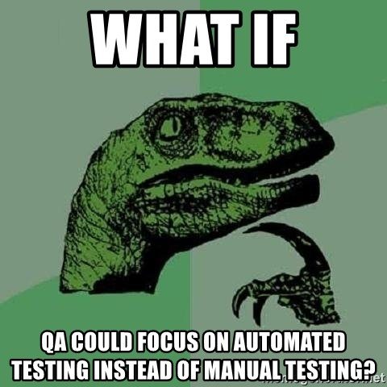

Title: Do not automate anything unless you automate the tests
Date: 2021-11-04
Category: Posts
Tags: technical-excellence, testing, TDD, testability, automation, system-programming
Slug: automate-tests
Author: Alex Bunardzic
Summary: Automating critical systems operations without having automated tests is risky practice

There are three types of automated tests that software engineers focus on:

1. Customer-facing functionality
1. Code structure quality
1. Systems operations

## Customer-facing functionality

Teams build and ship features that enable customers to perform self-service activities. Customers appreciate the convenience of being in the driver’s seat and availing themselves of many useful and needed services.

The desired behaviour of the systems that teams are building must be fully tested before it is placed in front of paying customers. It is extremely desirable to make the systems fully testable by writing automated tests. Such tests are faster and more reliable than manual tests. They enable teams to engage in continuous delivery while minimizing the risk of introducing defects.

## Code structure quality

Unlike automating the tests that guarantee the desired behaviour of the system, automating the tests that guarantee the code structure quality is a bit trickier. Code structure quality hinges on many industry accepted design principles. Static code analysis tools can provide the metrics that expose the level of the code structure quality. Where the tricky part enters the picture is in deciding which of those metrics are a necessary factor when it comes to assessing the code structure quality.

While the automated tests that verify customer-facing behaviour (i.e., functionality) are by their nature binary (i.e., either the functionality is present or it isn’t present), automated tests that assess the code structure quality are quite nuanced. It is up to the company’s quality standards to establish the bar – the minimum acceptable quality of the code structure that gets shipped to production.

## Systems operations

When I started my career in the 1990s, the company I worked for (BC InfoHealth, cutting payroll for all hospitals in British Columbia) was still running their business on mainframe computers. Those behemoth machines were situated in the sealed, air-conditioned computer room with a crew of computer operators buzzing around wearing white lab coats (sounds like a scene from some futuristic movie).

Back in the day, operating those large computer systems was completely manual. One of the reasons mainframe computers got phased out was the unwieldiness of the operations. It was too slow, cumbersome, tedious, and quirky, not to mention exorbitantly expensive.

Fast forward to today when we finally managed to completely commoditize the computing infrastructure (infrastructure-as-code). Since infrastructure is code, that means it is fully programmable. And that’s why there is a big push toward automating all systems operations.

To automate systems operations, one must become proficient in systems programming. Programming systems operations is not necessarily the same as programming business applications. If we are to efficiently program any systems operations, we need to understand how those systems work.

I have seen plenty of very knowledgeable systems programmers write very elaborate programs that automatically run intricate computer operations. I remember reviewing large source code files, containing tens of thousands of lines of code per file. And in almost every of those large files, the code was far from being trivial. Hundreds, if not thousands of nested if-else statements, hundreds of try-catch blocks of code. It’s a veritable jungle!

Whenever I review any such large files containing the code that runs intricate computer operations, I always make a point to ask the authors: “How did you test this and how do you plan to keep testing the changes going forward?”

The answer always manages to shock me: “We always test it manually!”

What is odd in that situation is that experts who spend a lot of time writing sophisticated programs and scripts to automate computer operations never seem to write automated tests. Almost always (in my experience), they resort to manual testing.

That arrangement raises all sorts of red flags in my mind. When I look at those intricate and convoluted nested if-else statements and those numerous try-catch blocks of code, all I see is plenty of danger zones. If whoever is maintaining those automated scripts does not fully understand the logic governing the automation, they run a huge risk of introducing serious bugs while maintaining the automated system operations.

## Never write any automated processing without first having automated tests that cover it

I think it would be foolhardy to produce a lot of automation without having tests that run any time we make any changes to the automated system and alert us if anything gets broken. That, in my mind, would be an absolute minimal requirement for a well-engineered solution.

We have adopted and implemented TDD practices in WorkSafeBC. However, those practices only pertain to automating the processing of business policy rules. When it comes to automating systems operations, we don’t have any TDD, nor other automated testing strategy. Seems like we always tend to resort to manual testing when making changes to the source code that automates critical system operations.

It is high time to mitigate the risks and discontinue such approach and to adopt and implement the test-first approach. It is very important to first and foremost implement executable expectation when automating any aspect of the system operation. Once we have that executable expectation up and running, we can safely proceed to implement the code that will automate the actual operation. That way, we will produce a safety net of tightly knit automated tests that will guarantee we won’t inadvertently break anything nor introduce any regression when maintaining, enhancing, enriching, or repurposing any of our automated operations.

## Conclusion

Software engineers serve the business needs by automating business processes. But in addition to that, software engineers engage in continuous improvement of the processes that deliver the business automation.

While the automation of the business processes is delivered via carefully chosen testing strategy, automation of the critical systems operations lacks such well-engineered strategy. It is critically important that we adopt stringent test-first approach to automating critical systems operations. The criticality is even more urgent when we realize that automated system processing always runs a risk of creating catastrophic damages by programmatically elevating the permissions during runtime. All it takes is for an automated program/script to issue the **RunAs** command, and the program elevates itself to the highest level of authority on the system. Basically, the program becomes a super user, capable to doing anything on the system!

We must make sure any such unauthorized breaches of security get caught by the tests before the automated script/program reaches production.