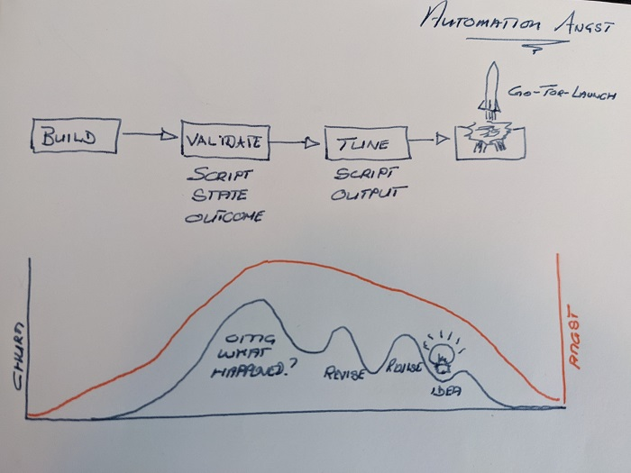
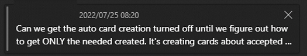
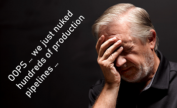

Title: Automation Mayhem and Angst is normal
Date: 2022-07-29
Category: Posts
Tags: automation, learning 
Slug: automation-churn-and-angst
Author: Willy Schaub
Summary: Doing a manual and mind-numbing task twice or more? Automate!

The simplest form of automation replaces meek, rudimentary, and manual tasks with digitized processes. While automation is part of the deoxyribonucleic acid (DNA) of a healthy DevOps mindset, we should continue to “strive to innovate and improve beyond repeatable processes and frameworks” – [Core DevOps Values]( https://www.tactec.ca/devops-core-values). Therefore, instead of focusing on examples of automation we have introduces to help us maintain 2000+ continuous delivery pipelines and associates services, I will focus on the emotional side of automation in this brief post. The automation samples and “gotchas” will follow soon.

> 

---

# Brace yourself for instability and churn

> 

After we identify, analyze, and prioritize a manual and mind-numbing task we **BUILD** our automation code, as shown in the “Automation Angst” illustration. After **BUILD**, follows **VALIDATE**, during which we validate the automation script, the pre- and post-automation state, and the overall outcome of the automation exercise. 

There is usually an initial spike of churn as the automation **failures** due to unexpected outliers or when we realize that a task that is super easy for a human is a not suited for our binary machines.

What follows are a few less dramatic spikes as we revise and fine **TUNE** the automation. There are new feature requests, triggered by new improvement ideas, refactoring, and revisions to reduce technical debt – until we finally make the **GO-FOR-LAUNCH** call.

This type of Microsoft Teams chat message is not uncommon as you flip the automation from dormant to active and it is tempting to disable the automation as requested. However, to be able to fine tune the automation, I urge you not to flip the switch back to dormant. Instead work with the stakeholders, especially the agitated ones, to continuously improve the automation – there is never a good time to action the automation churn! 

> **LEARNINGS**
>
> - **Remain critical** to identify and promote the automation that add value, and to deprecate unviable automation.
>
> - **Do not despair** when automation takes time and effort to fine-tune and integrate into our existing processes. 
>

---

# “Angst” that will never really go away

> 

The major turbulence we experience while working on process automation is the “Angst” when we realize the potential of the automation on our operational environment.

> 

As highlighted in the "Automation Angst” illustration the fear of **FAILURE** spikes at the start and declines gradually as we make progress with fine-tuning and continuous improvement of our automation. The Angst is normal - embrace it as your guardian of built-in quality and embrace the continuous **FAILURES** to advance your automation.

While I have no recipe for sleepless nights where you mull over thousands of lines of config-as-code, wake up in a sweat dreaming of scrum masters and engineers pounding on your door after breaking their pipeline, or pondering over when to click the launch button, I can reassure you that my entire team is still intact and promoting automation as a pivotal pillar. At some point you simply have to click on the **ENTER** button and watch the action q-;) 

> **LEARNINGS**
>
> - **FAILURE is an option here. If things are not failing, you are not innovating enough.** - Elon Musk.
>
> - **Gradually increase the blast radius**. Use feature flags or other strategies to gradually increase the area of impact (blast radius) of your automation. The **big bang** strategy is not only bold, but mote t minimizes your chance to continuously automate, observe, learn, and refine.
>

---

# What are your automation experiences?

What are your automation stories? I am looking for the good, the bad, and the ugly 😊 Ping me on [@wpschaub](https://twitter.com/wpschaub) or [LinkedIN](https://www.linkedin.com/in/wpschaub/) until we enable the commenting feature below.

