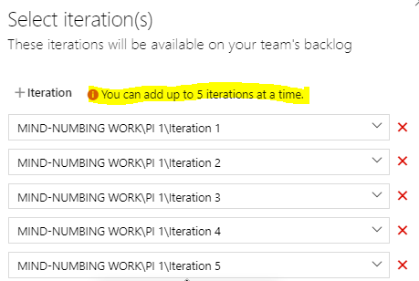
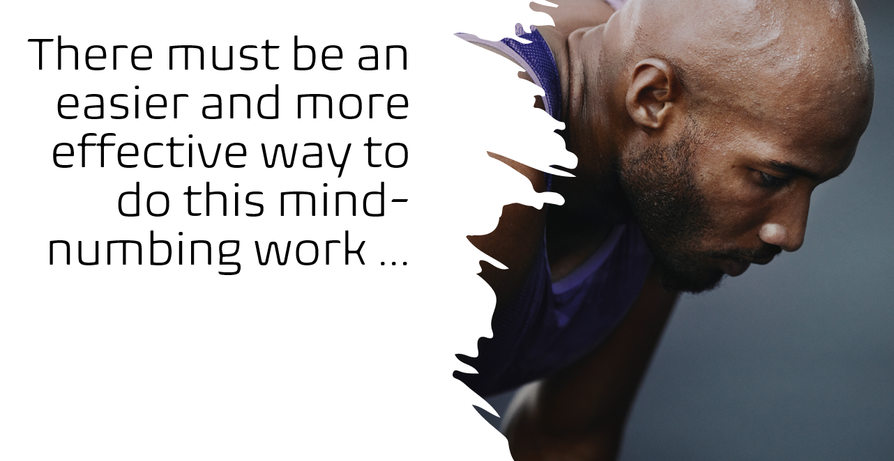

Title: Automation enables engineering to focus on value
Date: 2021-04-29
Category: Posts
Tags: automation, eliminate-waste
Slug: automation-lesson-1
Author: Willy-Peter Schaub
Summary: Asking yourself why you are performing a set of manual tasks again and again? If yes, automate!

That is a question I ask myself a few times a day ... and too often answer with "nah, creating an automation script sounds like more work." But, is it really more work and are we true to our goals of alignment, automation, consistency, enablement, simplicity, and reduction of waste? 

When I picked a maintenance card, based on previous automation, from our Kanban board today, I decided to do a quick calculation of what effort ... if any ... I am saving by NOT doing the maintenance by hand.

---

# Case Study #1: Creating Iteration Paths

Roughly every two years must add 12 program increments, each with 5 iterations to our Azure DevOps (AzDO) projects and then map them to all the AzDO Teams within the AzDO project.

I decided to invest some of my personal time to get some rough estimates on how long this exercise takes. Here is a summary of effort in our sandbox:

| MANUAL TASK                                            | REF | - | SECONDS | - | CLICKS |
|--------------------------------------------------------|----:|---|--------:|---|-------:|
| Create a program increment                             | 1   |   | 13      |   | 9      |
| Create five (5) iterations under the program increment | 2   |   | 65      |   | 90     |
| Map five iterations to a team                          | 3   |   | 11      |   | 9      |

 

So, this does not look to bad, if you make no typos. What is important to remember is that the Azure DevOps user interface only allows you to add 5 iterations to a team at a time ... not very productive, but that is a story for another post.

 

The number of projects and teams is volatile, but today I would have to update 257 teams across 25 projects. Does not sound too bad. Let me get **rough** estimates on how many times I would have to click my keyboard and how long I would have to spend behind my laptop this weekend.

> **TASK**
>
> Add 12 program increments, each with 5 iterations, to each project (25) and map the (12*5=60) iterations to each team (257) in each project.

Here is a visual after creating one program increment with 5 iterations:

 

| REF | CALCULATION                         | SECONDS | - | CLICKS |
|:---:|-------------------------------------|--------:|---|-------:|
| 1   | 12 PIs * 25 projects * x = 300 * x  | 3900    |   | 2700   |
| 2   | 12 PIs * 25 projects * x = 300 * x  | 19500   |   | 27000  |
| 3   | (120/5) * 257 teams  * x = 6168 * x | 67848   |   | 55512  |

> **TOTALS**
>
> **Seconds**: 91248 = 25.367 hours and **Clicks** : 85212

So, if I fill up my Ovomaltine mug on Saturday morning at 9AM, I will be done with the task by Sunday morning just before 11AM. A typical operational task and doable, no?!? 

 

---

# Compare it to our automation scripts

OK, now let us look at the facts ...

 

I do not believe that we need to discuss this any further for "your Penny to drop" that automation, at the right time, is **cost effective**, **productive**, and **consistent**. Also, there is a lot less **WASTE**!

Have a great weekend!

