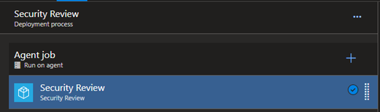

Title: Automation and the great unknown
Date: 2022-08-05
Category: Posts
Tags: automation, learning, tips, azure-devops
Slug: automation-task-group-learning
Author: Daniel Broderick
Summary: Inadvertently restricting access to thousands of pipelines with a simple automated task group insertion.

The problem: How can the security team run all the tasks like the scans they need to run? 

The idea was simple inject an empty security review task group into the release pipelines, the security team can update the task group whenever they please. Providing a central location for the security items. 
 
> 

---

# Automation to the rescue

The automation was written, fired off by a YAML pipeline and the empty task group was injected. Over 3000 pipelines were updated. The injection automation runs weekly to inject the task group to any new pipelines that may be created.
 
> 

Using the REST API all that had to be done was create the JSON payload and send it.

```
{
    "environment": {},
    "refName": "",
    "enabled": true,
    "alwaysRun": true,
    "taskId": "$TaskGroupID",
    "version": "1.*",
    "name": "$TaskGroupName",
    "continueOnError": true,
    "timeoutInMinutes": 0,
    "retryCountOnTaskFailure": 0,
    "definitionType": "metaTask",
    "overrideInputs": {},
    "condition": "succeededOrFailed()",
    "inputs": {}
}
```

> Job done – or so it was thought.

---

## Users cannot edit

The team got a call a few weeks later that some users could no longer edit their releases, there was an error saving due to an issue with the security review stage.

How strange? Users could edit before, a quick check of the permissions yield no results as to why. 

After working with a user we discovered the steps that allowed editing and steps to invoke the error. 

What was not known at this stage was why. What was causing this? The security review task group was working, the release pipeline was working. Saving – nope.

---

## Exporting and comparing
The pipeline JSON definition was exported before and after changes that enabled users to edit – low and behold a variable that the security team were using in one of the tasks was a parameter in the task group. This was not present when injecting the empty security task group.

---

## The Fix

The automation was not injecting this parameter into the definition. This caused the error when certain users saved. The automation was Injecting an empty task group though this task group was no longer empty. 

The automation needed to reflect this. 

A quick edit of the automation and users are back in business.

Below one can see the input field that is required when using the REST API.

```
{
    "environment": {},
    "taskId": "$TaskGroupID",
    "version": "1.*",
    "name": "$TaskGroupName",
    "refName": "",
    "enabled": true,
    "alwaysRun": true,
    "continueOnError": true,
    "timeoutInMinutes": 0,
    "retryCountOnTaskFailure": 0,
    "definitionType": "metaTask",
    "overrideInputs": {},
    "condition": "succeededOrFailed()",
    "inputs": {
                "variableName": "variableValue"
              }
}
```

**Lesson learnt**, anytime a new variable or parameter is required the automation will have to be modified to add this input in.

---

## Back to happy customers!!!

> 
 
This goes to show that automation and improvement is a continuous process. It would have been easy to abandon the automation and go back to what works. With any automation there will be bumps in the road however it’s important to navigate past these. 

> 

> **Happy automation!**

