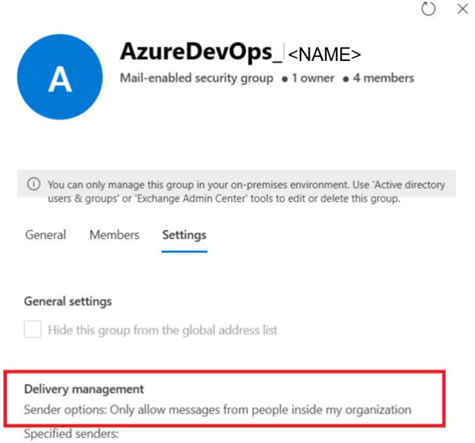

Title: Azure DevOps Notifications and email-enabled AD Groups
Date: 2025-03-28
Category: Posts 
Tags: azure-devops, tips
Slug: azure-boards-tips-ad-notifications
Author: Willy-Peter Schaub
Summary: Understanding email-enabled Active Directory (AD) groups and Azure DevOps (AzDO) notifications.

We have relied on an Active Directory (AD) group-based security model with Azure DevOps for many years. This setup includes email-enabled AD groups for pull request reviewers, as well as Azure Pipeline and environment approvers. It worked seamlessly—until it did not- plunging us into a frustrating cycle of misinformation and troubleshooting. To help you avoid the same headaches, here is our checklist for enabling email notifications from Azure DevOps for Active Directory (AD) groups.

# Checklist

- Azure DevOps (AzDO) iterates through the members of an AzDO group when triggering a notification and sends an email to each user individually.
- However, AzDO does `not` iterate through the members of an AD group when triggering a notification — instead, it sends the notification to the AD group’s mailbox.
- AzDO does `not` send notifications to users or email-enabled AD groups unless they have at least read-only permissions in the associated AzDO project. To ensure notifications are received, we add the email-enabled AD groups used in the Azure DevOps project to the Readers group.
- Lastly, your AD group’s mailbox must **allow external emails** from ```azuredevops@microsoft.com``` — make sure to check the infamous checkbox to prevent this restriction, which turned out to be our root cause.

>  

If you are struggling with notifications, refer to these references and then work through the checklist above.

- [About notifications](https://learn.microsoft.com/en-us/azure/devops/organizations/notifications/about-notifications?view=azure-devops)
- [Determine recipients of notification emails](https://learn.microsoft.com/en-us/azure/devops/organizations/notifications/concepts-email-recipients?view=azure-devops)
- [Not getting emails from subscriptions or notifications](https://learn.microsoft.com/en-us/azure/devops/organizations/notifications/troubleshoot-not-getting-email?view=azure-devops)

---

That is all folks.

