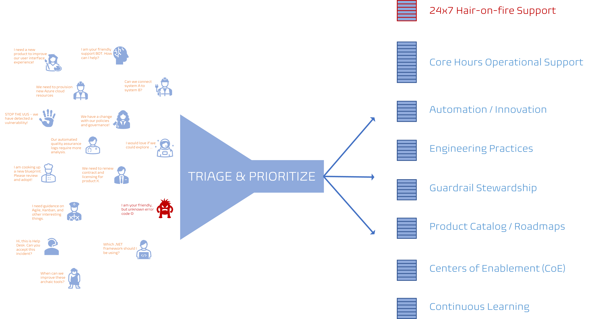
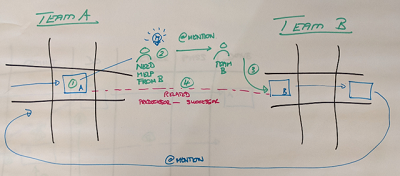
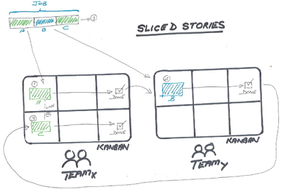
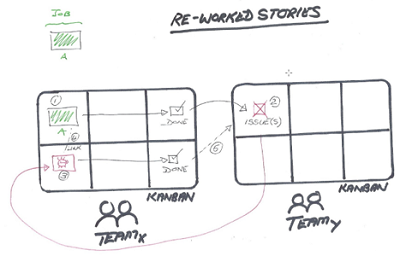
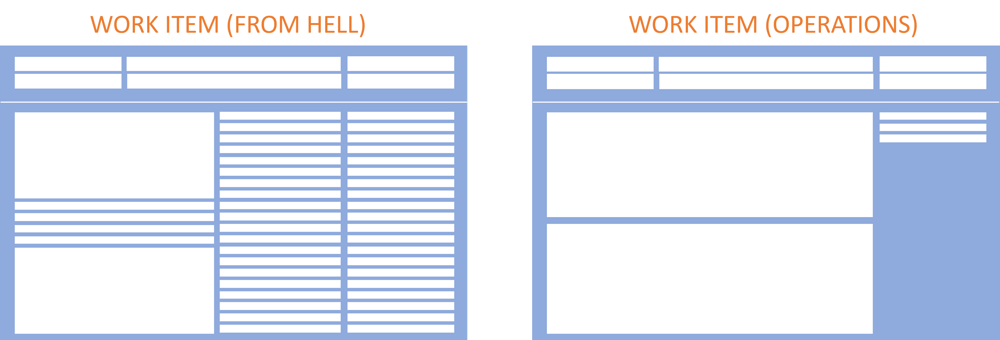
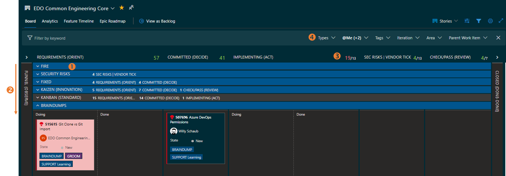

Title: Azure Boards Tips for Operations Teams
Date: 2022-12-23
Category: Posts 
Tags: azure-devops, tips
Slug: azure-boards-tips-operations-team
Author: Willy-Peter Schaub
Summary: A few useful "did you know" tips when using Azure Boards for Operational-type teams.

After observing users work with and occasionally struggle with the [Azure Boards](https://azure.microsoft.com/en-ca/products/devops/boards/), it is time for me to share a few tips. We continue from [Agile Boards Tips](/agile-boards-tips.html) and focus on operational teams this time.

---

# What makes an Operations team different from a Delivery team?

There are likely tons of definitions and views of groups of engineers making up an operations, operational, services, or system teams. I will focus on my team, Common Engineering, is one of our common services teams, focused on operations. We empower our delivery teams, aka software development, with consistent and standardized **processes** and **products**, **innovation** of tool chains and continuous delivery pipelines, and **support** of operational infrastructure.

>  

As shown, the focus on processes, products, innovation, and support are creating a  variation of support requests we receive and associated work that we plan after triage and prioritization. A challenging, but exciting mix of services we are focused on every day. 

If your daily working day looks similar, you may want to consider these learnings from our team.

---

# Document process of dealing with blockers and external dependencies

Delivering exceptional, responsive, and forward-thinking operational support is our top priority, which trumps all other visions, goals, objectives, and dreams. It requires us to continuously improve our value streams, to improve our [cycle and lead times](https://www.agile-academy.com/en/agile-dictionary/lead-time-vs-cycle-time/). 

For example, we continuously analyze, collaborate, agree, and documented how to deal with common scenarios, powered by [Azure DevOps](), such as ...

>  

While **processing** work item A, we realize that we need help from another common services team to complete the support **request**. 

- We clone our original work item (A) and set up a predecessor --> successor relationship to work item (B). This allows us to visualize the dependencies on our [Delivery Plans](https://learn.microsoft.com/en-in/azure/devops/boards/plans/review-team-plans?view=azure-devops).
- We **@mention** the original requestor and team B, so that they are notified to determine if work item (B) is actionable. If yes, they pull it to their backlog, triage, and action as per their process.
- We then click on the **Follow** work item feature and wait for work item (B) to move to ```DONE``` state and/or to be **@mentioned** by team B.  
- As we complete our work in parallel, we move work item (A) to ```DONE``` state.
- The original request is considered DONE once work item (A) and work item (B) are ```DONE```.

>  

Optimally we detect **dependencies** while **triaging** the support **request**. If yes, we proactively slice the job into multiple work items. As before, we configure with predecessor and successor relationships and notify (**@mention**) the stakeholders - but it is done **proactively**, not reactively which is far more efficient and less stressful q;-)

>  

The last example shows that we never move a work-item back from ```DONE``` state or in other words, we never drag a work item card from right to left on our **Kanban** board. Instead, we create a new work-item (typically a clone of the original), fix the issue(s), rinse and repeat the dependencies.

Yes, it is more work, but it allows us to track and visualize the actual workflow.

---

# Consider an Operational Work Item Type

As shown below, we have all encountered the work item type from hell - the worst work item (bug) type I had the misfortune to work with had 200+ fields, multiple tabs, mandatory dependencies, and fields that no-one could explain. An inefficient and frustrating user experience!

>  

For **operational support requests** we created a streamlined work item type, which auto-filled most fields during creation. Both the **requestor** and  team dealing with the request, can enjoy a far more efficient process and digest the request and status **at-a-glance**.

---

# Arrange your board

It is important that you fine tune your **Board** to suit **you** and deliver visual value to **your** team and stakeholders. Here is what ours looks like...

>  

1. We use **swimlanes** to map the requests we receive into a few well-known buckets, such as hair on ```FIRE```, ```security risks```, ```fixed``` date, ```Kaizen```, ```STANDARD```, and ```Braindumps``` (information sharing).
2. We use the standard ```top=highest-priority``` prioritization strategy when scanning the swimlanes and cards within each swimlane column.
3. As shown, we still have to work on and improve our ```work in progress``` (WIP) and associated WIP limits.
4. We use the ```Filters```, as discussed in [Azure Boards Tips](/azure-boards-tips.html).

The ```STANDARD``` swimlane is where we live and breath operational support, with a **Kanban** mindset and focus on Flow. We pull work from the right and prioritize work that has a clear flow from ```NEW``` to ```DONE```, using every opportunity to identify inefficiencies and waste.

The ```FIXED``` and ```KAIZEN``` swimlanes is where we practice our **Scrum** and **Scaled Agile Framework (SAFe)** mindset, planning, prioritizing, and committing work to program increments and associated iterations.  

We are using the right-mindset for the right job, at the right time, to continuously deliver value,

---

# Use a visual dashboard

> 

Like Kanban boards, as discussed in [Agile Boards Tips](/agile-boards-tips.html), you can create visual Azure DevOps dashboards, to monitor and identify smoke, before you have a raging fire on your hands. Our blurred dashboard is one of my default startup pages in my **Edge** browser and a page I continuously monitor during the day.

1. The tiles present an assortment of invaluable indicators. Anything in ```red``` requires our attention, for example ```orphaned``` work items (no parent), ```blocked``` work items, closed (```timeless```) work items without an iteration, and operational support work items that are missing required ```tags```.
2. The list of pipeline ```status``` allows us to keep an eye on our maintenance pipelines and the lead- and cycle-time graphs visualize how have been doing over the past 30 days.
3. There are a lot more gems on the board, some relevant to all of us, some interesting for our scrum master. There are also gems, such as a list of ```my pull requests``` and ```pull requests assigned to me``` allow me to be more proactive.

As with Kanban boards, take two steps back and ensure that the visual cues for **you** and **your team**.

Lastly, remember the [Delivery Plan](https://learn.microsoft.com/en-in/azure/devops/boards/plans/review-team-plans?view=azure-devops) which allows you to create a delivery board-type plan view combining multiple teams, backlogs, and iteration cadences. The delivery plan configuration of settings and styles is like the board, but it also allows you to collapse cards and show dependencies.

> **IMPORTANT**
> Dependencies are only shown for predecessor/successor links and dependency lines are only drawn if both the predecessor and successor cards are visible on the delivery plan view.

Any other tips to share?

