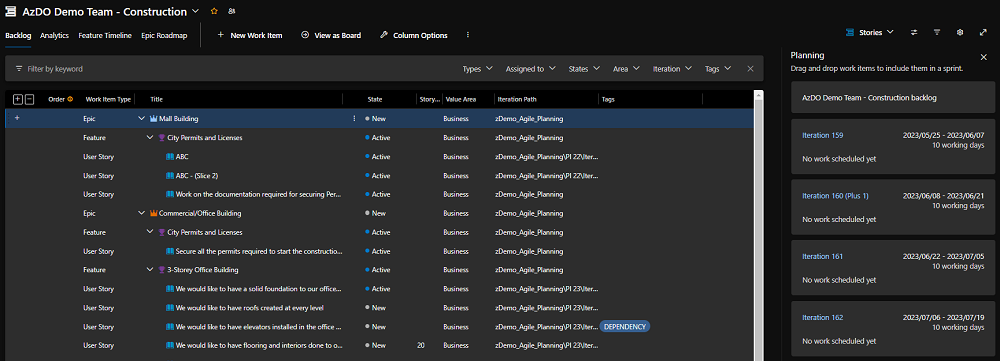
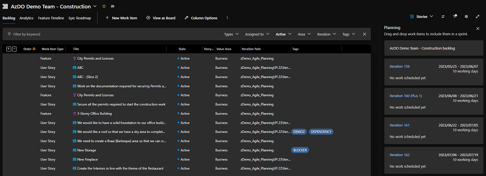
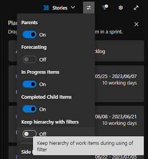
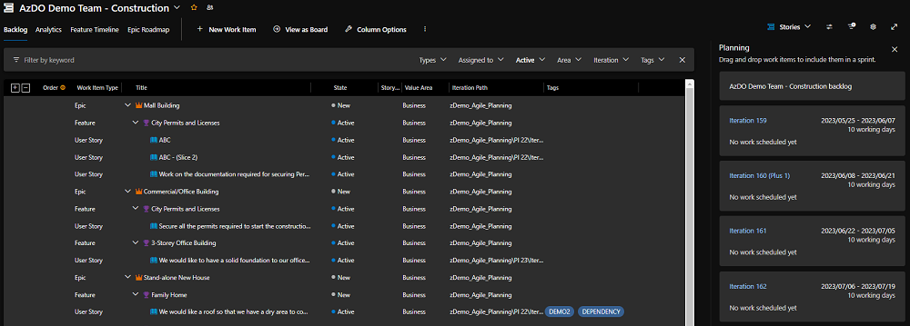

Title: Azure Boards Tips - Retain hierarchy with filter
Date: 2023-06-05
Category: Posts 
Tags: azure-devops, tips
Slug: azure-boards-tips-retain-hierarchy-with-filter
Author: Willy-Peter Schaub
Summary: Why does the hierarchy view [not] vanish when selecting a filter? 

We continue the journey of feature discovery with the [AzureDevOps](https://azure.microsoft.com/en-us/products/devops) Board, which we started with [Azure Boards Tips](/azure-boards-tips.html), and [Azure Boards Tips for Operations Teams](/azure-boards-tips-stop-messing-with-our-backlog.html).

---

# Odd behaviour when using the backlog filter

We often find ourselves switching the [Azure Board](https://azure.microsoft.com/en-us/products/devops/boards/) to the backlog view and enable parents, giving us a hierarchical view as shown below. 

>  

Then we use the filter to show a subset of the work items, in this case those with a state of **Active**.

> 

An annoying side effect of using filters, is that the hierarchical view disappears.

---

# Flip a toggle to get the view you want

A feature I discovered is the "keep hierarchy with filters" toggle under **View Options**. 

>  

If you toggle that to **On** you get the view I believe should be the default. Best of both worlds ... filter set, and parent and child hierarchy enabled.

>  

---

Any other tips to share?

