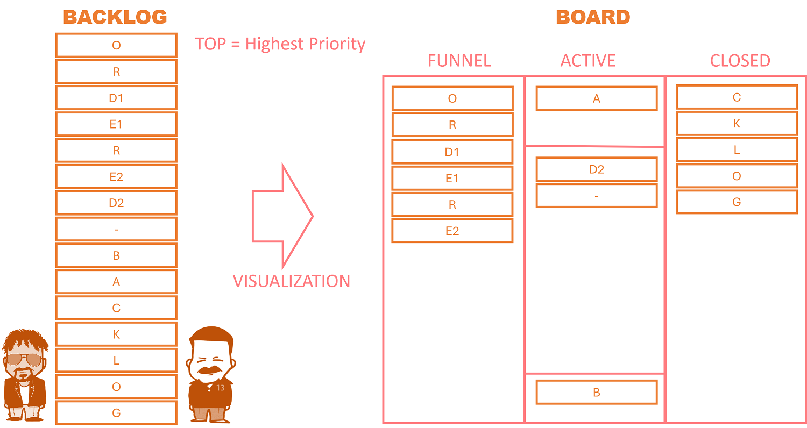
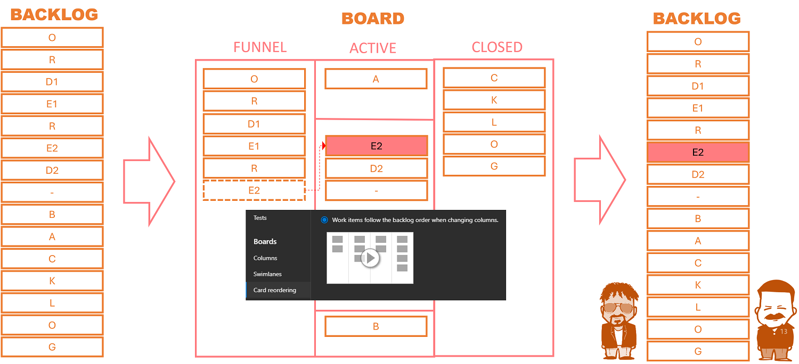
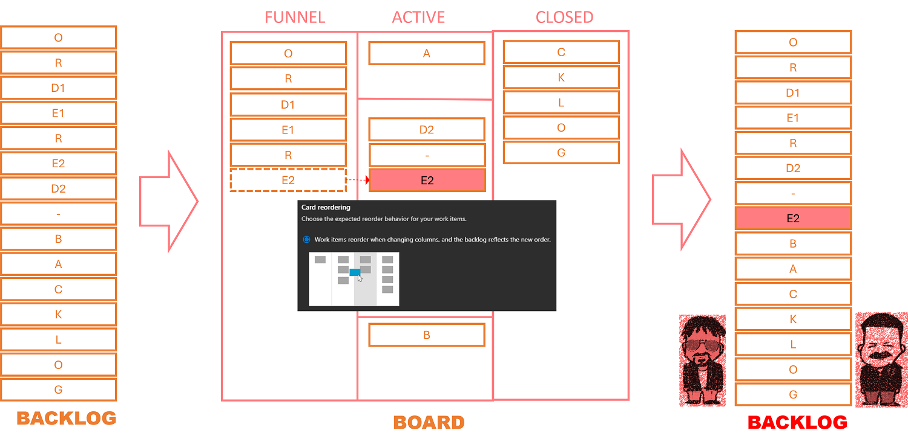

Title: Azure Boards Tips - Stop messing with our backlog!
Date: 2023-04-02
Category: Posts 
Tags: azure-devops, tips
Slug: azure-boards-tips-stop-messing-with-our-backlog
Author: Willy-Peter Schaub
Summary: A few useful "did you know" tips when using Azure Boards.

We explored the [Azure Boards](https://azure.microsoft.com/en-ca/products/devops/boards/) in [Azure Boards Tips](/azure-boards-tips.html) and [Azure Boards Tips for Operations Teams](/azure-boards-tips-operations-team.html). However, I failed to emphasize one important rule when you are working with my team, as well as the teams stewarded by my colleague, Agent #9 from our [Navigating DevOps through Waterfalls](https://www.tactec.ca/ndtw-resources/) adventure.

>
> Feel free to visit and peruse ```our``` backlog, however, **do not** make any changes on ```our``` backlog!**
>
>  
>

---

# The board is a visualization

>  

The **BACKLOG**, as shown on the left, is an ordered and prioritized flat or hierarchical list of deliverables, features, technical debt, and other bits and pieces that should be implemented to deliver value to delighted end-users. The **BOARD** is a ```visual``` representation of the same data, commonly categorized in columns and swim lanes.

Note a few important points:

- **ordered** and **prioritized** list
- **visual** representation
- items at the **TOP** have the highest priority

---

# The correct, but not default way

>  

When you set the ```Card reordering``` feature to ```Work items follow the backlog order when changing columns``` **magic** happens when you drag a card from one column to the other on the board.

In our example above, we are dragging the **E2** card from the **FUNNEL** to the **ACTIVE** column and the center **SWIMLANE**. As you drop the card **anywhere** in the column, the board positions it correctly using the groomed and ordered backlog. As shown, the card will be placed above **D2**, because on the backlog **E2** is positioned before **D2**.

After dragging the card, both Agent #9 and Agent #13 are ```happy``` as their pristine, ordered, and prioritized single source of truth backlog remains unchanged.

Unfortunately, this is not the default mode with [Azure Boards](https://azure.microsoft.com/en-ca/products/devops/boards/).

---

# The default, but not correct way

>  

The default ```Card reordering``` feature is set to ```Work items reorder when changing columns and the backlog reflects the new order```.

In our example above, we are dragging the **E2** card from the **FUNNEL** to the **ACTIVE** column and the center **SWIMLANE**. As we drop the card after the ***-*** card, the board positions it where we drop it.

After dragging the card, both Agent #9 and Agent #13 are ```unhappy``` as their pristine, ordered, and prioritized backlog remains has been changed. While the tragedy is not evident with this simple example, consider hundreds of cards being dragged and dropped by a team per day. The backlog turns into a single pile of mess very quickly, making the board the single source of truth. 

---

# Upset with the current default?

It is obviously a personal / team preference as to whether the backlog or the board are their single source of truth. For me, the **backlog** which I groom regularly like an immaculate Rose Garden, is my single source of truth. The **Board** is a ```visualization``` of the same data using the backlog as source.

- Am I wrong to be upset with the default option selected by Microsoft?
- What are your thoughts?

