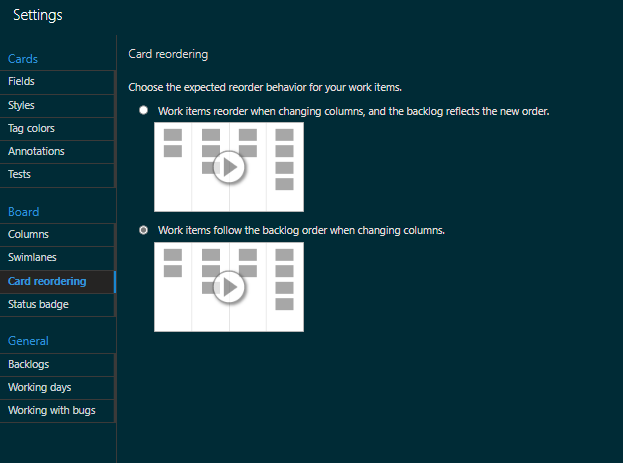
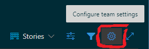
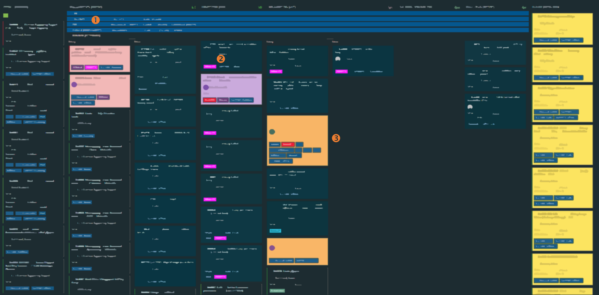
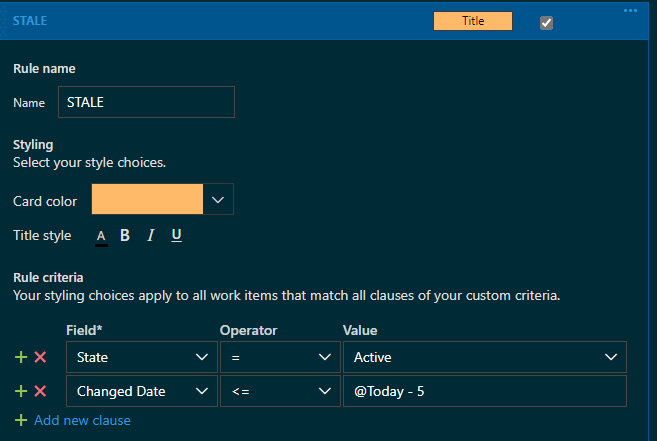
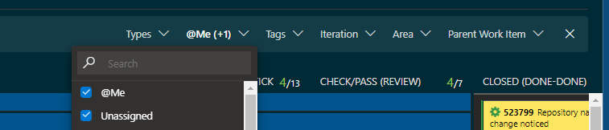
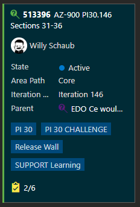

Title: Azure Boards Tips
Date: 2022-12-02
Category: Posts 
Tags: azure-devops, tips
Slug: azure-boards-tips
Author: Willy-Peter Schaub
Summary: A few useful "did you know" tips when using Azure Boards

After observing users work with and occasionally struggle with the [Azure Boards](https://azure.microsoft.com/en-ca/products/devops/boards/), it is time for me to share a few tips.

---

# Select the right card reordering strategy

>  

The board supports two reorder behaviours when you drag and drop your cards. 

- Reorder work items when changing columns and update the backlog accordingly. (Default)
- Follow backlog order when changing columns.

As I **groom** and maintain an **ordered** (prioritised) backlog, I prefer the second behaviour. It drops the card according to the work items order within the backlog. In other words, if it has the highest priority on the backlog it will appear at the top of the column, no matter where you drop it. Once dropped, you can intentionally drag and drop the card within the column, which updates its order (priority)within the column and updates the backlog accordingly.

>  

> GOTO ```Configure team settings```
> Select ```Card reordering``` and select the expected reorder strategy.

---

# Create visual cues on your board

>  

Maximize your [Azure Boards](https://azure.microsoft.com/en-ca/products/devops/boards/) on your biggest monitor and take two steps back. Can you see visual cues for (1) cards flowing in swim lanes, (2) tags that pop out from the rest to indicate special metadata, such as PRIORITY, and (3) card colours that indicate their states?

Even though the above board has been blurred, I notice nine (9) cards that are a ```PRIORITY``` due to the tag colour, one (1) card that needs to be discussed ```violet colour```, two (2) cards that need to be groomed ```salmon colour```, and two (2) cards that are stale ```orange colour```. Oh, the yellow cards on the right tell me that their ```iteration path``` has not yet been set.

The [Azure Boards](https://azure.microsoft.com/en-ca/products/devops/boards/) delivers powerful **visual cue** features - use them! 

Please do not use the card colour styles to indicate who they have been assigned to. There are only ten (10) possible styles, and you are better off using the **filter** to focus on your work - see below.

>  

> GOTO ```Configure team settings```
> Select ```Tag colors``` and define special colours for special tags
> Select ```Styles``` and define up to ten (10) styles to stand out.

Here is an example of a rule that turns stale cards orange:

>  

---

# Use the filter!

>  

The [Azure Board](https://azure.microsoft.com/en-ca/products/devops/boards/) team implemented a great filter, allowing you to filter you board on ```work item types```, ```assigned to```, ```Tags```, ```Iterations```, ```Area paths```, and ```Parent Work Items``` to reduce the noise and allow you to focus on what is important. 

For example, my board is filtered on cards assigned to ```@Me```, ```Unassigned```, and ```my team's AD group``` so that I can focus on my work and keep an eye on the unassigned work. 

---

# My work items are vanishing!?! 

>  

Ensure that all work item possible states are mapped to one or more of the [Azure Board](https://azure.microsoft.com/en-ca/products/devops/boards/) columns. If a state is not mapped against a column, the card will literally **vanish** from your board when its state changes to the unmapped state - the board is literally doing what **you** have configured it to do.

>  

> GOTO ```Configure team settings```
> Select ```Columns``` and map the work item states for each column

---

# Add high-value fields on the card

>  

The last thing you want to do is click on a card on your Kanban board - **WASTE**! Ensure you have the relevant fields mapped to your card so that in most cases you can simply look at the card to understand what to do next. 

>  

> GOTO ```Configure team settings```
> Select ```Fields``` and map up to 10 fields in the order they need to appear on your card
> DO NOT check ```Check if you want to display fields even if they are empty``` - **WASTE**!

---

# Do not forget the Delivery Plan!

>  

[Delivery Plan](https://learn.microsoft.com/en-in/azure/devops/boards/plans/review-team-plans?view=azure-devops) TBD

Any other tips to share?

