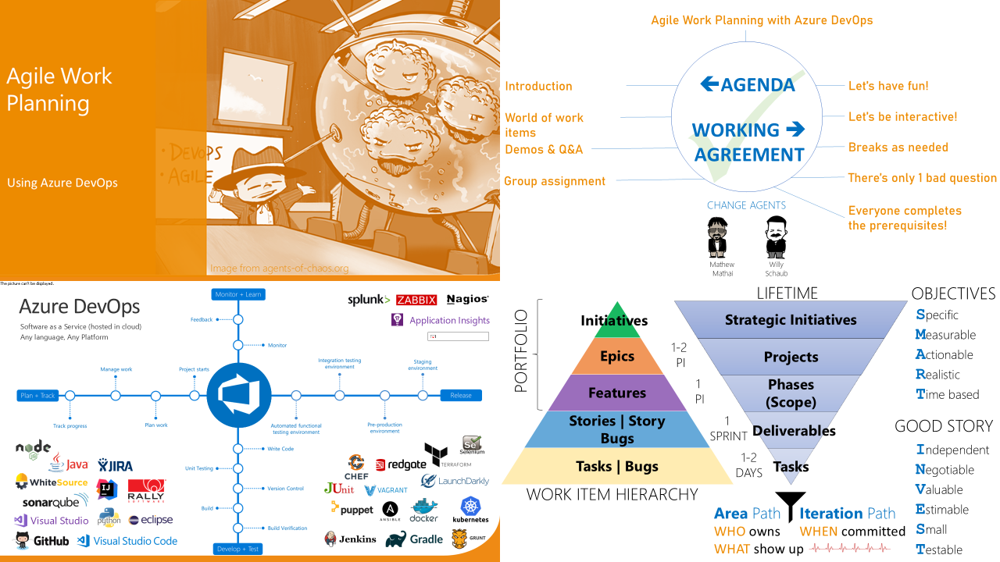
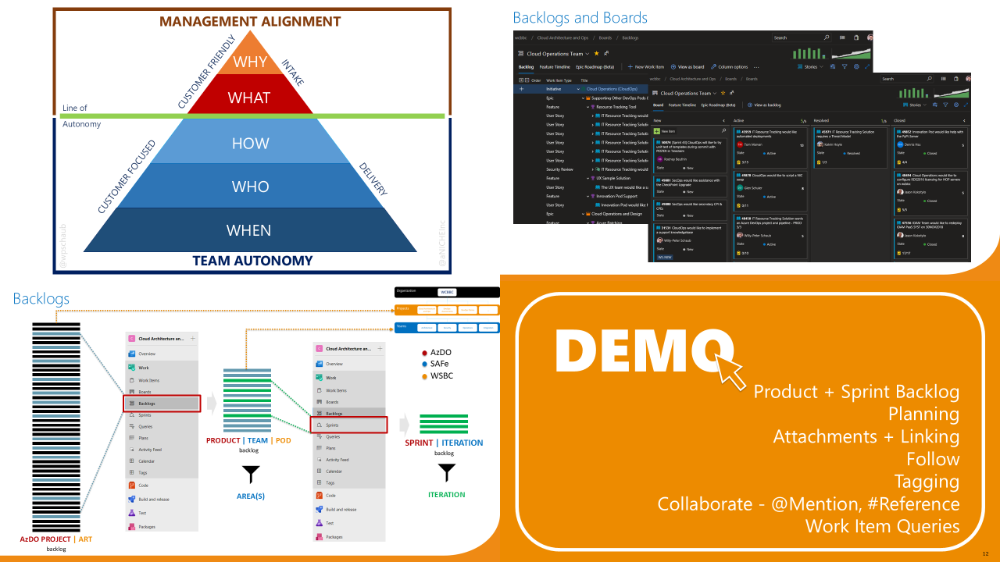
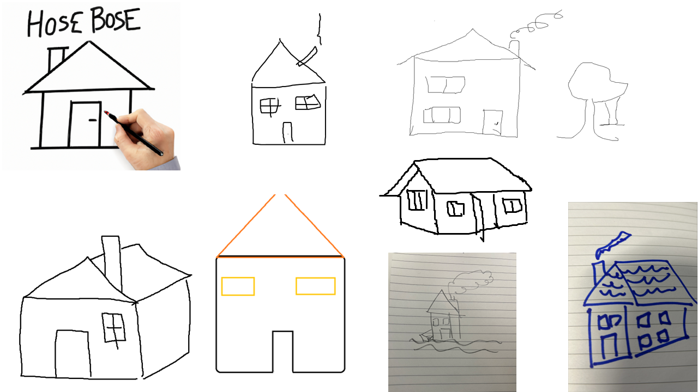

Title: Agile Planning with Azure DevOps
Date: 2024-10-23
Category: Posts 
Tags: azure-devops, learning, event
Slug: azure-devops-agile-planning-working-session
Author: Willy-Peter Schaub
Summary: Recalling the recent agile planning session hosted by common engineering during the +1 innovation and planning iteration.

Our team developed an interactive session to highlight the benefits of Azure DevOps Boards for Agile Planning, focusing solely on out-of-the-box features many, many moons ago. Recently, we handed over this session to our Agile Coaches for future improvements and hosting. 

This blog post summarizes our shared insights, exercise outcomes, and provides references for other Azure Boards posts to conclude the fun working session.

---

# Infamous slides

Here are the few slides we covered during the introduction:

>  
>  

---

# Fun Exercises

To emphasize the importance of creating SMART (Specific, Measurable, Achievable, Relevant, Time-bound) and actionable work items, we requested users to draw a sketch based on the following prompt: "_Willy would like you to build a home._"
Below are several examples of their responses.

>  

We then changed the ask to: "_Willy would like you to build a home using an emergent design so that you build his isolated and rugged dream log cabin in the middle of a lake_" and got these:

>  

It shows how simply describing a work item can significantly alter assumptions about user requests.

---

# Core topics we covered while exploring Azure Boards

At a recent Azure Developer Influencer Microsoft Innovation Hub Event, I observed a subject matter expert conducting an unscripted demonstration, engaging spontaneously with the audience throughout the process. This interactive and improvisational approach resulted in one of the most effective presentations I have ever witnessed. By participating in the problem-solving journey and collaboratively addressing challenges as they arose, I not only enjoyed the experience but also gained substantial knowledge.
Inspired by this approach, I decided to adopt a similar strategy for my working session. Dispensing with the prepared script, I addressed the following topics using a straightforward example: crafting the work items necessary to build a launch pad, and constructing a two-stage rocket, featuring both a sea-level engine and a vacuum engine.

**Product Backlog**	

- Organization \ project \ service bread crumb
- Preview Features
- Profile
- Backlog Levels
- Backlog Filters
- Backlog options – new “keep hierarchy with filters” feature
- Create Features (Pad, Rocket)
- Create Stories (A-Engine, V-Engine, 1st and 2nd Stage, Stack) and Tags (SpaceX)
- Create Relationships (Mapping)
- Create Relationships (Predecessor/Successor)
- New auto-complete automation

**Product Board**

- Columns
- Swimlanes
- Styles
- Ordering
- Tasks

**Delivery Plan**

- Demo PI Planning
- Demo Roadmap

**Dashboards, Queries**

- Demo Tech Debt dashboard
- Demo Common Engineering dashboard
- Demo writing a query - all items updated today
- Demo writing a query - all SpaceX tagged work items

I hope everyone found the session informative, learned some new tricks, and had as much fun as I did. I am looking forward to seeing how our Agile Coaches Sangeeta and Anita will improve the workshop and deliver the 2.5-hour session.

Below are some related blog posts for more details.

---

# Related content

Here are more blog posts talking about Azure Boards:

- [Automate Azure DevOps work item state transitions like a Pro](https://wsbctechnicalblog.github.io/back-to-basics-azdo-backlog-automation.html)
- [Azure Boards Tips - Retain hierarchy with filter](https://wsbctechnicalblog.github.io/azure-boards-tips-retain-hierarchy-with-filter.html)
- [Azure Boards Tips - Stop messing with our backlog!](https://wsbctechnicalblog.github.io/azure-boards-tips-stop-messing-with-our-backlog.html)
- [Azure Boards Tips for Operations Teams](https://wsbctechnicalblog.github.io/azure-boards-tips-operations-team.html)
- [Azure Boards Tips](https://wsbctechnicalblog.github.io/azure-boards-tips.html)
- [Back to Basics: Kanban](https://wsbctechnicalblog.github.io/back-to-basics-kanban.html)
- [Back to Basics: WIP Limit](https://wsbctechnicalblog.github.io/back-to-basics-wip-limit.html)
- [Searching for common nodes across area paths](https://wsbctechnicalblog.github.io/area-paths-and-nodes.html)
- [The clash of Azure DevOps Kanban fields and Shared Area Paths](https://wsbctechnicalblog.github.io/shared-area-paths.html)
- [Visualizing work item dependencies in Azure Boards](https://wsbctechnicalblog.github.io/azure-devops-dependencies.html)

---

Farewell Azure DevOps Agile Planning working session, and best of luck to our Agile Coaches in guiding this content forward!

