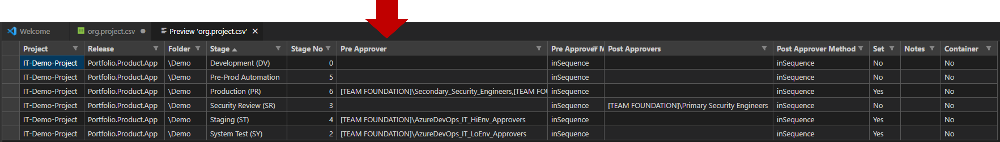

Title: Automation Bad Day
Date: 2023-03-06
Category: Posts 
Tags: azure-devops, pipelines
Slug: automation-bad-day
Author: Willy-Peter Schaub
Summary: It was our turn to have day from automation hell.

<OVERVIEW>

---

# Our configuration-as-code (c-a-c)

> 

<TBD>

---

# Meltdown timeline

> 

<TBD>

[Pipeline error: Failure in sending the provision message](https://status.dev.azure.com/_event/371776903)

---

# 2AM CALL @ high-noon

>  

<TBD>

>  

<TBD>

---

# Core Issue

>  

<TBD>

---

# Remediate & Learn

<TBD>

---

<CLOSE - SUMMARY >

