Title: Visualizing work item dependencies in Azure Boards
Date: 2022-09-07
Category: Posts 
Tags: azure-devops
Slug: azure-devops-dependencies
Author: Willy-Peter Schaub
Summary: We want to plan and manage dependencies across multiple teams areas, providing awareness of the dependencies in a simple way. 

This post summarizes the findings from our working group that focused on finding better, simpler, and more reliable ways to plan, manage, and track dependencies in product development.

> 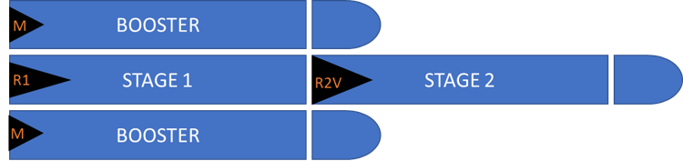 

I am using a hypothetical scenario of two teams in our **Delivery Teams** Azure DevOps project who have been tasked to build a rocket with two stages and boosters. 

1. Stage 1 must be built first and includes a SpaceX Raptor 1 engine. 
2. Stage 2 is built next and includes a SpaceX Raptor 2 engines for Vacuum conditions. 
3. The boosters with SpaceX Merlin engines are built last. 

All engines are supplied by the **Build Engines** team in another **Common Services** Azure DevOps project.

> 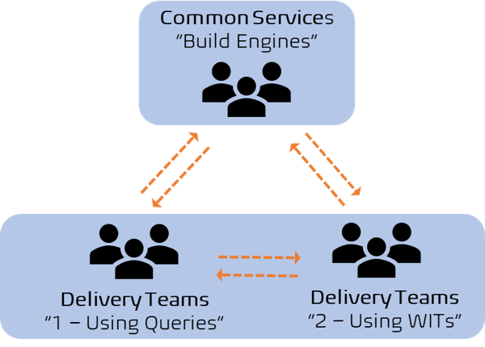 

When creating the team backlogs, we use the **predecessor** and **successor** work item link types to craft the dependency tree and guide the teams through a turbulence free development phase. 

> 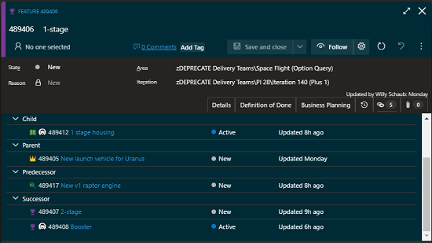 

As shown above, the 1-stage Feature (489406) work item has two **successor** links, defining that 1-stage must be completed first. It also has a **predecessor** link to the Raptor v1 engine, which must be available before the 1-stage can be completed.

> Refer to [Reference guide for link types used in Azure DevOps and Azure Boards](https://docs.microsoft.com/en-us/azure/devops/boards/queries/link-type-reference?view=azure-devops) for details on link types. 

---

# Delivery Team 1 - Using Dependency Query

Delivery team 1 has opted to create one Story Enabler work item for the Raptor v1 engine they need from the Build Engines team and link it to the **1-stage** Feature (489406), as shown above. 

**IMPORTANT** - The delivery team **1** creates the dependency work item, collaborates with the common services **Engines** team, and once the requirements are clearly defined the work item is **pulled** by the common services team to their backlog. Teams only create work items on their own backlogs and never **push** work items to other backlogs.

> 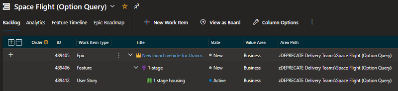 

Looking at their team backlog there is no visual evidence of the Raptor v1 engine dependency.

> 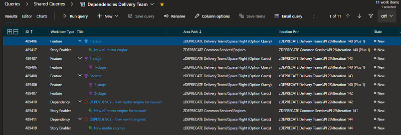 

The team uses a [WIQL Query](https://docs.microsoft.com/en-us/azure/devops/boards/queries/wiql-syntax?view=azure-devops) to track and manage their and other team dependencies.  

> 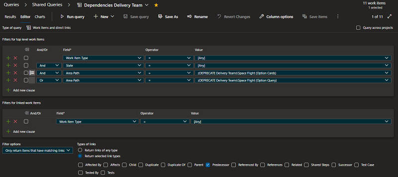 

The dependency query is using the **Work Items and direct links** query type and looks for **predecessor** link type.

>
> **QUERY-BASED DEPENDENCY TRACKING** 
> 
> - PROS
>   - Their backlog and board only show what they, as team 1, are responsible to deliver.
>   - There is no noise or **waste** on their Kanban board.
>   - Their dependency query has a consistent look & feel as their backlog view.
> 
> - CONS
>   - Their backlog and board show no visual cue of the Raptor v1 engine dependency. 
>

---

# Delivery Team 2 - Using Dependency Work Items

Delivery team 2 has opted to create a dependency work item (489410) and a Story Enabler (489417) work item for the Raptor v2 engine they need from the Build Engines team. The dependency work item (489410) is used as a placeholder work item on the team's backlog linked to the Story Enabler (489417) which is pulled by the Engines Common Services team to their backlog. They use the same placeholder+dependency pair process to add the Booster's dependency on Merlin engines.

> 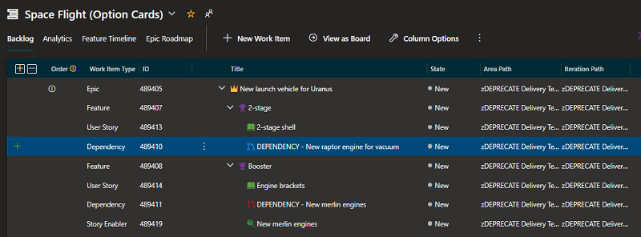 

Looking at team 2's backlog, we note the following:

1. Dependency work item (489410) for v2 Raptor engine is on the backlog, linked as a child to 2-stage Feature (489407).
2. Raptor v2 engine Story Enabler (489417) is gone - pulled to the Engine team's backlog.
3. Dependency work item (489411) for Merlin engine is on the backlog, linked as a child to Booster Feature (489408).
4. Merlin engine Story Enabler (489419) is still on the team 2 backlog, which implies that the common services Engine team is not able to commit to the work item yet.

> 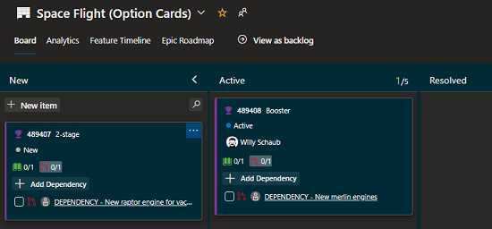 

Switching to the **Feature** board view, we have a visual cue on both the 2-stage and Booster cards that they have dependencies. Users can click on the dependencies to get more detail and to follow the dependency links.

> 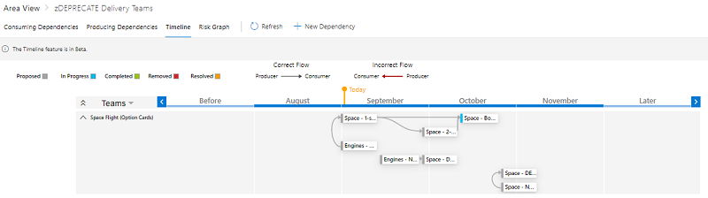 

The team also uses the optional [Dependency Tracker](https://marketplace.visualstudio.com/items?itemName=ms-eswm.dependencytracker) extension to get visual information on their dependencies, timelines, and risks. The extension is not for the faint hearted but delivers phenomenal dependency details when used currently.

>
> **CARD-BASED DEPENDENCY TRACKING** 
> 
> - PROS
>   - Their backlog and board show what they **and** common services teams are responsible to deliver.
>   - Their backlog and board show visual cues of the Raptor v2 and Merlin engine dependencies.> 
> - CONS
>   - We need a custom dependency work item type.
>   - There is noise and **waste** on their Kanban board for work their team is not responsible for.
>   - While common services team are unable to commit, we have two (often confusing) cards on the backlog for each dependency.
>

 Personally I prefer how team 1 deals with their dependencies. It is simple, it avoids the noise and complexity of custom and multiple dependency cards and can be combined with the [Dependency Tracker](https://marketplace.visualstudio.com/items?itemName=ms-eswm.dependencytracker) extension or the [Delivery Plans](https://docs.microsoft.com/en-us/azure/devops/boards/plans/add-edit-delivery-plan?view=azure-devops) to create visual cues.

---

# Common Services Team - Building Rockets

Let us switch focus to the common services Azure DevOps project and the **Engines** team.

> 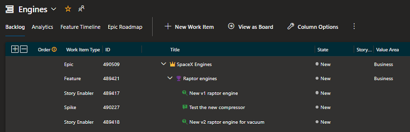 

Looking at their backlog we see the two Raptor engine Story Enablers (489417, 489418) dependencies and a Spike. They could use [Tags](https://docs.microsoft.com/en-us/azure/devops/boards/queries/add-tags-to-work-items?view=azure-devops) to create visual cues that two of the work items are dependencies, or they too could consider a custom Dependency work item type.

> 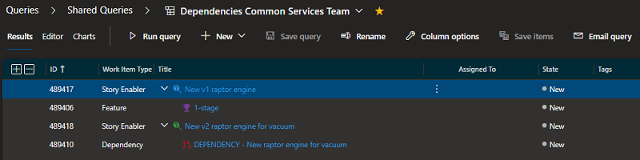 

Using a similar WIQL query as the delivery team 2, as above, the Engines team visualize and manage their dependencies.

> 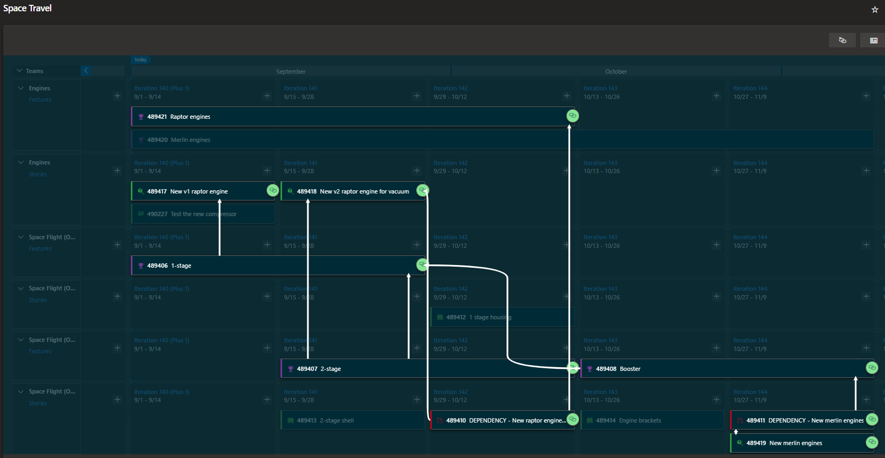 

Last, but not least the team uses a [Delivery Plan](https://docs.microsoft.com/en-us/azure/devops/boards/plans/add-edit-delivery-plan?view=azure-devops) to visualize their Feature and Requirement backlogs, as well as those of the teams they serve. The Delivery Plan provides provide an interactive visual view of multiple team backlogs and the dependencies.

>
> **IMPORTANT** - The Delivery Plan only draws a dependency line for dependencies which has both the successor and predecessor cards visually shown on the plan.
>

Other extensions to consider include the [@Scale](https://marketplace.visualstudio.com/items?itemName=solidify.solidify-scale) extension, which delivers a program board on steroids.

---

# Summary of recommended approach

Personally I prefer how the **Delivery Team 1 - Using Dependency Query** defines their dependencies. Here is a high-altitude overview of their process:

1. Delivery team identifies a dependency X (Merlin engine) in feature A (booster).
2. Delivery team opens feature A and runs dependency [one-click](https://marketplace.visualstudio.com/items?itemName=mohitbagra.witoneclickactions).
   - Merlin engine is the **predecessor** (must be done first)
   - Booster is the **successor** (must be done after Merlin engine)
3. One-click create work item X
   - Adds **parent-child** to Feature (parent) 
   - Adds **successor/predecessor** link to Feature (successor)
4. Team collaborates with common services **Engines** team to define the WHAT, WHY, and WHEN in X.
5. When common services team is ready to commit, they pull the work item X to their backlog.
6. Common services optionally changes work item to be parented to one of their Features.
   - At this time the work item X vanishes off the backlog as a work item on delivery side.

Everyone then uses the dependency queries we covered herein, and/or [@Scale](https://marketplace.visualstudio.com/items?itemName=solidify.solidify-scale), and/or [Delivery Plan](https://docs.microsoft.com/en-us/azure/devops/boards/plans/add-edit-delivery-plan?view=azure-devops), and/or [Dependency Tracker](https://marketplace.visualstudio.com/items?itemName=ms-eswm.dependencytracker) to visualize extension.

How are you dealing with dependencies in Azure DevOps? 

