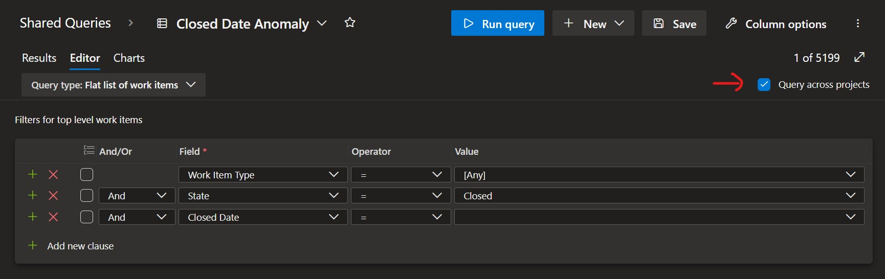
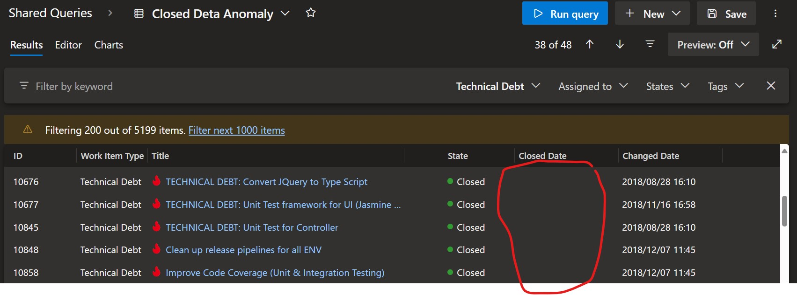

Title: Why is the Closed Date field empty in my work items?
Date: 2024-11-20
Category: Posts 
Tags: azure-devops
Slug: azure-devops-empty-closed-date-field
Author: Willy-Peter Schaub
Summary: More importantly, what is the issue and how do we resolve it?

If you notice that the Closed Date field is empty in some closed Azure DevOps work items or want to ensure your Azure DevOps backlog is accurate, run this query in your Azure DevOps organization to get a complete picture: 

> _Closed data anomaly query ._
>
> 

> 
>
> Select the ```Query across projects``` option to do a complete sweep of your Azure DevOps organization. If your query returns over 20K work items, divide it and run it project by project in Azure DevOps.
>

We encountered challenges in troubleshooting some of our tracking reports and determined that while the reports were accurate, the source data from Azure DevOps work items was problematic. Upon running the query in our environment, we identified a stunning 5199 work items lacking crucial data.

> _Closed data anomaly query showing empty closed date fields._
>
> 

Recognizing this as a product issue, we submitted an Azure Support Ticket (#2410160040016196). Microsoft acknowledged a bug in Azure DevOps that failed to add the Closed Date to the work item template for custom work item types by default years ago. 

The solution involves adding the Closed Date field and subsequently hiding it from the work item layout. However, work items closed prior to applying this fix lack a Closed Date value.

Regrettably, Microsoft did not provide a public script to address this issue. Therefore, if you require a custom script to update previously closed work items, please await the second part of this work item, which is currently being developed by my colleague, Daniel Broderick.

