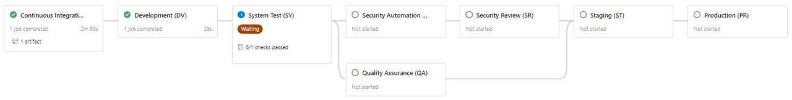
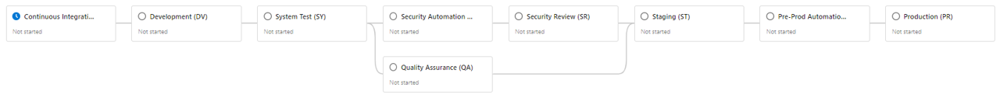

Title: Azure DevOps Pipeline OSS v2.1 Flow 
Date: 2023-02-22
Category: Posts 
Tags: azure-devops, oss, pipelines
Slug: azure-devops-pipeline-oss-v2-1-flow
Author: Willy-Peter Schaub
Summary: Two pull requests with pipeline updates for your perusal. 

We recently enhanced our in-house Azure Pipelines v2 application-type blueprints. Although we deemed the latest blueprint as too WorkSafeBC specific and therefore have not published it, we posted two pull requests with an update to the git-tools-git-version.yml template, [PR#13](https://github.com/WorkSafeBC-Common-Engineering/AzureDevOps.Automation.Pipeline.Templates.v2/pull/13), and an update to the overall pipeline workflow, [PR#14](https://github.com/WorkSafeBC-Common-Engineering/AzureDevOps.Automation.Pipeline.Templates.v2/pull/14).

---

# Path Version Variable

The change in the git-tools-git-version.yml template is subtle. By adding line ```83``` we create and set both the ```semVersion``` and the ```patchVersion``` variable.

```
81  - powershell: |
82      Write-Host "##vso[task.setvariable variable=semVersion;isOutput=true]$(GitVersion.MajorMinorPatch)"
83      Write-Host "##vso[task.setvariable variable=patchVersion;isOutput=true]$(GitVersion.Patch)"
```

Refer to [Pull Request 13](https://github.com/WorkSafeBC-Common-Engineering/AzureDevOps.Automation.Pipeline.Templates.v2/pull/13) for details.

>
> ALSO SEE:
>
> - [How to share variables amongst Azure Pipeline agents](https://wsbctechnicalblog.github.io/sharing-variables-amongst-agents.html)
> - [Gotchas when sharing variables with Azure DevOps stages and jobs](https://wsbctechnicalblog.github.io/sharing-variables-with-stages-and-jobs.html)
>

---

# Pre-Production Automation Stage

With the v2 blueprints we introduced the ```Quality Assurance Automation``` and ```Security Automation``` stages, allowing you to run quality assurance automation after deploying to development or system test environment, as well as security automation before triggering a security review.

> v2 pipeline flow
>
> 

As per [discussion with 604Kev](https://github.com/orgs/WorkSafeBC-Common-Engineering/discussions/4#discussioncomment-5002914) we introduced a pre-production automation stage, allowing you to perform trivial tasks before deploying to production environments, such as:

- Notifying release management
- Creating work items of Azure Boards for tracking
- Telemetry

> v2.1 pipeline flow
>
> 

Refer to [Pull Request 14](https://github.com/WorkSafeBC-Common-Engineering/AzureDevOps.Automation.Pipeline.Templates.v2/pull/14) for details.

Hope you like the improvements. Next up is a Cloud Native Web Application blueprint.

