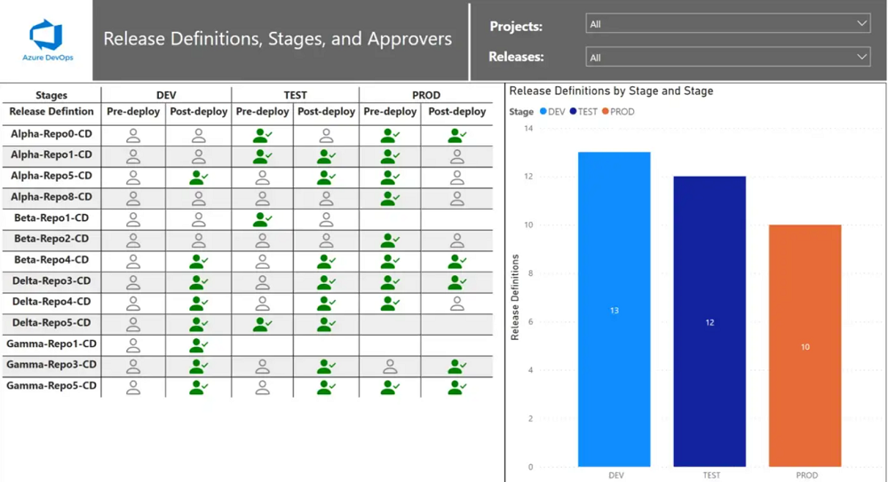
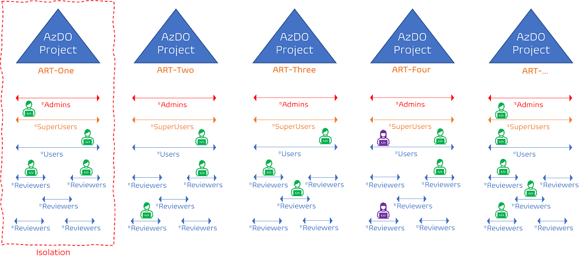
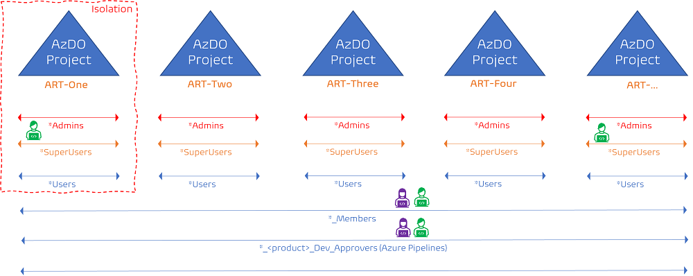

Title: Azure Devops simplicity to rule them all
Date: 2023-02-03
Category: Posts 
Tags: azure-devops,eliminate-waste
Slug: azure-devops-simplicity-to-rule-them-all
Author: Willy-Peter Schaub
Summary: Keep Azure DevOps setup simple and avoid a lot of pain and waste!

It is seldom that you have an opportunity to plan and deploy your engineering process using [Azure DevOps](https://azure.microsoft.com/en-us/products/devops/) from the ground up - a greenfield deployment not previously polluted by snowflakes (variations of the same) and custom development (everyone has a preference). If you do, I have two recommendations:

1. Keep it **simple**.
2. Create **one** Azure DevOps Project to rule them all.

Which reminds me of [Donovan Brown's](https://devblogs.microsoft.com/devops/what-is-devops-donovan/) infamous definition of DevOps "_DevOps is the union of people, process, and products to enable continuous delivery of value to our end users_", and his iconic statement "_You cannot buy DevOps and install it._" I even created laptop stickers for his DevOps definition, as it is crisp and balances my belief in the value of DevOps. Unfortunately, Microsoft renamed their product to Azure DevOps, making the argument of his iconic statement a real challenge to uphold.

This post, however, is based on learning lessons the hard way and preparing a brownfield that had years of development based on autonomy over guardrails and storms of snowflakes. It took us a year of hard work, amazing innovations, and grit …

---

# Simplicity and consistency over Snowflakes!

It does not take long to realize that supporting thousands of CI/CD [Azure Pipelines](https://learn.microsoft.com/en-us/azure/devops/pipelines/?view=azure-devops), [azure Repos](https://learn.microsoft.com/en-us/azure/devops/REPOS/?view=azure-devops), and [Azure Artifacts](https://learn.microsoft.com/en-us/azure/devops/ARTIFACTS/?view=azure-devops) that have drifted from each other is neither sustainable, nor cost effective. We had some bright engineers create pipelines running steps in parallel, using a platter of custom extensions, and scripts that makes any engineer’s heart rate shoot through the roof with excitement. Until the engineer leaves the organization and another engineer has the responsibility of maintaining the artwork and deal with a hotfix at the same time. Multiply this by a hundred to a thousand fold and you quickly realize complexity, cost, and un-maintainability of a technology **waste**, that is supposed to empower the engineers to deliver continuous value.

We invested in creating the pillars for **guardrails**, **automation**, **consistency**, and **self-service automation**. See these posts for more details:

- [Can government agencies be innovative?](https://wsbctechnicalblog.github.io/can-government-agencies-be-innovative.html)
- [https://wsbctechnicalblog.github.io/governance-manifestos-guardrails.html](https://wsbctechnicalblog.github.io/governance-manifestos-guardrails.html)
- [Our open-source pipeline blueprints have landed!](https://wsbctechnicalblog.github.io/our-open-source-pipeline-blueprints-have-landed.html)
- [https://wsbctechnicalblog.github.io/yaml-pipelines-part9.html](https://wsbctechnicalblog.github.io/yaml-pipelines-part9.html)

---

# Lean on out-of-the-box features

Whenever a user requests a new custom extension to be installed from [Azure DevOps Marketplace)https://marketplace.visualstudio.com/azuredevops/), make sure you ask the five (5) WHYs! 

While it is fun and exciting to watch a delighted end-user, you will soon receive little patience and understanding when the  users have an issue with the extension or are looking for new features. Worst of all, if an extension is deprecated or a vulnerability is detected by security, there is very little of support and service level agreements you can rely on with **free** extensions.

Keeping it simple and relying on out-of-the-box service features, keeps the feature and maintenance under control. If you must invest in an extension, I recommend that you:

Pick extensions with:

> 

-	The **verified domain** and the **top publisher** validations - they imply commitment through exemplary policies, quality, reliability, and support.
-	A high number of **installs**.
-	A high average rating (**stars**), Q&A, and Ratings & Reviews that give you a warm and fuzzy feeling.

Remember, once an extension is installed, it quickly becomes a critical feature of your user’s processes, making it difficult to reverse or exchange.

---

# Governance Reporting is a must

It is important that you can monitor and audit your engineering process for consistency, standardization, adherence to guardrails and standards, and identify when configurations start drifting apart. 

We invested in a platter of automated reporting, via the [Azure DevOps REST API](https://learn.microsoft.com/en-us/rest/api/azure/devops/?view=azure-devops-rest-7.1), and have also embraces the phenomenal work done by [Vinicius Moura]( https://twitter.com/vinijmoura) with his [Azure-DevOps](https://github.com/vinijmoura/Azure-DevOps) open source project on GitHub.

> _List all Release Definitions, Stages, and Approvers on Classic Releases in Azure DevOps_
>  

Not only are we able to answer most questions from internal audits in seconds, we are able to continuously observe the health of our engineering process and get a nudge when things are about to drift off the rails.

---

# One project to rule them all!

I will keep this section very short and refer you to the excellent [One Team Project to rule them all](https://nkdagility.com/blog/one-team-project/) post by [Martin Hinshelwood](https://nkdagility.com/).

Again, I wish that Microsoft had not called it a Team Project, as it has resulted in years of confusion and migraines. As Martin correctly emphasizes in his blog a Team Project cannot be equated to a Visual Studio Project, a software, or whatever project. Project <> project! 

If only I had a dollar for every wasteFUL discussion that goes:

- User: "_Please create me a new Azure DevOps Project._"
- **WHY?**
- User: "_We are starting a new project._"
- **WHY** can we not just create a new Team for you in our mainstream Azure DevOps Team Project?
- User: "_We feel that we need a new project, not a new team?_"
- **WHY?**
- User: "_Because we are starting a new project._"
- ...

After 5-years of pushing for a "one project to rule them all" we are now staring at multiple Azure DevOps Team projects that have drifted apart from each other, making it sheer impossible to consolidate all Azure Repositories and Azure Pipelines, while maintaining all the history mandated by policies.

Avoid the pain and start with "**one project to rule them all!**"

---

# Use Active Directory (AD) groups to authorize users

Another hard lesson we learnt over time:

- Use **Active Directory (AD)** groups to authorize users.
- Keep your security model **simple** and number of AD groups **low**.
- **Delegate** the auditing and membership management of AD groups.
- **Automate** the creation of AD groups and adding and removing of user memberships.

When you are dealing with multiple Azure DevOps Team projects, you may end up with a security model like the following.

>  

If you are the **green** engineer, you will **hate** the Azure DevOps powered engineering process. It is complex and anything but user-friendly and empowering - and no fault of Azure DevOps!

One of our working groups invested well-spent time to understand our security model and come up with a **simpler** and **user-friendly** security model. It still defines AD groups per Azure DevOps Team project for AD groups providing **administrative** and **elevated** permissions to enforce the least-privilege policy, but introduces other AD groups that span all of the Azure DevOps Team Projects that should be **one"".

>  

Now if we had "one team project to rule them all" we would have started with the same security model from the start.

---

Hopefully this post gives you a few pointers to mull over, to help you transform your Azure DevOps powered engineering process, and avoid a lot of the **WASTE** and **challenges** we endured over the past few years.

I am excited our state of the engineering process. **Watch the space**, as we shine the light on upcoming innovations, new and better ways to innovate, and empower our engineers through service excellence. 

