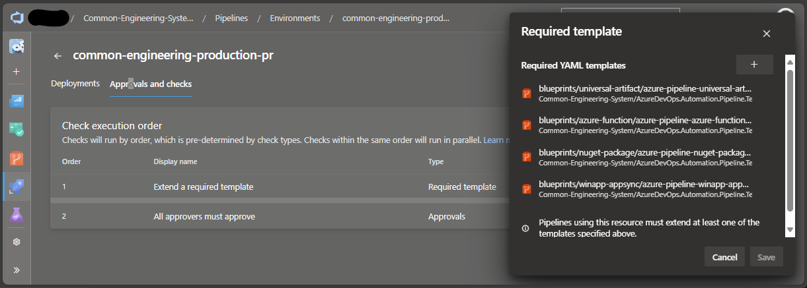

Title: Azure DevOps Pipeline Blueprints - Exploring the start template
Date: 2025-01-10
Category: Posts
Tags: azure-devops, pipelines, engineering
Slug: azure-pipeline-blueprints-explore-start
Author: Willy-Peter Schaub
Summary: Drilling Deeper: A Closer Look at the Blueprint Start Template.

I have decided to dive into our Azure Pipeline blueprints, explore the nitty gritty, and highlight a few nuggets for discussion. Today, we will start with the Start Template, focusing on the [blueprints/__101__/azure-pipeline-__101__-start.yml](https://github.com/WorkSafeBC-Common-Engineering/AzureDevOps.Automation.Pipeline.Templates.v2/blob/master/blueprints/__101__/azure-pipeline-__101__-start.yml) file in our open-source [AzureDevOps.Automation.Pipeline.Templates.v2](https://github.com/WorkSafeBC-Common-Engineering/AzureDevOps.Automation.Pipeline.Templates.v2) repo. I will also pose a few questions for my team to consider as we review and refine our approach.

> 

Also refer to our [Pipelines - Why bother and what are our nightmares and options?](/why-pipelines-part1.html) blog series for more details.

---

# Today's topic - *-start.yml

This template serves as the entry point for our application-type blueprints and is the only template engineers need to kick off their YAML-based Azure Pipelines. The ```*-start.yml``` template marks the beginning of the continuous integration and delivery process, seamlessly passing control to the ```*-control.yml``` template using the **extends** keyword.

```
# --------------------------------------------------------------------------
# WorkSafeBC Multi-Stage Blueprint-Based Pipeline Design Practice
# --------------------------------------------------------------------------
# See https://aka.ms/yaml for Azure DevOps Pipeline documentation
#
# __101__ Blueprint
# --------------------------------------------------------------------------
# HOW TO USE
#   - Name file azure-pipeline-__TODO_PORTFOLIO__-__TODO_PRODUCT__-__101__-start.yml
#   - Copy file to 'pipelines/' under the root folder of your repo
#   - Look for TODO and update / fine-tune as needed
#   - In AzureDevOps.Automation.Pipeline.Configuration.v2 repo, configure
#     your associated /deploy/__TODO_PORTFOLIO__-__TODO_PRODUCT__-config.yml
#     configuration file.
# --------------------------------------------------------------------------

trigger:
  batch: true
  branches:
    include:
    - refs/heads/release/*
  paths:
    include:
    # TODO: Replace __token__ and remove this comment
    - /__TODO_FOLDERNAME__ 
    exclude:
    - ReadMe.md     # Excluding changes to the Readme.me file (case dependent?)
    - README.md
    - readme.md
    
resources:
  repositories:
  - repository: CeBlueprints
    type:       git
    name:       '__TODO_INSERT_AZURE_DEVOPS_NAME_HERE__/AzureDevOps.Automation.Pipeline.Templates.v2'

extends:
  template: blueprints/__101__/azure-pipeline-__101__-control.yml@CeBlueprints
  parameters:
    portfolioName:   '__TODO_PORTFOLIO__'
    productName:     '__TODO_PRODUCT__'
    publishFolder:   '__TODO_FOLDERNAME__'
    suppressCD:      true # Allow engineering to do an immediate CI/build while CD is being configured
```

---

# Drill-down

In our template the ```resources:``` keyword defines external dependencies that your pipeline requires to run. These can be repositories, pipelines, containers, or other services. The resources section allows your pipeline to pull artifacts, access shared code, trigger based on other pipelines, and more. In our case, we are pulling YAML templates making up our blueprints from the AzureDevOps.Automation.Pipeline.Templates.v2 Azure Repo - we often refer to it as **pipeline-as-code**.

The ```extends:``` keyword allows us to reuse and inherit configurations from another template, aka the ```*-control.yml``` template, which we will explore on another day. It simplifies our pipeline by pulling in predefined logic from a shared template and extending it with our application-type blueprints. Think of it as template inheritance.

Today's **nugget** is the ```extends:``` keyword, which also enables us to configure one or more required template in our Azure Pipelines that must be included and executed as part of the pipeline to enforce organizational policies, governance, or security standards. These templates are configured, as shown below, by Azure DevOps administrators to ensure that certain steps, checks, or validations cannot be bypassed by individual teams or pipeline authors.



We use required templates to:

- Enforce security scanning
- Apply testing and quality checks
- Standardize build and release processes
- Ensure artifact management and deployment approvals

>
> 
>
> When using trusted templates in Azure Pipeline environments, you must refer to your extends template with the ```resources:``` feature, regardless of whether it is in the same or a different Azure Repo. Alternatively, Azure DevOps will fail you with the ```Required template XYZ Failed.```
>

---

# Questions

### For my team

- Q1: Should the branches not include ```refs/heads/release/*``` as well?

### For you

- Q2: Interested to review a pipeline cookbook?

We are working on a cookbook as an essential guide to Continuous Integration and Continuous Delivery (CI/CD) demystifies Azure Pipelines with actionable insights and our [AzureDevOps.Automation.Pipeline.Templates.v2](https://github.com/WorkSafeBC-Common-Engineering/AzureDevOps.Automation.Pipeline.Templates.v2) blueprints. From foundational principles to advanced engineering practices, it equips teams to transform their workflows with automation, Infrastructure as Code (IaC), and self-service tools. It has been written with gratitude to contributors and collaborators, this cookbook offers the knowledge you need to master CI/CD and redefine how software is built and delivered.

>  

---

Any questions or suggested improvements?
