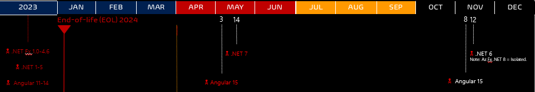

Title: Azure DevOps Pipeline Blueprints - Open Source Software Sync 20240318
Date: 2024-03-22
Category: Posts
Tags: azure-devops, pipelines, engineering
Slug: azure-pipeline-blueprints-oss-sync-20240318
Author: Willy-Peter Schaub
Summary: “_Constantly think about how you could be doing things better._” - Elon Musk.

We decided to align our internal blueprint updates with the cutting-edge templates provided by [WorkSafeBC-Common-Engineering](https://github.com/WorkSafeBC-Common-Engineering), an open-source project. This synchronization guarantees that you are always equipped with the most up-to-date enhancements and innovations from our team. Below is an overview of all the recent modifications.

---

# Drop Samples

Sharing the samples we inject into our [Azure Repos](https://azure.microsoft.com/en-us/products/devops/repos/) as part of our self-service automation has been linked with our blueprint efforts. However, it has become evident that this initiative has received minimal attention, provided limited value, and diverted our focus away from blueprint innovations. Consequently, I have taken the decisive step to remove these samples from our open-source repositories:

- AzureDevOps.Automation.Pipeline.Sample.universal-artifact
- AzureDevOps.Automation.Pipeline.Sample.generic-multiple-jobs
- AzureDevOps.Automation.Pipeline.Sample.generic-single-job
- AzureDevOps.Automation.Pipeline.Sample.azure-function
- AzureDevOps.Automation.Pipeline.Sample.nuget-package

If you need them, ping me!

---

# .NET 8

> End-of-life (EOL) Roadmap
>
> 

Anticipating the impending end of support for .NET 6 in November, we have taken proactive measures to elevate our open-source and internal blueprints to the latest version of .Net 8 by default, but will support .Net 6 as an option.

---

# Simplifications

We have aligned all our blueprints with the [Navigating Azure DevOps Complexity: Harnessing Objects to Simplify YAML Template Parameter Management](/azure-pipeline-yaml-refactor-parameter-objects.html) improvements and simplifications, which affected the following blueprints:

- [azure-function](https://github.com/WorkSafeBC-Common-Engineering/AzureDevOps.Automation.Pipeline.Templates.v2/tree/master/blueprints/azure-function)
- [nuget-package](https://github.com/WorkSafeBC-Common-Engineering/AzureDevOps.Automation.Pipeline.Templates.v2/tree/master/blueprints/nuget-package)

... as well as the following templates:

- [generic-multiple-jobs](https://github.com/WorkSafeBC-Common-Engineering/AzureDevOps.Automation.Pipeline.Templates.v2/tree/master/blueprints/generic-multiple-jobs)
- [generic-simple-jobs](https://github.com/WorkSafeBC-Common-Engineering/AzureDevOps.Automation.Pipeline.Templates.v2/tree/master/blueprints/generic-single-job)

---

What else can/should/must we consider as part of our blueprints? Thoughts?
