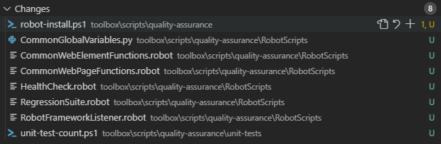
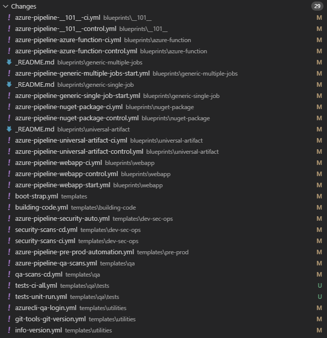

Title: Azure DevOps Pipeline Blueprints - Open Source Software Sync 20250105
Date: 2025-01-07
Category: Posts
Tags: azure-devops, pipelines, engineering
Slug: azure-pipeline-blueprints-oss-sync-2025-01-05
Author: Willy-Peter Schaub
Summary: Refresh the toolbox and templates with 2024 enhancements.

We have focused on improving our open-source [v2 CI/CD app blueprints](https://github.com/WorkSafeBC-Common-Engineering/AzureDevOps.Automation.Pipeline.Templates.v2) and the associated [v2 toolbox](https://github.com/WorkSafeBC-Common-Engineering/AzureDevOps.Automation.Pipeline.Toolbox.v2).

# TOOLBOX

The toolbox has been cleaned up, and new scripts have been added to simplify installing quality assurance tools and querying Azure Pipelines for tests. 

Here is a snippet of one of the new scripts the toolbox which checks whether any tests have been detected:

```
<#
    .DESCRIPTION
        Script to get the test count for a build pipeline and store it in a variable
        ref: https://learn.microsoft.com/en-us/rest/api/azure/devops/testresults/resultdetailsbybuild/get?view=azure-devops-rest-7.2
    .PARAMETER PAT
        Personal Access Token (PAT) for the Azure DevOps account
#>

[CmdletBinding()]
param(
    [Parameter(Mandatory = $true)]
    [string]$PAT
)

$project = $env:SYSTEM_TEAMPROJECT
$buildId = $env:BUILD_BUILDID
$organization = "__TODO_INSERT_AZDO_ORG_NAME__"
$apiVersion = "7.2-preview.1"

Write-Host "Project: $project BuildId: $buildId Token Length: $($PAT.Length)"

try {

    $BasicAuthEncode = [System.Convert]::ToBase64String([System.Text.Encoding]::ASCII.GetBytes(":$($PAT)"))
    $AuthHeader = @{ "Authorization" = "Basic $BasicAuthEncode" }
    $buildPipelineTestResultsUrl = "https://vstmr.dev.azure.com/$organization/$project/_apis/testresults/resultsbybuild?buildId=$buildId&api-version=$apiVersion"
    Write-Host $buildPipelineTestResultsUrl
    $buildPipelineTestResults = Invoke-RestMethod -Uri $buildPipelineTestResultsUrl `
                                    -Headers $AuthHeader `
                                    -Method 'Get'  `
                                    -ContentType 'application/json'

    $buildPipelineTestCount = $buildPipelineTestResults.count
    Write-Host "##vso[task.setvariable variable=unitTestCount;isOutput=true]$buildPipelineTestCount"
    Write-Host "Total Tests: $($buildPipelineTestResults.count)"
}
catch {
    $apiCallError = -1
    Write-Host "##vso[task.complete result=SucceededWithIssues;]Task completed with issues"
    Write-Host "##vso[task.setvariable variable=unitTestCount;isOutput=true]$apiCallError"
    Write-Host "Error: $($_.Exception.Message)"
}
```

# WHY?

We are currently ensuring that tests run. Next, we will focus on enforcing successful and comprehensive test execution. Stay tuned for updates!

Changes:

> 

>
> 
>
> As part of this sync, I noticed that the Robot files do not adhere to our lower-case-kebab naming guidelines. We will publish a bug-fix update shortly.
> 

---

# TEMPLATES

The templates have undergone significant cleanup and enhancements, addressing a broad list of improvements:

- **Removed Application Insights logging** - While a cool concept, it remained unused and incurred unnecessary costs.
- **Enabled modeElite** - We have switched from false to true — signaling our commitment to higher quality standards.
- **Added unit test enforcement** - The pipeline now checks for unit tests and will fail if none are detected, reinforcing our focus on test coverage.
- **Enhanced version-info template** - Version details are now stored as a pipeline artifact for future reference, improving traceability.
- **Updated deprecated Azure Pipeline tasks** - We have replaced tasks marked for retirement to ensure long-term maintainability.

Here is a snippet of the updated info-version template:

```
# --------------------------------------------------------------------------
# info-version Template
# --------------------------------------------------------------------------
# See https://aka.ms/yaml for Azure DevOps Pipeline documentation
# 
# --------------------------------------------------------------------------

parameters:
# mandatory parameters
- name:     modeElite
  type:     boolean
- name:     applicationBlueprint
  type:     string
- name:     applicationType
  type:     string
# default parameters
- name:     vGuid
  type:     string
  default:  '__TODO_ADD_UNIQUE_GUID__HERE__'
- name:     vVersion
  type:     string
  default:  '2.0'
  
steps:
    - script: echo "${{parameters.modeElite}}:${{parameters.applicationBlueprint}}:${{parameters.applicationType}}:${{parameters.vGuid}}:${{parameters.vVersion}}
      name:         BootstrapInfo
      displayName:  Bootstrap Info
    - task: PowerShell@2
      inputs:
        targetType: 'inline'
        script: |
          Write-Host "##vso[task.setvariable variable=bootStrapModeElite;isOutput=true]${{parameters.modeElite}}"
          Write-Host "##vso[task.setvariable variable=bootStrapBlueprint;isOutput=true]${{parameters.applicationBlueprint}}"
          Write-Host "##vso[task.setvariable variable=bootStrapType;isOutput=true]${{parameters.applicationType}}"
          Write-Host "##vso[task.setvariable variable=bootStrapGuid;isOutput=true]${{parameters.vGuid}}"
          Write-Host "##vso[task.setvariable variable=bootStrapVersion;isOutput=true]${{parameters.vVersion}}"
        failOnStderr: true
        pwsh: true
      name:         BootstrapVars
      displayName:  Bootstrap Vars

# --------------------------------------------------------------------------
# Generate pipeline info and save it to a JSON file
# --------------------------------------------------------------------------
    - task: PowerShell@2
      displayName:  Bootstrap generate pipeline info
      inputs:
        targetType: 'inline'
        pwsh: true
        script: |
          $variablesData = [PSCustomObject]@{
              bootStrapModeElite = "${{parameters.modeElite}}"
              bootStrapBlueprint = "${{parameters.applicationBlueprint}}"
              bootStrapType = "${{parameters.applicationType}}"
              bootStrapGuid = "${{parameters.vGuid}}"
              bootStrapVersion = "${{parameters.vVersion}}"
          }

          $json = $variablesData | ConvertTo-Json
          $jsonFilePath = "$(Agent.TempDirectory)/pipe-info.json"
          $json | Out-File -FilePath $jsonFilePath
          Write-Host "JSON file saved to $jsonFilePath"
          
    # Publish pipeline info
    - task: PublishBuildArtifacts@1
      displayName: Bootstrap publish pipeline info
      inputs:
        PathtoPublish: "$(Agent.TempDirectory)/pipe-info.json"
        ArtifactName: 'pipe-info'
```

# WHY?

As mentioned earlier, we are fully committed to quality, driven by our common engineering processes and Azure Pipeline templates. We continue to embrace innovative approaches to improve and empower our engineering teams. In a future update, we plan to transition from using Azure Pipeline tasks to YAML commands, simplifying version tracking and management.

Changes:

> 

---

What else can/should/must we consider as part of our blueprints? Thoughts?
