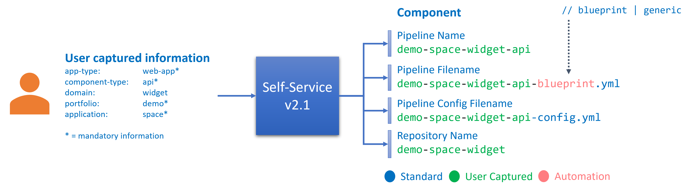
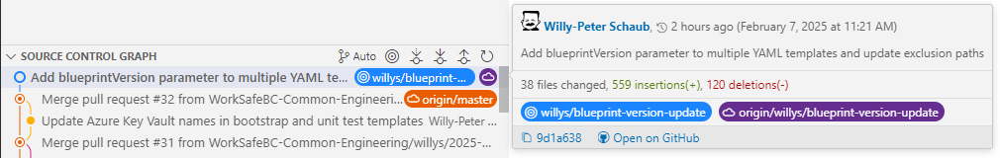

Title: Azure DevOps Pipeline Blueprints - Open Source Software Sync 20250207
Date: 2025-02-057
Category: Posts
Tags: azure-devops, pipelines, engineering
Slug: azure-pipeline-blueprints-oss-sync-2025-02-07
Author: Willy-Peter Schaub
Summary: Latest version and versioning of v2.1.0 templates.

We have focused on improving our self-service, which required us to finally introduce versioning for the [v2 CI/CD app blueprints](https://github.com/WorkSafeBC-Common-Engineering/AzureDevOps.Automation.Pipeline.Templates.v2) in v2.1.0.

# SELF-SERVICE

Our self-service process for paved roads, starting with a new Azure Repo (Git) simplifies setup by automatically adding a ```Hello World``` sample, an app-type-specific v2 CI/CD blueprint file, the configuration file, and triggering the Azure Pipeline to validate the setup.  We found a limitation with the configuration file being ```<portfolio>-<application>-config.yml```, restricting each repository to one domain and component type. This meant building a web app and its API required two repositories. 

The self-service automation logic could have implemented this update without altering the blueprints. However, we have also ensured that self-service creates kebab-style file names in accordance with our governance. The change involves switching from a dot to a dash. To maintain consistency and standardization, both old existing config files using dots and new config files using dashes will be supported. 

>
> v2.1.0 self-service flow
>
> 

To solve this, we added versioning to the v2 templates, allowing all components in one repository, as discussed below.

# BUT WAIT, What are Paved Roads?

```Paved Roads``` is a term we use to describe standardized and well-defined architectures, infrastructures, and CI/CD pipelines that act as foundational templates or blueprints for creating and deploying software solutions. These paved roads capture best practices, design patterns, and automation techniques that simplify the development process, reduce complexity, and ensure consistency across projects.

Just as paved roads provide a reliable and efficient transportation infrastructure for vehicles, paved roads in software development offer a structured path for engineers to follow. They include ```Architecture Blueprints```, ```Infrastructure Blueprints```, ```Security Blueprints```, and our v2 ```CI/CD Blueprints```.

> 

Our engineers have the option to choose from three distinct paths:

- **Paved Roads** - Follow well-established, reliable blueprints designed for efficiency and dependability.
- **Logging Roads** - Define new blueprints with an element of experimentation and innovation, while still adhering to some guidelines and flexibility.
- **Jungle** - Create disposable proof-of-concepts with unrestricted freedom, operating outside traditional constraints.

> 

This approach enables engineers to balance innovation and structure according to their specific needs.

# TEMPLATES

We introduced versioning because our templates are re-used by Azure DevOps during pipeline assembly at runtime. This allows us to support both v2.0.0 pipelines and their corresponding configuration files, as well as the enhanced v2.1.0 pipelines with updated configuration formats.

Rather than implementing versioning to support two distinct versions of the ```*-control-yml``` template, as outlined below, we chose to use conditinal expressions within the same set of templates and cascade the ```blueprintVersion``` from the ```*-start.yml``` template to all subsequent templates.

> Strategy 1 - Implement versioning with separate version templates

```
parameters:
  blueprintVersion: '2.1.0'

steps:
  - ${{ if eq(parameters.blueprintVersion, '2.0.0') }}:
      # Load v2.0.0 templates and config
      - template: v2.0.0/templates/demo-control.yml
        parameters:
          configFile: v2.0.0-demo-config.yml
  - ${{ if eq(parameters.blueprintVersion, '2.1.0') }}:
      # Load v2.1.0 templates and config
      - template: v2.1.0/templates/demo-control.yml
        parameters:
          configFile: v2.1.0-demo-config.yml
```

Below is the key code snippet from one of our ```*-control.yml``` templates that determines whether to load the old or the new format using conditional logic, ensuring backward compatibility while enabling enhanced functionality. 

> Strategy 2 (which we used) - Implement versioning with conditional logic in one and the same template

```
parameters:
- name:     blueprintVersion
  type:     string
  default:  2.0.0

# VARIABLES
variables:
- ${{ if and( ne(parameters.suppressCD, true), eq(parameters.blueprintVersion, '2.0.0') ) }}:
  - template: /deploy/${{ lower(parameters.portfolioName) }}.${{ lower(parameters.productName) }}-config.yml@self

- ${{ if and( ne(parameters.suppressCD, true), ge(parameters.blueprintVersion, '2.1.0') ) }}:
  - template: /deploy/${{ lower(parameters.portfolioName) }}-${{ lower(parameters.productName) }}-config.yml@self
```

I would not blame you for staring at the code, wondering why there is no apparent difference between versions 2.0.0 and 2.1.0. The distinction is subtle: it is the dash ```-``` instead of the dot ```.``` between the portfolio and product parameters 😉.

```
extends:
  template: blueprints/__101__/azure-pipeline-__101__-control.yml@CeBlueprints
  parameters:
    blueprintVersion:  '2.1.0'
    portfolioName:   '__TODO_PORTFOLIO__'
    productName:     '__TODO_PRODUCT__'
    publishFolder:   '__TODO_FOLDERNAME__'
    suppressCD:      true # Allow engineering to do an immediate CI/build while CD is being configured
```

We also had to update all the generic templates and the ```*-start.yml``` templates to pass the ```blueprintVersion``` to the ```boot-strap.yml``` and the ```*-control.yml``` templates respectively.

I did ask our AI wingman how to improve the code and got the following ... and I quote:

Your YAML snippet is concise and functional, but here are a few improvements to enhance clarity, maintainability, and readability:

Suggested Enhancements:

- **Add Contextual Comments**: Clearly explain each parameter's purpose to improve readability for someone unfamiliar with the template.
- **Provide Examples**: Where placeholders like __TODO__ are used, offer examples to make it clear how they should be replaced.
- **Align Indentation and Formatting**: Ensure consistent spacing for cleaner visuals.

... end quote.

I will share these suggestions with our engineers, but we are unlikely to incorporate these informational updates. Why? Our focus is on automating repetitive tasks — like creating repositories, pipelines, and replacing placeholder tokens — through self-service tools. Because of this, the stakeholders will rarely review this code and we prioritize conciseness and functionality over detailed readability.

Changes:

> 

>
> [Click here to view the associated Pull Request](https://github.com/WorkSafeBC-Common-Engineering/AzureDevOps.Automation.Pipeline.Templates.v2/pull/33)
>

---

What else can/should/must we consider as part of our blueprints? Thoughts?
