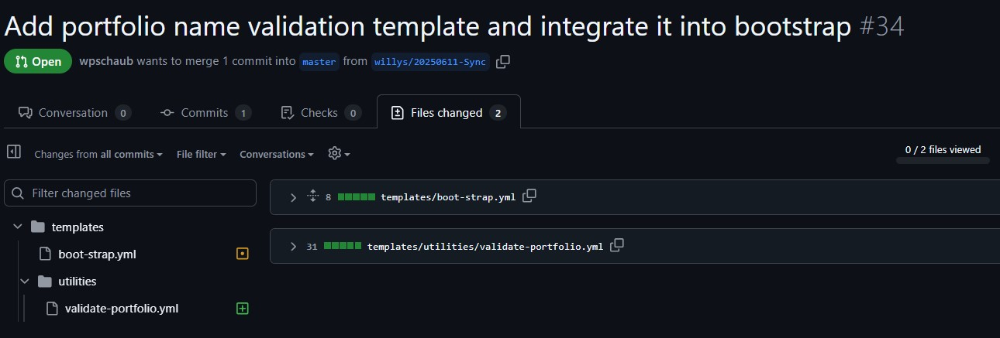

Title: Azure DevOps Pipeline Blueprints - Open Source Software Sync 20250613
Date: 2025-06-13
Category: Posts
Tags: azure-devops, pipelines, engineering
Slug: azure-pipeline-blueprints-oss-sync-2025-05-13
Author: Willy-Peter Schaub
Summary: Latest version and with small portfolio update.

We have confirmed there are no internal updates currently suitable for sharing with this community—rest assured, we are keeping a close watch. Behind the scenes, our focus has been on developing new app-type blueprints to expand coverage across our internal software development lifecycle. While these efforts are tailored for internal use and not directly applicable to the open-source project, they are driving meaningful progress.

One exciting enhancement: our bootstrap flow now validates the portfolio used by pipelines, A critical step forward for our self-service capabilities, as highlighted in our recent [Continuous Integration and Delivery Pipelines Cookbook](/announcement-ci-cd-cookbook.html). This improvement strengthens the foundation for scalable, autonomous development.

Changes:

> 

>
> [Click here to view the associated Pull Request](https://github.com/WorkSafeBC-Common-Engineering/AzureDevOps.Automation.Pipeline.Templates.v2/pull/34)
>

---

What else can/should/must we consider as part of our blueprints? Thoughts?
