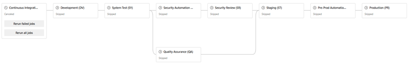
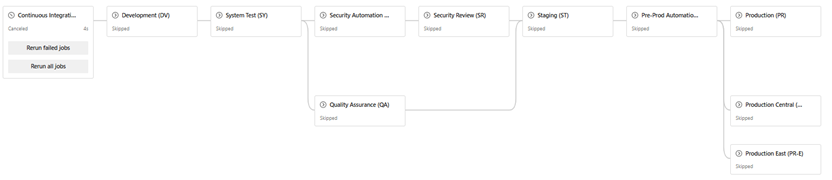
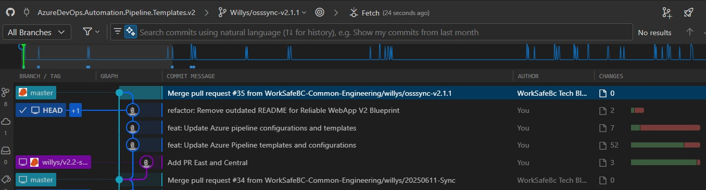

Title: Azure DevOps Pipeline Blueprints - Open Source Software Sync 20250919
Date: 2025-09-19
Category: Posts
Tags: azure-devops, pipelines, engineering
Slug: azure-pipeline-blueprints-oss-sync-2025-09-19
Author: Willy-Peter Schaub
Summary: v2.1.1 and a few Gems from our latest updates

We are excited to share a few standout improvements from our latest release, v2.1.1. These updates reflect our continued commitment to **excellence**, **resilience**, and thoughtful **innovation**.

- **Consistency Enhancements**: A platter of cleanups ensures greater consistency across the board—small refinements with big impact.
- **Hard-Earned Insights**: We have wrestled with YAML (fun, right?) and emerged with some valuable lessons. 
- **CD Pipeline Upgrade**: Our deployment flow now supports both Canada Central and Canada East regions, boosting resilience and laying the groundwork for our Blue/Green deployment strategy.

Curious about Blue/Green? Check out [VSTS - The Road to Continuous Delivery with Visual Studio Team Services](https://learn.microsoft.com/en-us/archive/msdn-magazine/2017/connect/vsts-the-road-to-continuous-delivery-with-visual-studio-team-services), a 2017 article that skims the concept and offers a solid foundation.

---

# Pipeline Flow Update

v2.1.0 Pipeline Flow, assuming all stages are enabled:

> 

v2.1.1 Pipeline Flow, assuming all stages are enabled:

> 

Those with eagle vision may have already noticed. We now support two additional production environments. This enhancement brings flexibility and resilience to our deployment strategy.

Of course, stage names are fully customizable, and each environment deploy stage in the pipeline flow can be enabled or disabled to suit your specific needs.

Looking ahead, I envision these three production stages evolving into a Prod-Blue and Prod-Green setup. This shift will unlock a host of exciting opportunities around zero-downtime deployments, rollback strategies, and traffic shaping—definitely a topic worthy of its own deep dive.

---

# Goodbye Complexity — Hello Clarity!

We are taking a decisive step forward by decommissioning the generic-multi-jobs template. It has now been moved to the zParked folder, so you can still access it if needed.

Over time, the misuse of this template, favoring multiple jobs over the simpler and more effective single-job generic template, has led to significant technical debt and unnecessary complexity. While the multi-job approach was a great idea in its time, it has unfortunately been overused in ways that did not align with its original purpose.

This change marks a shift toward simplicity, maintainability, and smarter template usage. Let us build from a position of strength and leave behind what no longer serves us.

---

# Hard-Earned Insights

**Conditional statements cannot be used in parameter lists**
At one point, both my brain and YAML’s seemed to implode. We hit a wall and ultimately decided to abandon the approach of trying to be fancy when defining parameters when including a template. Sometimes, work:life balance is best protected knowing when to pivot. Although ... I wonder if there is a solution.

The experience was not wasted though. It gave us clarity, reinforced our principles, and helped shape a better path forward, which is where DerekL comes in.

**Unknown variables result in run-time, not compile-time errors**
We encountered another tough nut to crack:

>
> _How can we introduce new configuration variables without breaking existing pipelines or disrupting stakeholder experience?_
>

The challenge with conditional statements forced us to pivot from our initial approach (which, admittedly, led to both my head and YAML’s imploding). Thankfully, my colleague DerekL, who we hope will start blogging soon to share his deep UI expertise, was working in parallel and came up with the following nifty solution that addressed the hurdle cleanly and effectively.

Here is some new code you will notice in all of the updated ```*-config.yml``` templates:

```
# Embedded non-negotiable stages ------------------------------------
securityReview:
    config:
    envName:                      ${{variables.securityReviewStageEnvName}}
    nameVM:                       ${{ coalesce(variables.securityReviewStageVmImage, 'ubuntu-latest') }}
    applicationBlueprint:         ${{parameters.applicationBlueprint}}
    blueprintVersion:             ${{parameters.blueprintVersion}}
    modeElite:                    ${{parameters.modeElite}}
securityAutomation:
    config:
    nameVM:                       ${{ coalesce(variables.securityAutomationStageVmImage, 'ubuntu-latest') }}
    applicationBlueprint:         ${{parameters.applicationBlueprint}}
    blueprintVersion:             ${{parameters.blueprintVersion}}
    modeElite:                    ${{parameters.modeElite}}
qaAutomation:
    config:
    nameVM:                       ${{ coalesce(variables.qaAutomationStageVmImage, 'ubuntu-latest') }}
    applicationBlueprint:         ${{parameters.applicationBlueprint}}
    blueprintVersion:             ${{parameters.blueprintVersion}}
    modeElite:                    ${{parameters.modeElite}}
preProdAutomation:
    config:
    nameVM:                       ${{ coalesce(variables.preProdAutomationStageVmImage, 'ubuntu-latest') }}
    applicationBlueprint:         ${{parameters.applicationBlueprint}}
    blueprintVersion:             ${{parameters.blueprintVersion}}
    modeElite:                    ${{parameters.modeElite}}
```

Notice the use of the ```coalesce``` function? It is a subtle but powerful move, allowing us to check whether a variable exists in the configuration file (as it will in future pipelines), while gracefully falling back to a default value for the thousands of pipelines created before v2.1.1 that have no awareness of the new variable.

This approach ensures backward compatibility without compromising forward momentum. A small tweak with a big impact😉. 

---

# Core Pillars

This upgrade was not just a technical lift. It was shaped by many thoughtful discussions, some easy, some tough. Through this collaborative effort, the core authors of the v2 blueprints aligned on a set of guiding principles to steer future updates with clarity and purpose.

**Core Principles**
The v2 blueprints are anchored in three foundational pillars:

- Consistency
- Simplicity
- Security

**CI/CD Pipeline Structure**

- CI and CD are distinct yet interconnected flows. Treat them as complementary—not interchangeable.
- To promote consistency, all new v2 blueprints will be based on standardized ```_101_``` blueprint templates.
- Shared logic and flows should be centralized in shared templates to reduce duplication and improve maintainability.

**Configuration Guidelines**

- All configuration should reside in the ```config.yml``` variable template to enhance transparency and discoverability.
- Azure and Azure DevOps configuration must be stored in config.yml for long-term maintainability.
- CI configuration must align with CD configuration, but neither should override the other. They should coexist with clearly defined boundaries.

**Looking Ahead**
One of our future aspirations is to standardize the ```cd.yml``` template. This will allow us to evolve and maintain CD pipeline flow logic in a single, unified location—streamlining updates and improving resilience.

---

Changes:

> 

>
> [Click here to view the associated Pull Request](https://github.com/wsbctechnicalblog/wsbctechnicalblog.github.io/pull/685)
>

---

For more insight and an in-depth journal of our open-source v2 blueprint adventure, see [Continuous Integration and Delivery Pipelines Cookbook](https://wsbctechnicalblog.github.io/announcement-ci-cd-cookbook.html).


---

What else can/should/must we consider as part of our blueprints? Thoughts?
