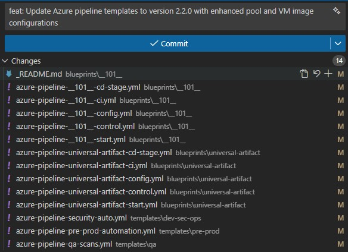

Title: Azure DevOps Pipeline Blueprints - Open Source Software Sync 20251223
Date: 2025-12-23
Category: Posts
Tags: azure-devops, pipelines, engineering
Slug: azure-pipeline-blueprints-oss-sync-2025-12-23
Author: Willy-Peter Schaub
Summary: v2.2.0 and a few Gems from our latest updates

We are excited to share more innovations and improvements from our latest release, v2.2.0. These updates reflect our continued commitment to **excellence**, **resilience**, and thoughtful **innovation**.

- **Consistency Enhancements**: A consistent way of configuring and calling agent pools and their virtual machines.
- **AI Insights**: Insight sinto using GitHub Copilot to help us with the innovations and alignment of all v2 blueprints.

---

# Config Template Update Example

```
- name:  developmentStagePool
  value: 'Azure Pipelines'
- name:  developmentStageVmImage
  value: 'ubuntu-latest'
```

---

# Control Template Updates Example

```
development:
    config:
    active:                       ${{variables.developmentStageActive}}
    envName:                      ${{variables.developmentStageEnvName}}
    namePool:                     ${{coalesce(variables.developmentStagePool, 'Azure Pipelines')}}
    nameVM:                       ${{coalesce(variables.developmentStageVmImage, 'ubuntu-latest')}}
```

---

# CD-Deploy Template Updates Example

```
variables:
  ${{ if ne(parameters.config.nameVM, '') }}:
    pool:
      name:      ${{parameters.config.namePool}}
      vmImage:   ${{parameters.config.nameVM}}
  ${{ else }}:
    pool:
      name:      ${{parameters.config.namePool}}
```

---

# Stage Template Updates Example

```
- stage:         ${{parameters.name}}
  displayName:   ${{parameters.displayName}}
  dependsOn:
  - ${{ each stage in parameters.dependsOn }}:
    - ${{stage}}
  ${{ if ne(coalesce(parameters.config.nameVM, ''), '') }}:
    pool:
      name:      ${{coalesce(parameters.config.poolName, 'Azure Pipelines')}}
      vmImage:   ${{parameters.config.nameVM}}
  ${{ else }}:
    pool:
      name:      ${{parameters.config.namePool}}
```

# Goodbye Mundane — Hello AI!

We used GitHub Copilot to help us with the v2.2 update, validation, and alignment with other blueprints. Checkout these two blog posts for more insight:

- [AI Assisted Development – Taming Azure Pipeline YAML](https://wsbctechnicalblog.github.io/ai-assisted-dev-taming-azdo-yaml.html)
- [AI Assisted Development – Taming Azure Pipeline YAML (Part2)](https://wsbctechnicalblog.github.io/ai-assisted-dev-taming-azdo-yaml-part-2.html)

---

Changes:

> 

>
> [Click here to view the associated Pull Request](https://github.com/wsbctechnicalblog/wsbctechnicalblog.github.io/pull/TBD)
>

---

For more insight and an in-depth journal of our open-source v2 blueprint adventure, see [Continuous Integration and Delivery Pipelines Cookbook](https://wsbctechnicalblog.github.io/announcement-ci-cd-cookbook.html).


---

What else can/should/must we consider as part of our blueprints? Thoughts?
