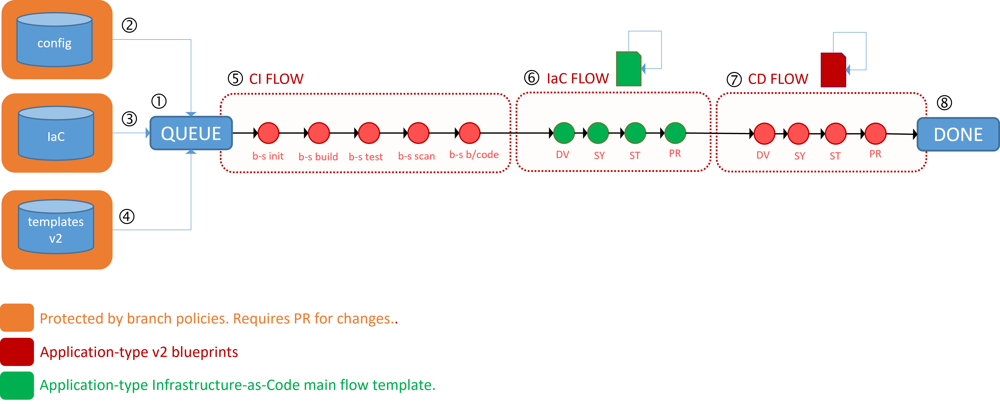

Title: Let us Elevate Our CI/IaC/CD Azure Pipeline Flow Together!
Date: 2023-09-19
Category: Posts
Tags: azure-devops, pipelines, engineering
Slug: azure-pipeline-iac-flow-decision
Author: Willy-Peter Schaub
Summary: Streamline Your Process: Isolating the Provision and Deployment Steps for Efficiency?

Continuing from our previous guide on [Navigating Azure DevOps Complexity: Harnessing Objects to Simplify YAML Template Parameter Management](/azure-pipeline-yaml-refactor-parameter-objects.html), we have now successfully wrapped up our latest Minimally Viable Product (MVP) 2. This milestone encompasses the implementation of infrastructure-as-code provisioning logic, illustrated below.

>  

We had a BINGO moment!

# Application-type recipes

Before I address my question, let me encapsulate the fundamental concept of our [WorkSafeBC Common Engineering v2 Blueprint](https://github.com/WorkSafeBC-Common-Engineering/AzureDevOps.Automation.Pipeline.Templates.v2)  pipelines:

1. When a team embarks on creating a solution, they simply choose the desired application type from our user-friendly self-service menu. After confirming a few essential details, they can initiate the process with a single click.
Our self-service chef swiftly generates an Azure Repository, adhering to our established naming conventions for consistency.
2. A sample of the selected application type is promptly uploaded to the repository, including essential common libraries like logging, ensuring standardized practices.
3. An Azure Pipeline is then configured, seamlessly integrated into the repository, and automatically triggered to complete the CI-only phase, ensuring an automated workflow and development environment.
4. As the Azure Pipeline is queued, it undergoes dynamic assembly using the application-type v2 blueprint templates, infusing a touch of magic while maintaining steadfast consistency.
5. Furthermore, a variable configuration template is introduced, imparting solution-specific variables to be seamlessly integrated as parameters - think of it as an all-YAML braai (barbeque), blending elements seamlessly.

This streamlined process exemplifies our commitment to efficiency, standardization, and automation in every facet of our pipeline workflows."

# So what is our MVP 2 all about?

Let us kick things off with MVP1, where our primary objective was to deliver a parameterized YAML-based template that seamlessly integrates into step 4 of the process outlined above. Our main concern was not the specific provisioning method, but rather ensuring that it adheres to YAML-based standards, is well-parameterized, and eliminates any wasteful hard-coding.

In MVP2, we successfully showcased the injection of this template into our v2 blueprints, with a specific focus on the development environment. Following some hours of dedicated effort in refining and fine-tuning MVP1, we proudly unveiled our inaugural CI+IaC+CD pipeline - the BINGO moment.

# Back to the question: Segregate or separate IaC from CD?

I will present two workflows: a separate and a segregated pipeline flow. The steps 1-5 remain consistent:

1. The pipeline is queued.
2. The solution-specific variable configuration template is introduced. We deliberately integrated the IaC and CD configurations into a single, unified template. This consolidation ensures that many components, which are commonly shared and reused by both IaC and CD, are seamlessly pulled from the config repository.
3. The infrastructure-as-code (IaC) template tailored to the application type is fetched from the IaC repository and seamlessly integrated into the pipeline.
4. The build/CI (continuous integration) and release/CD (continuous delivery) templates specific to the application type are sourced from the templates.v2 repository and seamlessly integrated into the pipeline.
5. The CI Flow initiates the application-type setup, compiles the solution, conducts thorough testing, and performs scans for vulnerabilities, ensuring adherence to high-quality coding practices.

> **GEM 1** 
> The configuration, infrastructure-as-code, and pipeline-as-code repositories are accessible by all engineers - transparency.
>
> **GEM 2**
> The repositories and associated policies allows our engineers to recommend configuration changes through a pull request, and our platform and enabling engineers (stewards) to validate the configuration changes.

Step 6 is the focal point of this post, where I introduce two distinct flow patterns, representing the core topic of discussion.

### Separated Flow

The infrastructure-as-code (IaC) and continuous delivery (CD) steps operate independently and are overseen by our application-type *control.yml template. Essentially, this template incorporates the IaC blueprint for every environment we intend to provision, ensuring all environments are set up before initiating the CD process

> 

**PROs**

- IaC and CD are logically and visually isolated from each other.
- IaC and CD Azure Pipelines environments can be defined in separate environments. 

**CONs**

- The visual representation of the runtime pipeline flow will be twice as long.
- The logic for determining which stages to run and which to ignore will be duplicated in both the *control.yml and *CD.yml templates. This introduces potential for duplication and drift

### Aggregated Flow

The infrastructure-as-code (IaC) and continuous delivery (CD) steps operate as one and are overseen by our application-type *CD.yml template. Essentially, we provision the environment, then deploy the solution to the environment in the same deployment job context.

>  

**PROs**

- The visual representation of the runtime pipeline flow will remain consistent.
- The logic for determining which stages to run and which to ignore will not be redundant.
- Azure Pipeline environments are recycled, minimizing duplication and streamlining administration efforts.
- The application-type *control.yml template maintains its simplicity.
- The application-type *CD.yml only requires one additional statement per environment: include IaC template.

**CONs**

- IaC and CD are not logically and visually isolated from each other. 

It is likely you have gathered that I am inclined towards the aggregated flow. What am I missing?

---

**Which of the two flow patterns do you favor, and what are your reasons?** Your input and candid feedback are highly valuable in shaping a CI/IaC/CD v2 blueprint grounded in the highest engineering standards.

