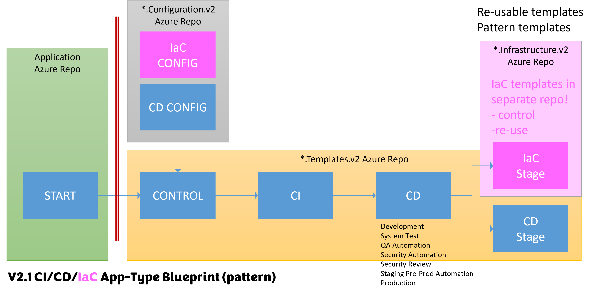

Title: Navigating Azure DevOps Complexity: Harnessing Objects to Simplify YAML Template Parameter Management
Date: 2023-08-23
Category: Posts
Tags: azure-devops, pipelines, engineering
Slug: azure-pipeline-yaml-refactor-parameter-objects
Author: Willy-Peter Schaub
Summary: Seizing the chance to enhance and optimize our CI/CD/IaC pipelines.

I understand that you may have been delving into our open-source endeavor, which revolves around Azure Pipelines for continuous integration and continuous delivery, employing YAML-based methodologies. If this initiative has not caught your attention yet, I highly recommend acquainting yourself with our  source project, focused on YAML-based continuous integratuion and continuous delivery Azure Pipelines. If not, you better explore our open-source [WorkSafeBC Common Engineering](https://github.com/WorkSafeBC-Common-Engineering/AzureDevOps.Automation.Pipeline.Templates.v2) project as a starting point.

For those who are new to this concept, I have compiled a selection of blog links that you might find valuable for a comprehensive understanding:
- [Part 1: Pipelines - Why bother and what are our nightmares and options?](https://wsbctechnicalblog.github.io/why-pipelines-part1.html)
- [Azure DevOps Pipeline OSS v2.1 Flow](https://wsbctechnicalblog.github.io/azure-devops-pipeline-oss-v2-1-flow.html)
- [Azure Pipelines Blueprint QA Integration](https://wsbctechnicalblog.github.io/azure-pipelines-blueprint-qa-integration.html)

---

# OK, why are we here?

Indeed, we are currently in the process of integrating infrastructure-as-code (IaC) into our v2 blueprints. This advancement entails the inclusion of a substantial number of parameters within our variable template files. As a consequence, a series of sleepless nights has ensued for our team. To provide a visual depiction, please refer to the illustration below, where the newly added components are represented in pink.

>  

If we have a quick look at the basic [101 sample variable template](https://github.com/WorkSafeBC-Common-Engineering/AzureDevOps.Automation.Pipeline.Templates.v2/commit/eee9e2e895e8869e1f4fc8e7b55b1973b469351f#diff-34a1ea16e45e933dd3f78d78dd2752204483355a45237fb33d7a31b1bb51e383) you will notice that we have a **FLAT** configuration file.

```
variables:

# --------------------------------------------------------------------
# Blueprint: __101__
#
# If you are not going to use all stages, as below, you can suppress them by simply commenting out
# or removing their entire configuration section.
# --------------------------------------------------------------------

# --------------------------------------------------------------------
# DEVelopment Stage
# --------------------------------------------------------------------
- name:  developmentStageName
  value: 'Development' # Do not change stage name value
- name:  developmentStageEnvName
  value: '<TBD>'
- name:  developmentStageVmImage
  value: '<TBD>'
# TODO Add your variables here

# --------------------------------------------------------------------
# System Test Stage
# --------------------------------------------------------------------
- name:  systemTestStageName
  value: 'SystemTest' # Do not change stage name value
- name:  systemTestStageEnvName
  value: '<TBD>'
- name:  systemTestStageVmImage
  value: '<TBD>'
# TODO Add your variables here

# --------------------------------------------------------------------
# Security Review Stage
# --------------------------------------------------------------------
- name:  securityReviewStageEnvName
  value: '<TBD>'

# --------------------------------------------------------------------
# Staging Stage
# --------------------------------------------------------------------
- name:  stagingStageName
  value: 'Staging' # Do not change stage name value
- name:  stagingStageEnvName
  value: '<TBD>'
- name:  stagingStageVmImage
  value: '<TBD>'
# TODO Add your variables here

# --------------------------------------------------------------------
# PRODuction Test Stage
# --------------------------------------------------------------------
- name:  productionStageName
  value: 'Production' # Do not change stage name value
- name:  productionStageEnvName
  value: '<TBD>'
- name:  productionStageVmImage
  value: '<TBD>'
# TODO Add your variables here
```

As a result, each time a new parameter is introduced, it necessitates an update to the [control template](https://github.com/WorkSafeBC-Common-Engineering/AzureDevOps.Automation.Pipeline.Templates.v2/blob/eee9e2e895e8869e1f4fc8e7b55b1973b469351f/blueprints/__101__/azure-pipeline-__101__-control.yml) to incorporate and transmit the extra parameter. This process has proven to be exasperating, labor-intensive, prone to errors, and ultimately, not a sustainable approach. It is far from straightforward and, therefore, presents a significant challenge and **WASTE**.

---

# Exploring options

### YAML update August 13, 2013

Over the long weekend, I enjoyed a delightful blend of relaxation and productivity. In between moments of unwinding with videos and tending to our adorable 10-week-old Dachshund puppy, I found myself immersed in the world of re-coding our ```__101__``` blueprint templates. Little did I know that this seemingly innocent endeavor would lead me on a tumultuous journey of debugging challenges.

Azure DevOps YAML, unfortunately, proved to be an intricate maze to navigate. One perplexing discovery was that it steadfastly refuses to accommodate variables of the object type or arrays of objects. The reasoning behind this limitation remains elusive, but take my word for it – this kind of support is conspicuously absent and an area in the binary space that I will defer for another rainy day.

This experience has taught me that even in the realm of coding, surprises abound. Despite the setbacks, I'm determined to continue refining our blueprint templates and conquering the intricacies of Azure DevOps YAML. Who knows what other insights and discoveries await as I press on with determination?

> 
> **LEARNING 1** - Defining YAML objects or array of objects as variables in an Azure Pipeline variable template is a no-go! You can do it with parameters, not variables.
>

### YAML update August 14, 2023

Following yet another early morning coding expedition and a debugging session that spanned the lunchtime hours, I made a pivotal decision. I opted to roll back our variable template to its simpler form, opting for straightforward variables. To address the array of objects within objects, I ingeniously integrated them as parameters within the control template. While this solution may not epitomize perfection, it undoubtedly provided a remedy for the crash debacle that had marred the weekend.

> 
> **LEARNING 2** - Simplify in small steps, not in a big bang. Otherwise you may embrace lots of debugging and unwinding of code changes.
>

Moreover, the ripple effect of this adjustment extended its benefits to the Continuous Deployment (CD) stage templates. Looking ahead, this approach promises to streamline the Infrastructure as Code (IaC) stage templates as well. These incremental strides within the realm of YAML Pipelines might seem small in scale, yet they represent a significant leap forward for our blueprint endeavors.

Initiating the submission of a draft pull request, I now find myself in a state of anticipation, eagerly awaiting the candid feedback of my colleagues. The outcome holds the promise of insights that will undoubtedly enrich the project and refine its trajectory q;-)

### YAML update August 18, 2023

> 
> **TIP** - Be sure to follow these steps before embarking on collaborative pull requests: stage your latest changes, commit them, and push them to the repository. Neglecting to push your changes can lead to confusion and inefficiencies, especially if the absence of a push results in non-sequential or illogical changes.
>

>  

I have received the 'thumbs up' from all of our stakeholders, except for Daniel, who is currently enjoying a well-deserved vacation. This marks the successful completion of the first phase of my simplification journey. Moving forward, the next steps are as follows:

- Publish this post.
- Initiate a Pull Request (PR) for open-source synchronization - Phase 1.
- Commence the process of updating our existing blueprints to align with the changes.
- Proceed with the submission of a Pull Request (PR) for open-source synchronization - Phase 2.

> Here is the pull request (PR) that matches the internal PR I submitted for REVIEW: [Synchronize 101 simplifications from in-house](https://github.com/WorkSafeBC-Common-Engineering/AzureDevOps.Automation.Pipeline.Templates.v2/pull/22).

---

# Revision of the proposed solution

### Changes in our ```__101__``` *-**config**.yml template

Regrettably, the concept of using variables to define objects and arrays of objects had to be abandoned as discussed. Instead, I have reverted back to the previous flat structure. Additionally, I have incorporated a state variable in place of the former name stage. I will delve into this further in our upcoming conversation.

Here is an extract, with the **__101__** sample configuration data:

```
# -----------------------------------------------
# Development Stage
- name:  developmentStageActive
  value: true
- name:  developmentStageEnvName
  value: '<tbd>'
- name:  developmentStageVmImage
  value: '<tbd>'
- name:  developmentStageTestData
  value: 'Development Stage Test Data'

```

### Changes in our ```__101__``` *-**control**.yml template

The latest enhancement involves the creation of an array comprising stage configuration objects and supplementary parameters. Specifically, each stage environment now possesses its own dedicated object. To illustrate, I have provided an excerpt from the development stage below:

```
 ${{ if and(ne(parameters.suppressCD, true), ne(lower(variables['Build.SourceBranchName']), 'merge')) }}:
  - template: /blueprints/__101__/azure-pipeline-__101__-cd.yml@CeBlueprints
    parameters:
      stage:
        development:
          config:
            active:                       ${{variables.developmentStageActive}}
            nameEnv:                      ${{variables.developmentStageEnvName}}
            nameVM:                       ${{variables.developmentStageVmImage}}
            testData:                     ${{variables.developmentStageTestData}}
          applicationBlueprint:           ${{parameters.applicationBlueprint}}                         
          modeElite:                      ${{parameters.modeElite}}
# TODO pass your configuration variables here
```

This new approach aims to streamline stage management and configuration. I am eager to explore the finer details in our upcoming discussions.

### Changes in our ```__101__``` *-**cd**.yml template

Gone are the days of relying solely on a growing list of parameters and stage names to orchestrate our deployment pipeline. Instead, we have adopted a more dynamic and adaptable strategy by focusing on the ```*.config.active``` value. This value serves as the driving force behind the inclusion or exclusion of stages from the pipeline. This approach provides a remarkable level of flexibility, enabling us to make adjustments without the fear of brittleness that stage names might introduce.

Let us explore this transformation through a tangible example. Below, you will find an excerpt showcasing the new approach in action, specifically in the context of the development and system test stages:

```
parameters:
- name:     stage
  type:     object
  
stages:

# -----------------------------------------------------------------
# DEVELOPMENT STAGE
# -----------------------------------------------------------------

- ${{ if eq(parameters.stage.development.config.active, true) }}:
  - template: /blueprints/__101__/azure-pipeline-__101__-cd-stage.yml@CeBlueprints
    parameters:
      name:                         'Development'
      displayName:                  'Development (DV)'
      config:                       ${{parameters.stage.development.config}}
      dependsOn:
      - ContinuousIntegration

# -----------------------------------------------------------------
# SYSTEM TEST STAGE
# ------------------------------------------------------------------
- ${{ if eq(parameters.stage.systemTest.config.active, true) }}:
  - template: /blueprints/__101__/azure-pipeline-__101__-cd-stage.yml@CeBlueprints
    parameters:
      name:                         'SystemTest'
      displayName:                  'System Test (SY)'
      config:                       ${{parameters.stage.systemTest.config}}
      dependsOn:
      - ContinuousIntegration
      - ${{ if eq(parameters.stage.development.config.active, true) }}:
        - Development

```

This snippet underscores how the cd template's revamped structure empowers us to effortlessly manage stages, pass configuration data, and adapt to evolving deployment needs.

### Changes in our ```__101__``` *-**cd-stage**.yml template

Lastly, the culmination of our efforts leads to the seamless flow of configuration and dependency objects into the ```*cd-stage**.yml``` deployment stage template, an evolution that not only facilitates innovation but also encourages extension. This pivotal enhancement brings forth a user experience that is notably simplified and intuitive.

```
parameters:
- name:     name
  type:     string
- name:     displayName
  type:     string
- name:     config
  type:     object
  default:  []
- name:     dependsOn
  type:     object
  default:  []

stages:

# ------------------------------------------------------------------
# STAGE
# ------------------------------------------------------------------

- stage:         ${{parameters.name}}
  displayName:   ${{parameters.displayName}}
  ${{ if ne(length(parameters.dependsOn), 0) }}:
    dependsOn:
      - ${{ each stage in parameters.dependsOn }}:
        - ${{stage}}
  variables:
      currentVersion: $[ stageDependencies.ContinuousIntegration.ContinuousIntegration.outputs['setSemVersion.semVersion'] ]
  pool:
    vmImage:     ${{parameters.config.nameVM}}
  jobs:
  - deployment:  ${{parameters.name}}
    environment: ${{parameters.config.nameEnv}}
    strategy:
      runOnce:
        deploy:
          steps:
          - script: echo name = ${{parameters.name}}
          - script: echo testData = ${{parameters.config.testData}}
```

In comparison to managing an expanding list of parameters, working with a comprehensive object empowers us to navigate complexities effortlessly. This shift provides a fertile ground for creativity and expansion, enabling us to embrace new possibilities and adapt to evolving deployment landscapes with remarkable ease.

# What is the impact on our open-source project?

In line with our commitment to progress and collaboration, we are excited to announce that the [AzureDevOps.Automation.Pipeline.Templates.v2
](https://github.com/WorkSafeBC-Common-Engineering/AzureDevOps.Automation.Pipeline.Templates.v2) open-source project is about to undergo a significant update. This update will reflect the advancements we have made and the enhancements we are introducing to our in-house blueprints.

>
> **CAUTION** - this is potentially a breaking change if you are relying on the default blueprints in the [
WorkSafeBC Common Engineering](https://github.com/WorkSafeBC-Common-Engineering) project. 

---

As we embrace this enhanced approach, we look forward to a future where deployment processes are not only efficient but also versatile, setting the stage for continuous innovation with our continuous integration, delivery, and provisioning pipelines.

Thoughts?
