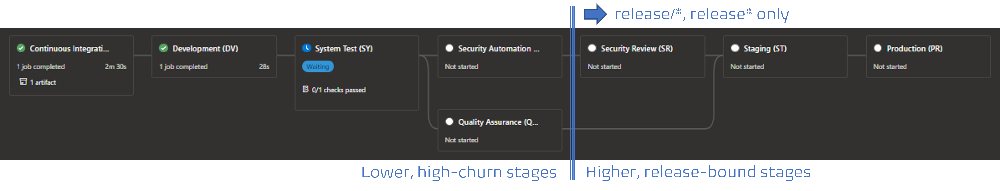
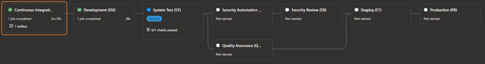
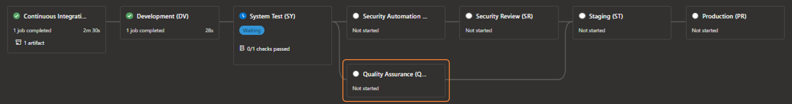

Title: Azure Pipelines Blueprint QA Integration
Date: 2022-12-09
Category: Posts 
Tags: azure-devops, pipelines, oss
Slug: azure-pipelines-blueprint-qa-integration
Author: Willy-Peter Schaub
Summary: WHERE and HOW to integrate quality assurance into our oss pipeline blueprints.

Let us review and how you can integrate your quality assurance (QA) scans in our [v2 application-type pipeline blueprints](https://github.com/WorkSafeBC-Common-Engineering/AzureDevOps.Automation.Pipeline.Templates.v2).

---

# High-altitude peek at the pipeline flow

The following illustration shows a typical continuous delivery pipeline, including continuous integration (CI), continuous delivery (CD), and supporting built-in automation and quality scans. 



Let us unpack the pipeline, based on the **azure-function** blueprint. Thanks to the magic of assembling the pipeline instance at queue, not definition time, the higher and release-bound stages only exist if the source branch matches the ```release/*``` or ```release*``` pattern. The last two stages in the lower, high-churn area are always part of the pipeline and the focus of this discussion.


The first stage is the continuous integration (CI), aka build, stage which is focused on **building** the product and injecting the **DevSecOps**, **Quality Assurance (QA)** and **building code** scans, managed by our [boot-strap](https://github.com/WorkSafeBC-Common-Engineering/AzureDevOps.Automation.Pipeline.Templates.v2/blob/master/templates/boot-strap.yml) template.


Subsequent stages are all part of the continuous delivery (CD), aka release, pipeline. In our case we deploy to **development** and **system test** environments, followed by the above-mentioned built-in automation and quality scans, the **security review** stage (which my colleague Kevin will discuss soon), and finally we deploy to **staging** and **production** environments. We use **manual approvals** to guard **system test**, **Staging**, and **production** environments, as well as a check for known and trusted templates for the **system test** and higher environments.

But, you probably want to know where and how to integrate your quality assurance scans.

---

# Quality-Assurance (QA) extension points


In a nutshell, you have two opportunities to influence and trigger quality assurance automation as part of your continuous delivery pipeline, based on the blueprints. 

## Continuous integration (CI) QA extension points?



You will find the first extension point in the *-ci.yml templates, for example [azure-pipeline-azure-function-ci.yml](https://github.com/WorkSafeBC-Common-Engineering/AzureDevOps.Automation.Pipeline.Templates.v2/blob/master/blueprints/azure-function/azure-pipeline-azure-function-ci.yml). This extension point is **blueprint** specific!

Scroll down to line around line 95, where you will find this placeholder:

```
# --------------------------------------------------------------------------
# CONTINUOUS INTEGRATION TEST
# --------------------------------------------------------------------------
    - task: DotNetCoreCLI@2
      displayName: 'Run Tests'
      inputs:
        command:    'test'
        projects:   '**/*Tests/*.csproj'
        arguments:  '--configuration $(buildConfiguration) --no-restore'
```

It is the responsibility of the software delivery team to define **consistent**, **comprehensive**, and **quality** continuous integration tests to empower us to automate the unit and regression testing while building the artifacts we want to deploy. You can extend the [building-code](https://github.com/WorkSafeBC-Common-Engineering/AzureDevOps.Automation.Pipeline.Templates.v2/blob/master/templates/building-code/building-code.yml) to validate the health of your unit tests by using a tool such as [Stryker](https://stryker-mutator.io/).


## Continuous delivery (CD) QA extension points?



The second extension, which runs in parallel to the security automation scans, can be found in the[qa-scans-cd.yml](https://github.com/WorkSafeBC-Common-Engineering/AzureDevOps.Automation.Pipeline.Templates.v2/blob/master/templates/qa/qa-scans-cd.yml) template.

A few words of caution:

- This extension point re-used and triggered by all blueprints!
- Any tasks running as part of this extension point must be **stable** and **reliable**!
- This extension point must honour the ```modeElite``` parameter, as discussed below.
- Validate your extensions using your feature branch and the [ref:](https://learn.microsoft.com/en-us/azure/devops/pipelines/process/resources?view=azure-devops&tabs=schema#define-a-repositories-resource) parameter before committing any change to your master branch. Once in master, your extensions will affect **all** blueprint-based pipelines.

If we peek into the template, we realize that we have two main sections. One that runs for lower (non-production) environments:

```
# -----------------------------------------------------------------------------------------------------
# QA AUTOMATION FOR LOWER (NON-PROD) ENVIRONMENTS STAGE
# -----------------------------------------------------------------------------------------------------
- ${{ if not(or(eq(variables['Build.SourceBranch'], 'refs/heads/release'), startsWith(variables['Build.SourceBranch'], 'refs/heads/release/'))) }}:
```

And another that runs for the higher (production) environments:

```
# -----------------------------------------------------------------------------------------------------
# QA AUTOMATION FOR HIGHER (PROD) ENVIRONMENTS STAGE
# -----------------------------------------------------------------------------------------------------
- ${{ if or(eq(variables['Build.SourceBranch'], 'refs/heads/release'), startsWith(variables['Build.SourceBranch'], 'refs/heads/release/')) }}:
```

In other words, you can selectively run quality-assurance in all pipelines or only in pipelines that are based on the ```release/*``` or ```release*``` source code branches, destined for production.

Within both these sections, you will find **blueprint** specific sections, allowing you to your quality assurance automation scans for selected blueprints only.

```
- ${{ if eq( lower(parameters.applicationBlueprint), 'azure-function' ) }}:
    - script: echo deal with qa scan relevant to azure-function application type
```

Once you have decided WHEN and for WHICH blueprints you want to run your quality assurance automation scans, insert the into the [qa-scans-cd.yml](https://github.com/WorkSafeBC-Common-Engineering/AzureDevOps.Automation.Pipeline.Templates.v2/blob/master/templates/qa/qa-scans-cd.yml) template. You **must** honour and deal with the ```modeElite```. 

- If ```modeElite = false``` your scans must **succeed** or complete with a **warning** - they are not allowed to throw an error, which would terminate the pipeline.
- If ```modeElite = true``` your scans must **succeed** or **fail** - any failure must terminate the pipeline.

It is up to you whether you deal with ```eliteMode``` in the [qa-scans-cd.yml](https://github.com/WorkSafeBC-Common-Engineering/AzureDevOps.Automation.Pipeline.Templates.v2/blob/master/templates/qa/qa-scans-cd.yml) template or pass and deal with it in your automation scans.


---

That is, it for today folks! Ping me on [@wpschaub](https://twitter.com/wpschaub) if you have any questions or feedback. Support for comments will hopefully soon be glued onto our technical blog. Watch the space!

