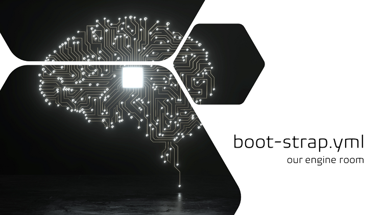

Title: Azure Pipelines Conditional Logic
Date: 2022-12-23
Category: Posts 
Tags: azure-devops, pipelines, oss
Slug: azure-pipelines-conditional-logic
Author: Willy-Peter Schaub
Summary: Make your YAML pipelines more versatile with conditional expressions.

Let us review why and how we use conditional expressions in our [v2 application-type pipeline blueprints](https://github.com/WorkSafeBC-Common-Engineering/AzureDevOps.Automation.Pipeline.Templates.v2).

---

# What is a conditional expression and why is it "cool"?

TBD


TBD

```
# VARIABLES
variables:
- ${{ if ne(parameters.suppressCD, true) }}:
  - template: /deploy/${{ lower(parameters.portfolioName) }}/${{ lower(parameters.productName) }}-config.yml@CeConfiguration
```

---

# Examples in our blueprints

## Conditional Quality Assurance and Security Scans


TBD

```
parameters:
- name:     applicationBlueprint
  type:     string
- name:     modeElite
  type:     boolean
  default:  false
  
steps:
# ------------------------------------------------------
# QA AUTOMATION FOR LOWER (NON-PROD) ENVIRONMENTS STAGE
------------------------------------------------------
- ${{ if not(or(eq(variables['Build.SourceBranch'], 'refs/heads/release'), startsWith(variables['Build.SourceBranch'], 'refs/heads/release/'))) }}:
  - script: echo 'QA CD Lower Environment Automation Placeholder ****************************************'
  - script: echo applicationBlueprint = ${{parameters.applicationBlueprint}}
  - script: echo modeElite = ${{parameters.modeElite}}
  
  - ${{ if eq( lower(parameters.applicationBlueprint), 'azure-function' ) }}:
    - script: echo deal with qa scan relevant to azure-function application type

  - ${{ if eq( lower(parameters.applicationBlueprint), 'nuget-package' ) }}:
    - script: echo deal with qa scan relevant to nuget-package application type

  - ${{ if eq( lower(parameters.applicationBlueprint), 'universal-artifact' ) }}:
    - script: echo deal with qa scan relevant to universal-artifact application type

  - ${{ if and(ne(lower(parameters.applicationBlueprint),'universal-artifact'), ne(lower(parameters.applicationBlueprint),'nuget-package'), ne(lower(parameters.applicationBlueprint),'azure-function')) }}:
    - script: echo UNKNOWN application type

------------------------------------------------------
# QA AUTOMATION FOR HIGHER (PROD) ENVIRONMENTS STAGE
------------------------------------------------------
- ${{ if or(eq(variables['Build.SourceBranch'], 'refs/heads/release'), startsWith(variables['Build.SourceBranch'], 'refs/heads/release/')) }}:
  - script: echo 'QA CD Higher Environment Automation Placeholder ****************************************'
  - script: echo applicationBlueprint = ${{parameters.applicationBlueprint}}
  - script: echo modeElite = ${{parameters.modeElite}}
  ... rinse and repeat ...
```

TBD

```
parameters:
- name:     applicationBlueprint
  type:     string
- name:     modeElite
  type:     boolean
  default:  false
  
steps:
------------------------------------------------------
# SECURITY AUTOMATION FOR LOWER (NON-PROD) ENVIRONMENTS STAGE
------------------------------------------------------
- ${{ if not(or(eq(variables['Build.SourceBranch'], 'refs/heads/release'), startsWith(variables['Build.SourceBranch'], 'refs/heads/release/'))) }}:
  - script: echo 'Security CD Lower Environment Automation Placeholder ****************************************'
  - script: echo applicationBlueprint = ${{parameters.applicationBlueprint}}
  - script: echo modeElite = ${{parameters.modeElite}}

------------------------------------------------------
# SECURITY AUTOMATION FOR HIGHER (PROD) ENVIRONMENTS STAGE
# ------------------------------------------------------
- ${{ if or(eq(variables['Build.SourceBranch'], 'refs/heads/release'), startsWith(variables['Build.SourceBranch'], 'refs/heads/release/')) }}:
  - script: echo 'Security CD Higher Environment Automation'
  - script: echo applicationBlueprint = ${{parameters.applicationBlueprint}}
  - script: echo modeElite = ${{parameters.modeElite}}
  ```

## Boot-Strap Flow



TBD

```
======================================================
# BOOTSTRAP TOOLBOX
======================================================
# Production Toolbox
- ${{ if or( eq( lower(parameters.bootstrapMode), 'init' ), eq( lower(parameters.bootstrapMode), 'runbuildingcodeonly' )) }}:
  - checkout: git://Common-Engineering-System/AzureDevOps.Automation.Pipeline.Toolbox.v2

======================================================
# BOOTSTRAP AI LOGGING
======================================================
- ${{ if eq( lower(parameters.bootstrapMode), 'init' ) }}:
  - task: PowerShell@2
    displayName: 'Bootstrap Telemetry START'
    inputs:
      filePath: '$(Build.SourcesDirectory)/AzureDevOps.Automation.Pipeline.Toolbox.v2/toolbox/scripts/application-insights/log-bootstrap-event-to-ai.ps1'
      arguments: -OperationId "$(Build.BuildNumber).$(Build.BuildId)" `
                 -Event  'Bootstrap' `
                 -Action 'Start' `
                 -BootstrapMode ${{parameters.bootstrapMode}} ` 
                 -ApplicationType ${{parameters.applicationType}} `
                 -ApplicationBlueprint ${{parameters.applicationBlueprint}} `
                 -PortfolioName ${{parameters.portfolioName}} `
                 -ProductName ${{parameters.productName}} `
                 -SourcesDirectory ${{parameters.sourcesDirectory}} `
                 -VerboseFlag ${{parameters.verbose}} `
                 -ForceCheck ${{parameters.forceCheck}}
      failOnStderr: true
      pwsh: true
    continueOnError: true
```

## Conditional Templates


TBD

```
# VARIABLES
variables:
- ${{ if and( ne(parameters.suppressCD, true), ne(parameters.useDefaultConfig, true) ) }}:
  - template: /deploy/${{ lower(parameters.portfolioName) }}/${{ lower(parameters.productName) }}-config.yml@CeConfiguration
- ${{ if and( ne(parameters.suppressCD, true), eq(parameters.useDefaultConfig, true) ) }}:
  - template: /deploy/default.config/nuget-package-config.yml@CeConfiguration
```

---

# Lastly, a spacing GOTCHA!

TBD

```
- ${{ if not(or(eq(variables['Build.SourceBranch'], 'refs/heads/release'), startsWith(variables['Build.SourceBranch'], 'refs/heads/release/'))) }}:
  - script: echo 'Security CD Lower Environment Automation Placeholder ****************************************'
  - script: echo applicationBlueprint = ${{parameters.applicationBlueprint}}
- script: echo modeElite = ${{parameters.modeElite}}
```
That is, it for today folks! Ping me on [@wpschaub](https://twitter.com/wpschaub) if you have any questions or feedback. 

