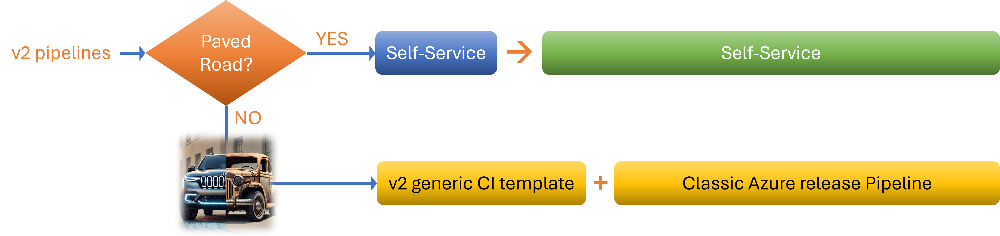
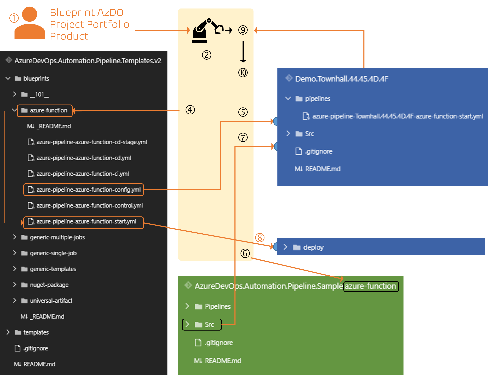
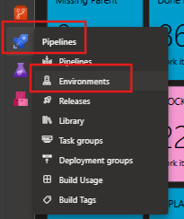
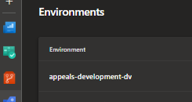

Title: v2 Pipelines and the Rise of Automation
Date: 2025-10-20
Category: Posts 
Tags: azure-devops, pipelines, engineering
Slug: azure-pipelines-magic-v2-pipelines
Author: Willy-Peter Schaub
Summary: Kickstarting our awareness series with a deep dive into v2 pipelines and their automation magic.

This post is the first of a few in a little series where we cherry-pick specific topics straight from our [CI/CD cookbook](/announcement-ci-cd-cookbook.html), all in the name of boosting focused engineer awareness and getting hands dirty with enablement. Today’s spotlight is shining bright on **v2 pipelines**, and we are diving into the world of self-service automation that makes life a whole lot easier for everyone involved.

The idea here is simple! We want to embrace what is already working like a charm, making our delivery even smoother by turning those pipelines into something more robust, flexible, and accessible for everyone on the team. With the introduction of **v2 pipelines**, engineers can now enjoy a whole new level of autonomy and efficiency. That means less hassle, fewer holdups, and a much faster turnaround when it comes to building and shipping stuff. The aim is to cut down on the friction, pave the way for smoother collaboration, and truly step up the pace of our development cycles.

By standardizing all security processes and ensuring their consistent execution, this approach establishes a secure baseline for your build and release pipeline. It eliminates the need for costly, reactive security scans or tests post-deployment, enabling proactive risk mitigation and accelerating time-to-market. This positions your team to improve from a place of strength—where security is embedded, not bolted on.

# v2 Pipelines

Let us chat about the two distinct flavours of **v2 pipelines**, each one tailor-made for different team vibes and where your crew sits on the DevOps maturity spectrum. This is all about finding the right fit and letting teams roll with what works best for them, no matter if you are cruising with the tried-and-trusted or testing the waters with something brand new.

>  

### v2 CI/CD app-type blueprint

First up, we have got the **Recommended Flavour**. This is the `v2 CI/CD app-type blueprint`, built on trusted, YAML-based templates that you can count on. It is all about following our `Paved Road` approach, which means using tried-and-tested processes, products, and those reusable `bricks` the team keeps banging on about. This setup is designed to give you that sweet blend of consistency, security, and a place where you are building and shipping. If you are keen on keeping things straightforward, sticking to what is approved, and making sure your pipeline behaves itself, this is genuinely the way to go. Most teams are encouraged to take this route because it saves headaches and keeps things ticking along smoothly.

### v2 generic + classic

Then, for the adventurous folks keen to push the boundaries with tools and processes that have not made their way onto the Paved Road yet, there is the **Generic Flavour**. This option gives you a `v2 generic CI YAML template` which runs the required automated scans under the bonnet, paired with a `classic Azure release pipeline`, a combo that is affectionately known as a **Ferrari pulling a horse cart**. It has got plenty of power under the hood, but honestly, it is not quite the slick, seamless experience you would get with the recommended setup. Still, it is a brilliant temporary bridge for those trailblazers and innovators, letting you get your ideas out there until your tools get formalised and officially welcomed into our growing ecosystem. So, whether you are sticking with the conventional or having a go at the unconventional, there is a pipeline tailored for your journey, no need to fuss or force anything. Just pick the flavour that suits, and off you go!

# Self-Service

### CI with a bang!

Let us take a moment to reflect on how we have implemented our self-service automation, guided by the v2 blueprints. This is a strong example of engineering discipline and thoughtful design, where quality and maintainability take precedence over velocity.

>  

1. The user accesses our `self-service portal`, selects the appropriate app-type blueprint (e.g., azure-function).
2. The interim solution takes the user to a `self-service pipeline`. When it is run by the user, it prompts the user to choose the target Azure DevOps (AzDO) project and `Portfolio`, enter a `Product` name, and initiate the process by clicking the RUN button.
3. This action `runs the self-service pipeline`, which runs a PowerShell script (see Sample Code 46 on page 162 in the CI/CD cookbook). The script executes under a service account with the necessary permissions to perform all required operations.

The automation then proceeds with a series of well-orchestrated steps:

4. A new Git repository is created in the selected AzDO project, named using the `Portfolio` and `Product` identifiers.
5. The system locates the relevant app-type blueprint implementation within the `AzureDevOps.Automation.Pipelines.Templates.v2` repository.
6. A new YAML-based pipeline is created in the new Git repository. It uses the `-start.yml` template corresponding to the selected app-type blueprint, and is named using the Portfolio and Product.
7. The `Src` folder containing the app-type sample is copied from the sample repository into the new Git repository.
8. Configuration template is added to the new repository, using the `-config.yml` blueprint template, again named using the Portfolio and Product.
9. The `new pipeline` is registered with Azure DevOps, organized under the Portfolio folder.
10. Finally, the pipeline is queued. With the `suppressCD`parameter set to true by default, only the CI portion of the pipeline runs initially, as the configuration template has not yet been updated.

>
> **IMPORTANT**: In future self-service implementations, we will improve the overall flow, hide the plumbing, and likely pre-configure the `-config.yml` template as well.
>

### CD after a config update

Getting the delivery team sorted with a repository and pipeline now honestly takes just seconds, which is a big win and really proves how solid our automation and blueprint-driven system is. It is lightyears ahead of the old slog, and it gives everyone more time to focus on the fun stuff instead of wrestling with annoying setup steps. For now, though, until the next version of self-service comes along and makes things even slicker, our cloud systems engineers will still have to go in and manually tweak the `-config.yml` template that is dropped into the Azure Repo.

That little bit of hands-on effort is super important. It is what ensures every deployment gets dialled in perfectly for each stage, whether you are talking development, staging, or whatever else you have got running. It might seem like a minor manual hurdle, but it is a crucial part of keeping our solutions top-notch, rock steady, and ready for anything down the line. So, while we are waiting for more automation awesomeness, let us not rush it, doing things right is what keeps our ship sailing smoothly.

Here is the way I suggest you tackle this step, and trust me, it makes your life a lot easier down the road. 

### 1. Explore the config file
First thing’s first. Pop open the `-config.yml` template sitting in your Azure Repo and take a proper look at how it is set out. Do not rush through it! Each app-type comes with its own unique flavour, so you can expect to spot a few differences in the variables and layout, depending on the blueprint you are working with. Take a few minutes to get your bearings, scan through all the sections, and make sure you know what is what before you dive in.

### 2. Configure the Azure Pipeline Environments

The second bit is to start with the `*StageEnvName` variables. Head over to your Azure DevOps project and navigate to `Pipelines > Environments`.

>  

There, you will find all the environments listed out, each one following a naming convention that makes it dead simple to match up: `<portfolio>-<stagename>-<stageacronym>`. Grab the correct environment names and slot them into your `-config.yml file`. Just copy them over exactly as they appear, so there is no confusion or weird gremlins popping up later.

>  

### 3. Configure the Azure Deployment Bits

Once you have sorted that out, it is time to update those `deployment-specific variables`. Here is where you want to lean on what is already working for you. Crack open your classic Release Pipelines, scan through the tasks and parameters you have been using, and use these as a solid reference to update your config. Keeping things consistent with what is tried-and-tested saves you headaches and makes sure everything plays nicely with the rest of your build and deploy process down the line. Do not be shy to take your time here or to contact your common engineering team if you have questions, it is worth it.

### 4. Activate the Deployment Stages

Now, the last bit is to set the `*StageActive` variables to `true` for every stage where the infrastructure is provisioned. That way, the pipeline knows exactly which bits are ready for action and which ones still need to wait their turn. Getting this right is what keeps things rock solid later.

### 5. Final polish

All in all, this method is straightforward, intentional, and delivers results you can count on. Sure, you have got to do a couple of manual tweaks, but doing these steps properly means every deployment is custom-fit, dependable, and in line with how we like to roll. In this part of the process, there is no “fast way”. Going slow and steady is what keeps our solutions sharp, consistent, and totally future-proof.

And just before you wrap up, do not forget to change the value of the `suppressCD` parameter in your `-start.yml` template to `false`. This little tweak is what signals to the blueprint that it needs to fire up all those stages you marked as `active` in the config file, plus any mandatory automation stages that are needed. When you do this, you are basically unlocking the full pipeline, making sure nothing gets left behind.

### PS: Branching is important

Another important thing to know about these v2 blueprints is how they handle the way environments get injected into the pipeline, depending on which branch you are working off. When your source branch starts with `release/*`, only then do the higher stage environments get thrown into the mix for your queued pipeline. If you are not on a release branch, then the v2 blueprint keeps things lean and will only inject the lower environments, like development and good old system test. That means the fancy production and upper-level stuff stays out of the way, unless you are prepping for a release. It is a neat bit of logic, and it really streamlines how everything behaves behind the scenes, giving you way less clutter to worry about if you are just tinkering or testing something out. Honestly, it is a clever trick that saves you a pile of confusion, so when those big releases roll around, you know exactly which environments are getting the spotlight, and when you are doing the usual dev grind, the pipeline keeps things tidy and focused. More magic happening right there!

---

## What is next?

Keep your eyes peeled for more posts in this series, each one crafted to help teams get the absolute most out of our CI/CD ecosystem and make the journey even better. You do not want to miss what is coming next, it is worth the wait.

If you are after more details or need to dig a bit deeper, do yourself a favour and check out the [CI/CD cookbook](/announcement-ci-cd-cookbook.html). It is full of handy tips, tricks, and samples to make your day that much easier.

>
> **PS**: For the WorkSafeBC engineers, the eBook is available in our Awareness and Continuous Learning Dojo (orange belt) and our governance and guardrails library.
>

**Series breadcrumb**, which will be updates as we add more posts in this series:

- (this) v2 Pipelines and the Rise of Automation
- TBD

