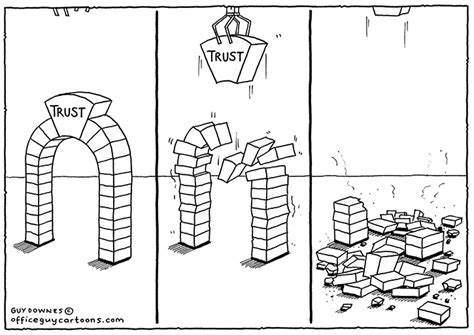

Title: Why Automation Needs People to Truly Thrive
Date: 2024-10-26
Category: Posts 
Tags: automation, engineering
Slug: back-to-basics-automation
Author: Willy-Peter Schaub
Summary: While automation is an essential ingredient for DevOps, it is not a silver bullet.

Continuous and significant advances have been made by us in automation, including infrastructure as code, pipeline as code, self-service, upgrade, and vulnerability remediation automation. However, there has been a noticeable hesitance in the adoption of these automation solutions, prompting the question: “_Why might an engineer choose not to adopt the available automation?_”

---

# TRUST

My hypothesis is that engineers will keep doing tasks manually unless they trust the automation and see its benefits. For example, we inherently trust Visual Studio automation because no engineer creates solutions and project files by hand anymore. People trust it because they are familiar with it and believe Microsoft maintains it with current best practices and innovations. Early versions of Visual Studio generated code that I sometimes questioned. Today, however, selecting an application type in the new project wizard is straightforward and feels normal.

>  

If trust is the salt in automation, what is the pepper?

My former leader and mentor always reminds me to ensure that we can answer the question: “_what is in it for me_?” Automation provides efficiency gains, accuracy, scalability, cost reduction, faster time to market, consistency, reliability, compliance, auditability, and enables continuous improvement. However, it does not address “the” question and often evokes concerns among engineers about making humans redundant, reminiscent of the industrial revolution.

We need messaging that addresses the mentioned benefits and emphasizes that automation eliminates many repetitive tasks. This allows engineers to spend more time on innovative and impactful work. For instance, generative AI, self-service automation, and upgrade automation are designed to assist engineers by freeing up time, reducing mental fatigue, and increasing creativity. The goal is not to make human roles redundant but to balance the work-life dynamic and enable improved, faster performance. 

Importantly, the time saved through automation should not solely be used to increase business output, as this would undermine the advantages and progress made with automation. 

>  

So, if **trust** is the salt, knowing “**_what is in it for me_**” is the pepper!

---

# The **VALUE** of automation

So what, apart from obvious benefits, what are some key values of automation?

- Automation excels at **repetitive** tasks.
- Automation speeds up repetitive tasks like testing, deployment, and data processing, increasing productivity.
- Automation reduces **human error**, ensuring **consistent** and accurate task performance.
- Automation allows users to **focus** more on complex problems, boosting job **satisfaction**, **innovation**, and productivity. I intentionally did not **bold** productivity, as some engineers may question this with "_So, I am not productive?_", which is obviously far from the intent and truth.

Automation with human involvement is a win-win. Together they create a symbiotic relationship that drives true progress.

---

# The **DARK** side of automation

Although automation has become a vital part of engineering environments, it also has a dark side we need to be aware of.

- Automation lacks **creativity** and **intuition** for solving complex problems.
- Each organization needs **customized** and **optimized automation** - a challenge evident from our shared [v2 CI/CD blueprints](https://github.com/WorkSafeBC-Common-Engineering/AzureDevOps.Automation.Pipeline.Templates.v2).
- **Human oversight** is essential to prevent errors. Have you ever considered living next to an autonomous nuclear plant or flying in a cockpit-less aircraft?
- Automation lacks **empathy** and **emotional intelligence** for complex customer support.
- Automation requires **consistent**, **standardized**, and **stable** environments.
- AI and data processing automation raise **ethical** concerns.
- Continuous **maintenance** is needed to keep automation relevant and error-free.

There is no doubt that automation is a powerful tool, but it needs people to guide, improve, and ensure its successful integration.

---

While writing this blog post, I have realised that to address the initial "noticeable hesitance" about automation, we need to raise **awareness** of our automation, collaborate with engineers to show its **value**, and gradually build **trust** to improve adoption. 

That is my take. What are you thoughts?

