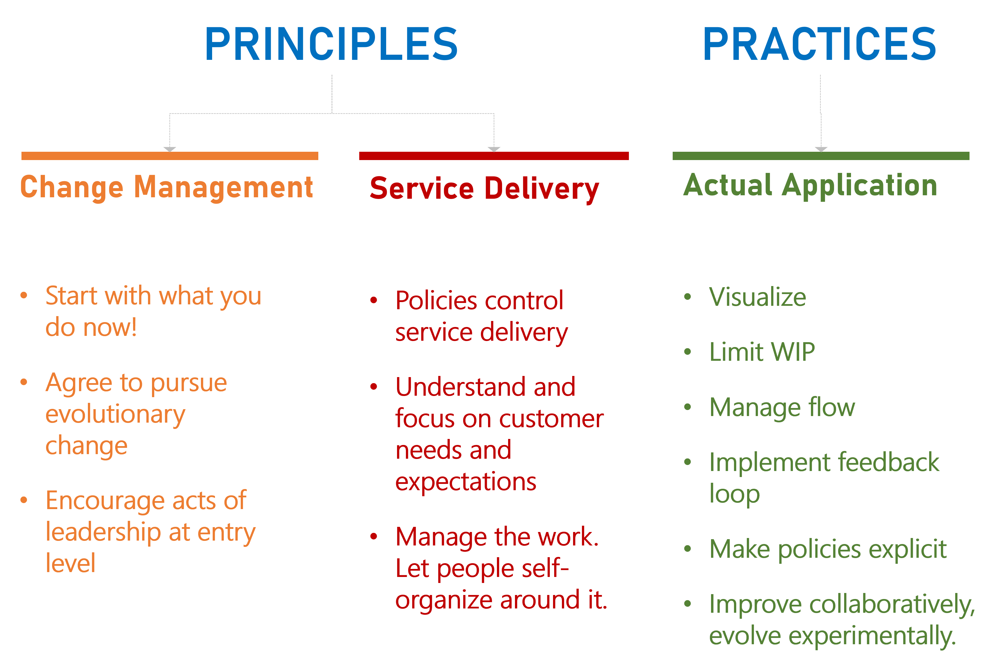
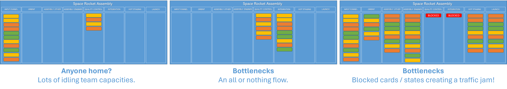
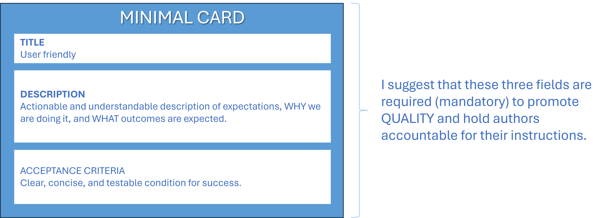

Title: Back to Basics: Kanban
Date: 2024-02-09
Category: Posts 
Tags: agile, azure-devops, learning, 101
Slug: back-to-basics-kanban
Author: Willy-Peter Schaub
Summary: "Kanban" is Japanese for "visual card" or "signal."

Kanban is a method of visually managing work processes, often used in lean and just-in-time production. It was developed by Taiichi Ohno for Toyota as a way to improve manufacturing efficiency and the word **Kanban*** means **visual card** or **signal** in Japanese. The system uses visual cues to initiate and manage workflow processes.

Main components of a Kanban system and a few reference links:

- **Kanban Board** - [Azure Boards](https://azure.microsoft.com/en-us/products/devops/boards/), [Azure Boards Tips](/azure-boards-tips.html), [Azure Boards Tips for Operations Teams](/azure-boards-tips-operations-team.html), [Azure Boards Tips - Stop messing with our backlog!](/azure-boards-tips-stop-messing-with-our-backlog.html), [Azure Boards Tips - Retain hierarchy with filter](/azure-boards-tips-retain-hierarchy-with-filter.html), [Visualizing work item dependencies in Azure Boards](/azure-devops-dependencies.html), and [Enable Agile, Kanban, Scrum, or SAFe with Azure DevOps](/agile-planning-choice.html)
- **Cards** - [About work items and work item types](https://learn.microsoft.com/en-us/azure/devops/boards/work-items/about-work-items?view=azure-devops&tabs=agile-process), 
- **Work in Progress (WIP)** - [Back to Basics: WIP Limit](/back-to-basics-wip-limit.html) 
- **Limits  Signals (States)** - [About workflow states in backlogs and boards](https://learn.microsoft.com/en-us/azure/devops/boards/work-items/workflow-and-state-categories?view=azure-devops&tabs=agile-process) 

---

# Kanban Principles and Practices

An extract from one of our quick reference posters that covers the basic Kanban Principles and Practices:

>  

---

# Bad Smoke Signals

Here are some signs that you should examine your flow and try to make it more efficient:

>  

You want a smooth flow of cards (work) across the entire boards, with no visual bottlenecks (delays), or states (columns) that are idling.

---

# Actionable Cards

It annoys me when I have to deal with a card that I cannot act on. Here are cards that should be discarded or should cause the [Andon cord](https://en.wikipedia.org/wiki/Andon_(manufacturing)) to be pulled:

- Title is cryptic, description and acceptance critera are blank, and card is tagged as an urgent dependency.
- Title is actionable, but description and acceptance criteria are marked as "to be defined" (TBD).
- Title and description are actionable, but acceptance criteria is blank or TBD.

My team does not accept these cards onto our board anymore. We send back any card that is added to our board without our consent, with a polite "non actionable" reply. 

>
> 
> An actionable **ACCEPTANCE CRITERIA** is Key! Acceptance criteria serve as essential conditions for the approval of a Kanban card (Azure DevOps Work Item)[https://learn.microsoft.com/en-us/azure/devops/boards/work-items/about-work-items?view=azure-devops&tabs=agile-process], either met or not met - it is a binary 1 or 0! They require **clarity**, **conciseness**, **user-focus**, and **testability**: Statements are formulated to be verifiable, allowing for the creation of tests that objectively assess whether the criteria are met**. 
>

Examples of an acceptance criteria for a complete rocket: 

### GOOD acceptance criteria

**Propulsion**

- Propulsion system specifications are clearly documented.
- Successful static firing tests confirm thrust performance and stability.

**Navigation**

- Navigation controls accurately adjust the rocket's trajectory in a simulated space environment.

**Launch Sequence**

- Concise checklist guides the rocket from ignition to the designated orbit.
- Emergency procedures are summarized for quick reference.

**Payload**

- Payload deployment ensures the safe release of the payload into the specified orbit.

**Mission Success**

- Success is defined by the payload achieving and maintaining the intended orbit.
- Safety features prioritize both the rocket launch and the protection of the payload.

### BAD acceptance criteria

- Blank.
- To be defined (TBD).
- Rocket launches successfully.

### Minimal cards

To avoid garbage entering your system and your Kanban workflow, here is a simple, yet effective card:

>  

---

You can use [Azure Boards](https://azure.microsoft.com/en-us/products/devops/boards/) to apply Kanban principles, whether you work with Kanban only or combine Kanban (operational support) and Scrum (innovation), like we do. I am a visual thinker, so I find the visual signals from Kanban very helpful. Have fun!

