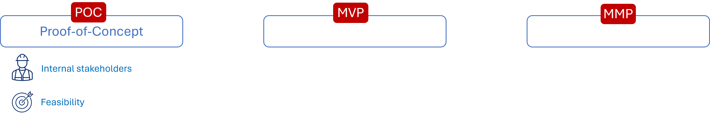
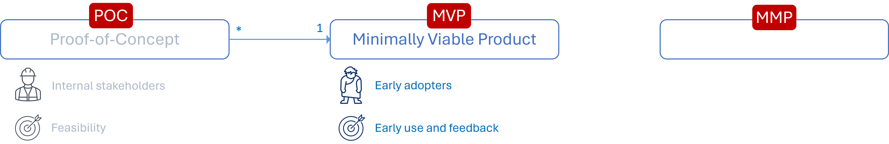
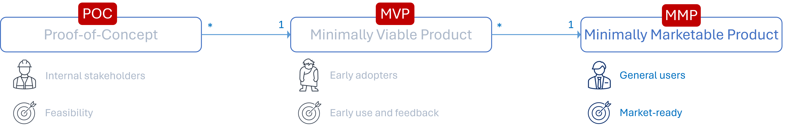

Title: Decoding the Acronyms: MMP vs. MVP vs. POC
Date: 2024-06-03
Category: Posts 
Tags: agile, learning, 101
Slug: back-to-basics-mmp-mvp-poc
Author: Willy-Peter Schaub
Summary: MMP, MVP, and POC: Understanding Their Differences and Choosing the Right Approach

I attended a workshop where they used many TLAs (two/three-lettered acronyms) that were hard to follow, especially after lunch when everyone was tired. Not all the participants knew what the TLAs meant, and they could cause misunderstandings or confusion. For example, SA could mean solution architect, systems architecture, or South-Africa. My team has an agreement to avoid TLAs in spoken communication and to only use them in written communication if there is a table of acronyms or the full form with the acronym in brackets is used first.  But, this is not the main point of this short blog post. In the same workshop we talked about MMP, MVP, and POC and I thought it was a good chance to clarify the acronyms and explain how I see the difference.

---

# Proof of Concept (POC)

>  

A Proof-of-Concept (POC) is a preliminary version or a small sample that evaluates the **feasibility** of an idea or concept. Its main goal is to show to its **internal stakeholders**, such as engineers and investors, that a solution of the idea could be created and would work as intended. 

A MVP usually follows one or more POCs - let us continue with the acronym MMP.

---

# Minimally Viable Product (MVP)

>  

A Minimally Viable Product (MVP) is a new product that has only the core features needed to satisfy the demands of **early adopters** and selected users, who can give **feedback** for further improvement. Its purpose is to test the product concept with minimal resources, offering value to users, but missing the features needed for a marketable product and most importantly the need for funding.

A MMP usually follows one or more MVPs - let us wrap up with the acronym MMP.

---

# Minimally Marketable Product (MMP)

>  

A Minimally Marketable Product (MMP) is a product that has enough features to be sold and offers comprehensive user experience. It satisfies the demands of a broader group of **users** beyond early adopters, can be released, and **marketed**. 

Usually, a market winning product is preceded by one or more MMPs. 

---

Thoughts? Do you agree?

