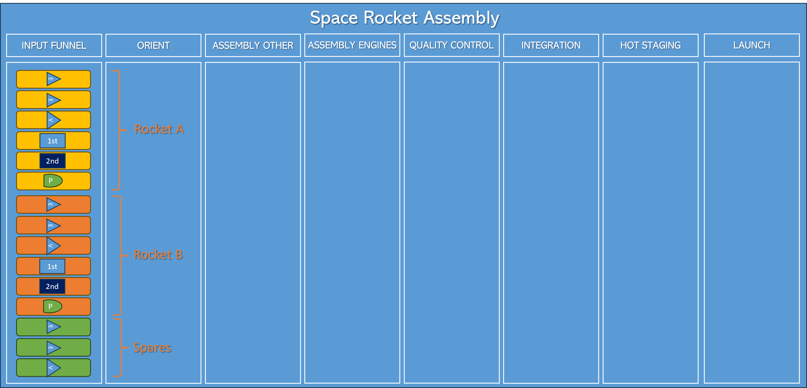
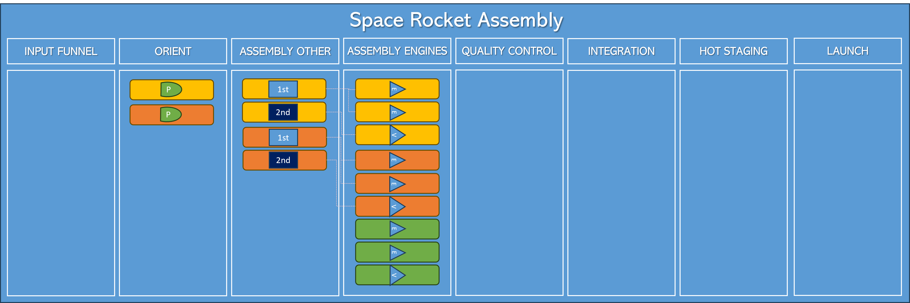
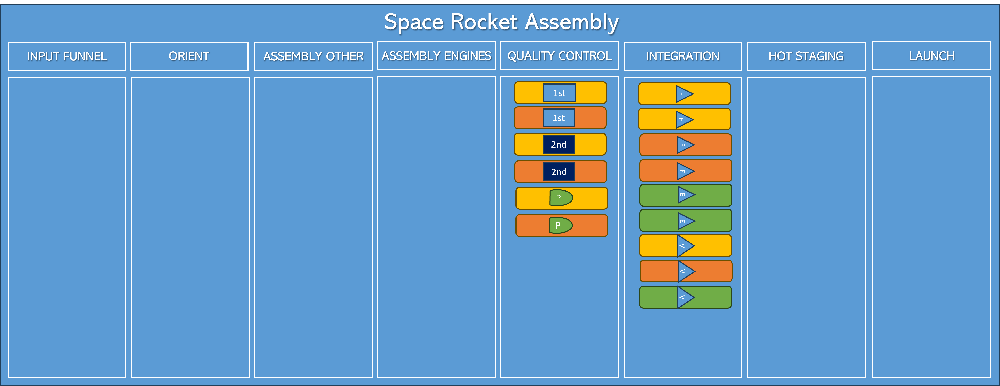
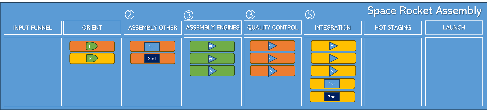

Title: Back to Basics: WIP Limit
Date: <YYYY-MM-DD>
Category: Posts 
Tags: agile, azuredevops, learning
Slug: back-to-basics-wip-limit
Author: Willy-Peter Schaub
Summary: Dealing with a Kanban Board meltdown, by controlling the work in progress.

We pickup from where we left off in  [Back to Basics: Batch Size](/back-to-basics-batch-size.html) and the following warning:

>
> 
> **CAUTION** - I am intentionally skipping a very important and related topic, which will be covered in the follow-up blog post - **Work in-Progress** (WIP). Without it, leaning towards smaller batch sizes would lead to a nuclear type reaction (a process in which two particles collide, to produce one or more particles), followed by a similar meltdown.
>

I will waste no time on covering the Azure DevOps Board - refer to [Azure Boards Tips](/azure-boards-tips.html), [Azure Boards Tips for Operations Teams](/azure-boards-tips-operations-team.html), [Azure Boards Tips - Stop messing with our backlog!](/azure-boards-tips-stop-messing-with-our-backlog.html), and [Azure Boards Tips - Retain hierarchy with filter](/azure-boards-tips-retain-hierarchy-with-filter.html) for a quick introduction.

---

# The rocket factory wakes up

TBD

>  

TBD

>  

---

# The rocket factory melts down

Let us assume that to assemble a low atmosphere engine we need 1x unit of work, for the vacuum engines we need 2x units of work, for the stages we need 3x units of work, and for the payload, due to its complexity 4-5 units of work.

A probable sequence of events would produce lots of low atmosphere and vacuum engines, which would produce a bottleneck in the integration stage, and to a lesser degree in the quality control stage. The hot staging teams would be sitting around, playing poker and reading the latest news about agility, which raises their frustration and does not allow the assembly factory to deliver value consistently.

> 

TBD

---

# Work-In-Progress (WIP) limit to the rescue

Welcome WIP limit, aka Work In Progress limit.

WIP, or Work In Progress, serves as a constraint within the realms of agile and lean methodologies. It signifies the upper limit of concurrently active units of work within a designated stage of the rocket assembly value stream. Enforcing WIP limits allows us to:

- **Optimize Workflow** - ensure that tasks progress through each stage smoothly and efficiently.
- **Prevent Overloading Teams and Processes** - contribute to sustained team effectiveness and prevent bottlenecks.
- **Prioritize Task Completion** - encourage teams to focus on completing existing tasks before initiating new ones, reducing multitasking.
- **Enhance Overall Productivity** - emphasis on completing tasks and controlling flow improves productivity.

In essence, enforcing WIP limits is a strategic practice aimed at creating a balance between task initiation and completion, fostering efficiency, and contributing to the smooth flow of work through the entire value stream.

# Rocket Assembly with WIP limits

WIP limits are determined based on factors such as team **capacity**, resource **availability**, and the overall **goals* of the project. Adjusting WIP limits help us fine-tune our process, change circumstances, and improve our ability to deliver value consistently.

Let us set the following WIP limits on the assembly stages:

- **Assembly Engines = 3** - limit the number of engines being assembled concurrently to three.
- **Assembly Other = 2** - limit the number of other concurrent assemblies to two.
- **Quality Control = 3** - limit the number of quality concurrent quality assurance to three.
- **Integration = 5** - limit the number of concurrent integration to five.

If we were to replay the operations in our factory, we could seamlessly integrate and roll out the first and second stages for rocket A for a hot stage test. Subsequently, we would repeat this process for rocket B, preparing it for its hot staging phase. The synchronicity of these efforts would result in both rockets being completed, poised and waiting for their payload. It sets the stage for an eagerly anticipated countdown and a spectacular launch once the final components are in place. In parallel we also complete the spare engines, which allow us to fail-fast in hot staging and replace faulty engines, before the payloads are delivered.

>  

