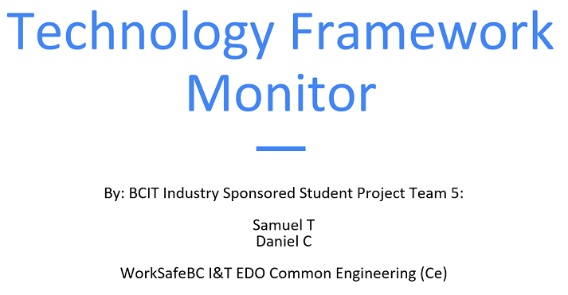

Title: BCIT Computer Systems Technology Industry Sponsored Student Project (ISSP)2
Date: 2023-05-25
Category: Posts 
Tags: event, oss
Slug: bcit-computer-systems-technology-industry-sponsored-student-project
Author: Willy-Peter Schaub
Summary: Today we have open-sourced our Technology Framework Monitor (TFM).

Today, I had another moment of pride, as I listened to the presentation delivered by two [British Columbia Institute of Technology](https://www.bcit.ca/about/visit/campuses-directions/burnaby/) students who have worked with my team for the past 4.5 weeks. I realized that I was watching and listening to the next generation of software engineers, who will continue the adventure that I embarked on in the early 80s.

>  

---

# The project

We (primarily Andreas Mertens, GitHub: AndreasNVI) developed the Technology Framework Monitor (TFM) product to gather information about every project within an [Azure DevOps](https://azure.microsoft.com/en-us/products/devops) organization. The product scans every [Azure Repository](https://azure.microsoft.com/en-us/products/devops/repos/), analyses the projects within each repository, and saves data in a SQL Server database for further analysis and reporting.

Examples of information collected and analyzed:

- Details of Azure DevOps Team Projects within the organization.
- Details of Azure Repositories within Azure DevOps Team projects.
- Version of .NET and flag end-of-life versions.
- Version of Angular.
- Version of Azure Function runtime.
- Version of NuGet packages.
- Version of npm packages.

---

# The challenge we set for the BCIT students

The TFM product needed a lot of love and care to clean-up the codebase so that we can release it as one of our open-source projects. For example, we needed to:

- Remove unused code and refactor the codebase to improve the performance and maintainability.
- Handle transient faults to deal with Azure DevOps throttling and circuit breakers.
- Support automation to run the product on a specific day, at a specific time, and do so continuously.
- Document the product usage and optionally produce 101-usage videos.

---

# What they experimented with and learned during the student project

- Worked with a platter of products, such as Microsoft Azure DevOps, GitHub, Visual Studio, and SQL Server.
- Got an in-sight into why the gathered information is pivotal to a sound engineering process and practices.
- Got an opportunity to collaborate with our common engineering practice lead, developers, and cloud systems engineers.
- had an opportunity to experiment with Git, GitHub, Azure DevOps, Visual Studio, and SQL Server.

---

# Oh, we open-sourced the solution!

>
> You can peruse our open-source [Technology Framework Monitor (TFM) product](https://github.com/WorkSafeBC-Common-Engineering/AzureDevOps.Technology-Framework-Monitor) on GitHub.
>

---

My final message to the students: "_When the "WorkSafeCodeCleanUpCrew," Team #5, faced a reduction in members from 3 to 2 BCIT students shortly after the kick-off, I immediately raised a red flag for our ambitious Technology Framework Monitor (TFM) open-source project. However, I was pleasantly surprised by Daniel and Samuel's response to the challenge. They not only embraced the situation but also rapidly mastered essential tools such as SQL Server, Visual Studio, GitHub, and Azure DevOps._

_Throughout the project, Daniel and Samuel demonstrated their commitment by conducting thorough research on engineering practices and products. They fearlessly experimented, dedicating their time to refactor both code and documentation. Their utilization of the Trello and Azure DevOps Kanban Board to track their progress was highly effective, ensuring transparency and enabling efficient collaboration._

_I cannot stress enough the awe-inspiring passion, perseverance, and dedication that Daniel and Samuel exhibited during this project. Their contributions to our open-source project, TFM, are nothing short of remarkable. I eagerly anticipate witnessing their future endeavors and the continued impact they will make._” 

Last, but not least, **THANK YOU** Andreas for being a patient and phenomenal mentor, coach, and fellow software engineer in this adventure. Also, a special **THANK YOU** to Martin (MerlinDarkstar) for being our Software Practice Lead and keeping us on the rails.

