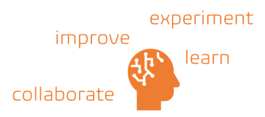

Title: Our quest to share our knowledge with the world, keeping it interesting and informal
Date: 2021-07-02
Category: Posts 
Tags: ai, innovation
Slug: blog-post-101
Author: Willy-Peter Schaub
Summary: Understand how to navigate and create content for our technical blog.

As an engineer I expect that everyone has the genetic building blocks to (want to) continuously and relentlessly improve, innovate, experiment, and collaborate.

 

Collaboration is essential as two or more brains are better than one, exchange ideas, knowledge, experience, and to come up with better ideas and ways of solving problems for today and tomorrow.

All of the above, without letting your ego get in the way, being scared to fail or ask a question, not afraid of seeking candid feedback. 

Our WorkSafeBC technical blog is one of many channels (or hammer) that helps us collaborate and share our experiences and knowledge with everyone. In this short post, I will focus on how to find content relevant to you, and if you are a WorkSafeBC engineer, to create your first post. 

---

# What do our categories and tags mean?

 

We **tag** our technical blog posts to allow you, the reader, to find and focus on content that is relevant and valuable to you. It is important to focus on what is valuable to you and skip the "bile".

Here is a list of tags we use when creating new content:

| TAG             |~~| FOCUS   |
|-----------------|--|---------|
| 101             |  | Back to basics. |
| agile           |  | Agile, Kanban, SAFe, and other frameworks to plan, track, and collaborate across teams. |
| ai              |  | Artificial intelligence, machine learning, and intelligent bots. |
| architecture    |  | Software architecture. | 
| automation      |  | Automate repetitive tasks and processes. |
| azure           |  | Microsoft [Azure](https://azure.microsoft.com). |
| azure-devops    |  | Microsoft [Azure DevOps](https://azure.microsoft.com/en-us/services/devops/) services. |
| books           |  | Reviewing new and recommended books.
| ceremony        |  | Collaboration ceremonies. |
| code            |  | Software coding.
| code-quality    |  | Objectively measurable characteristics of the code structure. |
| continuous-delivery |  | Uninterrupted flow of delivery of changes from development to production |
| delivery-on-demand |  | Ability to deliver/release changes to the system any time business demands those changes be put in front of customers. |
| design          |  | Structuring the system and the code in the most optimal fashion. |
| devops          |  | The union of people, process, and products to enable continuous delivery of value to our end users. - [Donovan Brian](https://www.donovanbrown.com/post/what-is-devops) |
| dojo            |  | Psychologically safe place dedicated to perfecting one's skills. |
| eliminate-waste |  | Continuous drive to avoid and reduce wasteful processes and products. |
| engineering     |  | Software engineering. |
| event           |  | Meetup, training, workshop, and other event gatherings. |
| feature-flags   |  | Separating deploy from release through feature toggles / flags. |
| github          |  | GitHub services. |
| innovation      |  | Disrupting the status quo by proposing hypotheses and conducting observable/repeatable experiments to corroborate or falsify proposed hypotheses. |
| journal         |  | Regular EDO Common Engineering journal entries to share our progress, failures, and learnings. |
| lean            |  | Maintaining low inventory, slim work in progress buffer and eliminating any duplications by practicing single source of truth paradigm. |
| learning        |  | Continuous learning. |
| metrics         |  | Telemetry, logging, metrics, and other evidence-based learnings. |
| oss             |  | Open source software initiatives and discussions. |
| pipelines       |  | Continuous integration, deployment, delivery, YAML, and other interesting topics to build, test, and deploy our software solutions. |
| posters         |  | Quick reference posters and cheat sheets. |
| quality         |  | Technical excellence and quality of engineering solutions to add value, not complexity. |
| release         |  | Release management practices and learning. |
| security        |  | "Trust, but verify " to avoid and function under malicious attacks. |
| system-programming |  | Automating system operations. |
| tdd             |  | Test-driven Development. |
| technical-excellence |  | Focus on satisfying the minimum acceptable standard of quality in terms of security, safety, reliability, resilience, and performance. |
| testability     |  | Designing changes to the system in such way that they are 100% testable in a deterministic fashion. |
| testing         |  | Test to raise the quality bar and deploy with confidence. |
| tips            |  | Tips and tricks. |
| version-control |  | Secure, version, and collaborate to build better code. |  
| workflow        |  | Streamline repetitive tasks and processes.
| x-as-code       |  | Virtualizing any aspect of the computing machinery. |
| xp              |  | Extreme programming ( XP) software development methodology. |


The list is reviewed as we review new content. Although we are open for change, for example adding new tags or renaming existing tags, we want to keep the churn and number of tags to an absolute minimum.

 

We are starting to also **categorise** our content to add a different lens for you to use to find relevant content. Here is a list of categories we use:

| CATEGORY |~~| MEANING |
|----------|--|---------|
| Events   |  | Specific updates covering events, such as meetups and workshops. |
| Posts    |  | Updates by our engineers and other interesting individuals, sharing their knowledge with the world. |


Thoughts? How can we improve our tags and categories? Please ping me on [@wpschaub](https://twitter.com/wpschaub) and help us improve our content.

---

# Create your first post

 

> [Blog Interesting - 32 Ways to Keep Your Blog from Sucking](https://www.hanselman.com/blog/blog-interesting-32-ways-to-keep-your-blog-from-sucking), by Scott Hanselman!

If you are working with or you are a WorkSafeBC engineer, you have invaluable technical knowledge and experience to share! Here is a 7-step checklist to get you started:

-  Understand [markdown](https://www.markdownguide.org/). Our blog posts, such as this one, are developed using the simple and easy-to-use markup language.
- Collaborate with the **WSBC Technical Blog Content Discussion** working group, which you can locate in Microsoft Teams.
- Clone our [wsbctechnicalblog-wsbctechnicalblog.github.io](https://github.com/wsbctechnicalblog/wsbctechnicalblog.github.io) repository.
- Create a feature branch ```<yourname>/<title>```, for example willys/blog-post-101. Do not use your primary, 2, or 5-ID!
- Create a new markdown file in the ```/content```, for example ```/content/blog-post-101.md``` and add the metadata header at the start, which will be used when your gem is converted to a live HTML page.

```
Title: <catchy title>
Date: YYYY-MM-DD
Category: <Events|Posts>, as above mentioned 
Tags: <Tags> comma separated, as above mentioned
Slug: Your <file-name> without the .md, using kebab style, for example code-as-text
Author: <FirstName> <LastName>, matching the name of your entry in the X [authors](https://wsbctechnicalblog.github.io/pages/authors.html) page.
Summary: <Quick summary of what post is about>.
```


...and finally:

- Create your content using the editor of your choice - mine is Visual Studio Code.
- Create a pull request and submit your changes for review and collaboration.

 

Done!

---

# One, two, or more authors?

 

Unfortunately, we can only define one author in the metadata, however, you can co-author a post with a colleague or with a member from our **WSBC Technical Blog Content Discussion** working group. We are more than happy and keen to assist you, even as an unknown ghost writer. 

If there are multiple authors, consider adding this:

> Authored by X, Y, and Z at the start of end of your post.

Just collaborate with us, ask questions (_the only one that is bad is the one you never ask_), and do not hesitate to ask for help.

---

# Approval process

The approval process to publish a post on WorkSafeBC Technical Blog consists of two (minimum) or more reviewers who must carefully examine content submitted in the form of Pull Request. Only if all involved reviewers approve the Pull Request will the blog post get published.

The following specific ethics will have to be followed: 

- Address sharing of intellectual property must be made transparent
- Speaking on behalf of WorkSafeBC must be approved by the management
- Conflicts of interest will not be allowed/tolerated
- Privacy/confidentiality must be observed at all times

---

# The Originality Clause

WorkSafeBC will only consider original content for publishing. Please make sure not to regurgitate something that has already been published at large and is a well known problem or issue for which there is an effective solution provided by the community.

We are striving for highest possible quality content. A quality blog post is expected to propose an issue or a problem (or a set of problems) for which the author may have found an elegant, simple solution.

---

# To conclude

Are you a reader of our technical blog post? Please do not hesitate to give us candid feedback to help us improve our content!

Are a WorkSafeBC'tonian? Hopefully this post will serve as an inspiration for you to start and to keep on blogging. We are waiting for your call and/or your pull request!

 

