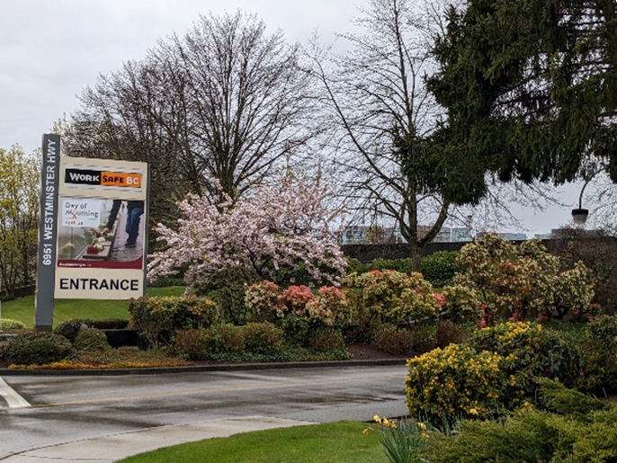

Title: Can government agencies be innovative? 
Date: 2022-05-24 13:13
Category: Posts
Tags: journal, learning
Slug: can-government-agencies-be-innovative
Author: Willy-Peter Schaub
Summary: How WorkSafeBC changed my perception.

It was a sunny day in July 2018, when I found myself standing on Westminster Highway, gazing at the WorkSafeBC entrance sign. 

Performing the 4x4x4x4 breathing technique, I was calming myself down to be focused.  After years of working as a consultant at government agencies, including in Bahrain and Kuwait, I was at two minds whether to show up for the interview at the provincial agency. To me, government contracts smell of rigid management, mind-numbing processes, regulations, lackluster and non-innovative engineering – right?

I started my career as an electrical engineer and fell in love with programming when I was introduced to debugging assembler code at the hardware level and spent my weekends tinkering with my [ZX Spectrum](https://en.wikipedia.org/wiki/Zilog_Z80) at home in the early 80s. My career was a mind-blowing adventure of more processes and products that I can remember, such as Assembler, Basic  , Cobol, C++, C#, Fortran, and PL/M programming, analysis, design, research, and management, with a strong focus on being an individual contributor – an engineer at heart.

> "Engineering is the closest thing to magic that exists in the world." ~ Elon Musk

In early 2018, after a phenomenal 9-year stint at Microsoft, I was burnt-out. My passion for technology, energy, and health were at an all-time low. I opted for a personal sabbatical and switched off all electronic devices for 6 months, focusing on my family, the stunning beauty of British Columbia, and a pile of unread books.

By July, I started to get restless as my passion for bits and bytes began to reboot my systems and   working on my work:life balance. At the same time, I got a call from a local vendor, looking for an experienced Scrum Master for WorkSafeBC. I walked past the entrance sign, up the parking lot hill, walked past the concrete complex, and signed in at the main reception.

 

The interview was not what I expected. Instead of formality, I enjoyed a behavioural and informal interview. I met Agent of Change #9 from [Navigating DevOps through Waterfalls](https://www.tactec.ca/ndtw-resources/) for the first time, as well as a manager that not only contradicted my perception of government organizations but pivoted from the Scrum Master role to Cloud Systems Engineering – very Agile! On my way back to the main reception I was mesmerized by a poster with WorkSafeBC’s noble vision: “_British Columbians free from workplace injury, disease, and death._”

Less than a month later, I joined the Cloud Operations team and found myself in an environment buzzing with an Agile and emerging DevOps mindset, and one that had an open ear for many of the improvement ideas I shared with engineering and management.  I became an advocate for simplicity, chiseling at complex, expensive and manual processes, expecting to be shown the main entrance door sooner than later. 

>“Simplicity is a great virtue, but it requires hard work to achieve it and education to appreciate it. And to make matters worse: complexity sells better.” – Elon Musk

Fast forward 1.5 years and I joined the organization full-time. Other than benefits and payroll, nothing changed  . I was empowered to start the common engineering idea on the side of my desk, continuously experimenting, innovating, and collaborating across the organization   through informal working groups and communities of practice. 

Agile and DevOps transformations, Scaled Agile Framework (SPC), SAFe DevOps, Azure and Azure DevOps services, Visual Studio, PowerShell, continuous integration and delivery automation, shift-left, shift-right, guardrail stewardship, collaborate on manifestos, working groups, dojos, communities of practice, centers of enablement, config-as-code, pipeline-as-code, automating everything automatable, reducing waste, optimizing meetings, writing blogs, articles, and even co-authoring a book was a sprinkle of the amazing exposure to people, process, and products I enjoyed during this period.  

I also had the privilege of completing the emerging leadership program. What I learned about myself during the program was both thrilling and chilling. I was flabbergasted by how others viewed me. I received lots of positive feedback, but it was the candid feedback that revealed unsettling challenges that had played a major role in my 2018 burnout - my obsession to be a perfectionist, my inability to achieve a work/life balance, and my acute allergy for command&control micro-managers. During the program, and especially in my final assignment, I highlighted the need for more collaboration, trust, the willingness to fail, and to create a fun working environment.

> "Failure is an option here. If things are not failing, you are not innovating enough." - Elon Musk

Fast-forward another 1.5 years, I find myself working with colleagues who are embracing Agile, continuously working on its DevOps mindset, moving from a project to a product approach, inspiring continuous learning, continuous improvement, continuous experimentation, and encouraging everyone to embrace failure as an opportunity to reflect and learn. Vibrant collaboration, forward-thinking, and innovation have become the norm. It is gratifying to see leadership   not only actioning industry trends and driving the bottom line, but actively listening to its people. 

Today, I am leading the now official Enterprise Development and Operations (EDO) Common Engineering team, filled with passionate, exceptionally smart, and down-to-earth engineers, collaborating with management that walks-the-talk, trusts, and supports our drive for simplicity, consistency, security, empowerment, and unrestricted collaboration to continue to build connections. Around me, I have observed     a growth in servant leaders, who appreciate the value of people and the importance of collaboration and empowering everyone to become a leader. 

> “Bosses demand respect, delegate and hold people accountable. Leaders collaborate and hold themselves accountable.” – Willy-Peter Schaub

We are an empowered team, focused and serious when we must be, brainwashed by SpaceX and Elon’s infamous quotes (my doing), always reminding each other of our quest for a healthy work:life balance and the importance of having fun.  You can peruse Why are we a (the) place to work for? to get an insight into our team.

I recently stood at the same spot, looking at the entrance sign. It dawned on me that a mere 3.5 years has passed. The phenomenal change is not only exciting but obliterates any doubts and concerns I had when I was calming myself down for my interview. I see how our innovation and technology work not only supports our overall  organizational vision but will take us places we may not have dreamt of.

> “As a leader I want to serve and protect my team, and encourage and empower everyone’s creativity, passion, purpose, and strengths. I want to leave an empowered team and not be missed.” – Willy-Peter Schaub

