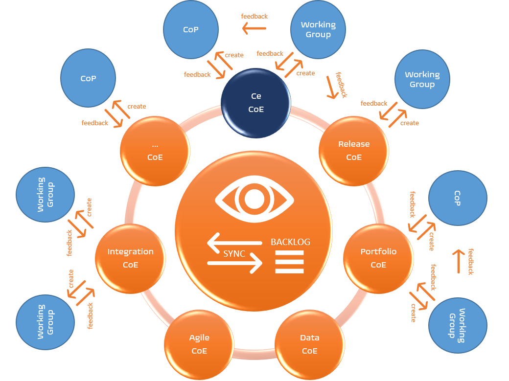
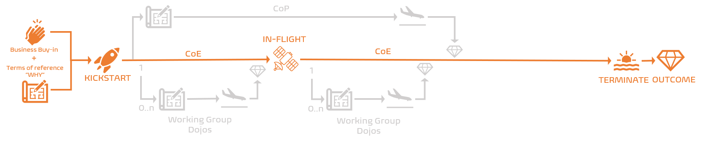

Title: What is our Center of Enablement (CoE) and WHY do we need it?
Date: 2021-11-08 13:13
Category: Posts
Tags: ceremony, devops, posters
Slug: ceremony-center-of-enablement
Author: Willy-Peter Schaub
Summary: It all starts with people from different disciplines to create a focused competency center and obliterating silos through vibrant collaboration!

Our Center of Enablement (CoE), typically known as center of excellence, assembles people from different disciplines to collaborate and enable our organization to shift across multiple disciplines to create a place where the highest standards are maintained. Every CoE is a coalition for change, made of these pillars: 

- Provide thought leadership, vision, and direction.
- Provide good practice and guardrails (aka governance).
- Establish collaboration with key stakeholders and other CoEs to abolish silos.
- Trigger working groups, dojos, and community of practices to implement research, education, and outcomes. 

 

---

# WHY do we need our CoE?

Looking through the lens of our common engineering ecosystem, we use our CoE to bring together committed and appropriate subject matter experts from different areas within the organization. Architecture, DevSecOps, Operations, Site Reliability Engineering, Innovations, and other stakeholders explore better ways to enable engineering to continuously deliver quality and value, through continuous process and products innovation.

Every CoE is laser focused on a strategic vision, actionable goals, and made up of apt, committed, and engaged members. It solves many of the common collaboration challenges we all experience:

- Too many meetings.
- Large meetings that are unsuitable for strategic thinking or to make a decision.
- Disengaged participants - **WASTE**.
- Lack of clarity of "**WHY** are we here?".

As you scale your ecosystem into a ring of interconnected CoEs, you will need to coordinate them through a CoE sync which:

- Shares the current status and roadmap for each CoE.
- Collaborates on current challenges for each CoE and the organization.
- Identify and track dependencies between CoEs.

 

---

# Lifetime

As shown below, the Center of Enablement (CoE) has a long-term lifetime, which starts with a terms of reference that outlines the "WHY" we need the CoE. Once we have business buy-in, we LAUNCH the CoE and switch to IN-FLIGHT mode until the value or energy of the CoE starts diminishing. We then TERMINATE the CoE and share the outcomes, the value, transparently.

The CoE has a long lifespan, that is terminated by a technology or approach of philosophy becoming obsolete. For example, if we had On Prem Engineering CoE, once we move fully to the cloud, it will be terminated. During the decline phase, the membership, governance, and vision will become stale. This is where it is important for the CoE members to track and identify trends and start the process of termination.

That said, think of the CoE lifetime as the [Huygens](https://en.wikipedia.org/wiki/Huygens_(spacecraft)) space probe's lifetime, which could be describes as a potentially infinite journey without any known destination.

 

Emphasize the long-term lifetime, the strategic laser focus, and the "**WHY we are**" here when creating a new CoE. Invest time to prepare your terms of reference for your CoE to ensure that you can launch with clear objectives and committed members. Walk up to a whiteboard or use a digital board to collaborate around **Current State**, **Future State**, **Current Problems**, **What can stop us**, **What we need to do**, **How do we know we are successful** to define your terms of reference.

 

No **flight plan** (terms of reference) and/or no **take-off approval** (business buy-in), no CoE launch!

---

# What is our secret sauce?

Here is a recipe for our Center of Enablement ceremonies:

## Executive buy-in!

Every CoE requires executive support to be empowered with a clear strategy, an innovation budget, and support where needed. It can take considerable effort to get the buy-in for innovation from skeptical engineering teams who _"have been doing it the same way for years."_ With executive buy-in these hurdles can usually be avoided or remediated.

## Cross-discipline collaboration!

CoEs rely on cross-discipline collaboration to erode debilitating silos and bring together the right mix of passion and expertise. For example, our common engineering ecosystem relies on architecture, business, development, operations, and other disciplines who respect each other and engage to create more efficient and effective guardrails, processes, and products.

## Consistency

CoEs must monitor and incentivize their members to adhere to the CoP guardrails and use the shared blueprints, working agreements, backlogs, processes, and products consistently. Consistency will enable cross-discipline and cross-CoE collaboration to flourish. 

## Transparency 

Transparency of strategies, visions, goals, and outcomes are pivotal to avoid duplication of effort, creation of **WASTE**, and fuel the overall energy. The CoE-Sync and the **Townhall** event are two of the key incentives that enable monitoring, sync, and transparency.

## Consistent guardrails!

CoEs require guardrails and a blueprint to standup and energize new CoPs. Here are some of our guidelines, sorted alphabetically:

- 2-pizza sized team (3-9 members).
- Groomed and prioritized backlog.
- Innovation charge code for members to commit their time.
- Long-term lifetime.
- Membership is by invitation only.
- CoE triggers Community of Practice, Working Group, and Dojo ceremonies linked to CoE.
- CoE owns Community of Practice, Working Group, and Dojo ceremony lists and planning.
- Recognition of attendance.
- **Terms of Reference** defining **WHY** we are here and **WHAT** are our objectives and hypothesis that defines the CoE's existence and purpose, for example standardization, guidance, governance, and removing blockers.
- Weekly to bi-weekly cadence.

Also have a look at our CoE working agreement poster for a crisp summary of these and other guidelines.

---

# What are our CoE deliverables?

The Center of Enablement acts as a hub for all the information, learnings, and outcomes for all the collaboration, community of practice, working group, and Dojo events it triggers. 

- Regular updates on the CoE terms of reference, for example at the Townhall.
- Regular updates on the triggered events, for example at the Townhall.
- Recordings of all collaboration sessions.
- Ongoing Net Performance Score (NPS) from members and stakeholders.

---

# Reference Information

## Quick Reference Posters

Download a copy of our ceremonies overview and CoE working agreement poster here:

> 
>
> DOWNLOAD >> [Ceremony Overview Poster PDF](/documents/working-agreement-ceremonies-overview.pdf)
>
> DOWNLOAD >> [Working Agreement - Center of Enablement PDF](/documents/working-agreement-ceremony-center-of-enablement.pdf)

## Other ceremonies

Here are references to more information on ceremonies mentioned above:

- [Community of Practice](/ceremony-community-of-practice.html)
- [Dojo](../images/coming-soon.png)
- [Townhall](../images/coming-soon.png)
- [Working Group](/ceremony-working-group.html)

Looking forward to your "vibrant" collaboration and feedback!

