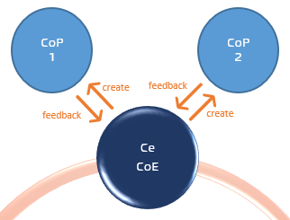
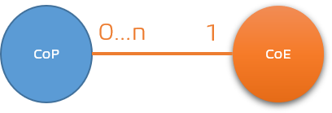
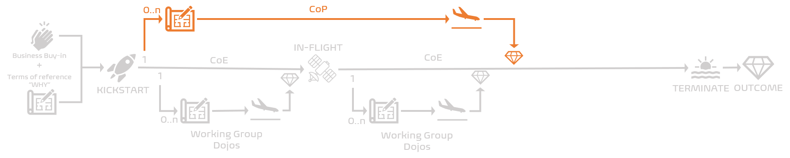
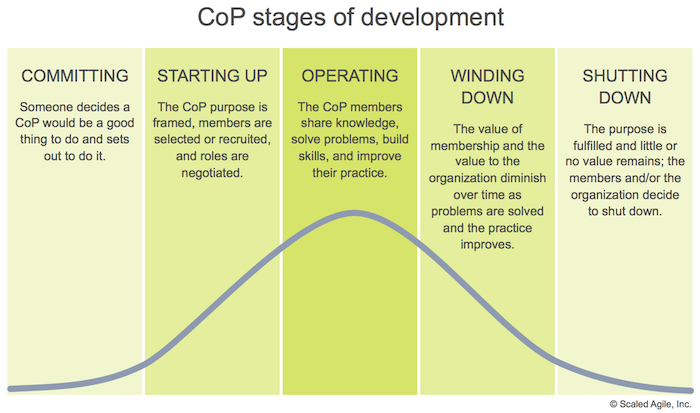

Title: What is our Community of Practice (CoP) and why do we need it?
Date: 2020-11-10 13:13
Category: Posts
Tags: ceremony, devops, posters
Slug: ceremony-community-of-practice
Author: Willy-Peter Schaub
Summary: "People with great PASSION can make the impossible happen" - Elon Musk.

Community of Practice (CoP) is an event by people that share a concern or passion for something they do and learn how to group of people with common disciplines do it better as they interact regularly. As implied by the name, a CoP is a **community**, driven by **passion**, and therefore voluntary.

Read [Community of Practice](https://www.scaledagileframework.com/communities-of-practice/) for details on how to organize, operate, and encourage your community. Within the context of this blog post we are referring to CoPs that are triggered by and serve our [Centers of Enablement (CoE)](/images/coming-soon.png).

---

# WHY do we need our Community of Practice (CoP)?

Looking through the lens of our common engineering ecosystem, we use our CoPs to bring together committed and passionate people from different areas within the organization who are inspired by quotes such as these:

- _“Every person is defined by the communities she belongs to.”_ – Orson Scott Card.
- _"Constantly think about how you could be doing things better. Keep questioning yourself."_ - Elon Musk
- _"Really, the only thing that makes sense is to strive for greater collective enlightenment."_ - Elon Musk
- _“People should pursue what they’re passionate about. That will make them happier than pretty much anything else.”_ - Elon Musk
- _“Diversity: the art of thinking independently together.”_ – Malcolm Forbes.

Our core objective is to promote collaboration and share tribal knowledge, experience, and passion for processes, products, and other interesting themes that our Centers of Enablement (CoE) are focused on.

Every CoE typically triggers one CoP, but can trigger more as needed throughout its lifetime.

---

# Lifetime

As shown below, the Center of Enablement (CoE) typically spawns one Community of Practice (CoP), which has a long-term lifetime. Similar to the CoE the CoP starts with a terms of reference that outlines the "WHY" we need the CoP, with an inherited buy-in from the CoE. We KICKSTART the CoP and switch to IN-FLIGHT mode until the value or energy of the CoP starts diminishing. We then TERMINATE the CoP and share the final outcomes, the value, with the CoE. 

 

>
>  Something to peruse:  [Community of Practice Maturity Model](https://workingknowledge-csp.com/wp-content/uploads/CoP_Maturity_Model_v1.pdf) by Bill Kaplan from Working Knowledge.
>

No **flight plan** (terms of reference), no CoE launch!

---

# What is our secret sauce?

Here is a recipe for our Community of Practice ceremonies:

## Executive buy-in!

Every Working Group inherits the executive support to be empowered with a clear strategy and support where needed from its parent Center of Enablement (CoE).

## Cross-discipline collaboration!

A Community of Practice relies on vibrant collaboration and respect, similar to the [Dojo](/images/coming-soon.png), in particular:

- Respect those more experienced. 
- Do not force your ideas on others.

## Consistency

Communities of Practice must monitor and motivate their members to adhere to the CoP guardrails, and use shared blueprints, working agreements, backlogs, processes, and products consistently. Consistency is pivotal to share and implement the CoP outcomes through its parent CoE and associated Working Groups.

## Transparency 

Transparency of hypothesis, visions, goals, and outcomes are pivotal to avoid duplication of effort, creation of **WASTE**, and fuel the overall energy. The CoE-Sync and the **Townhall** event are two of the key ceremonies that enable the sharing of CoP deliverables and outcomes.

## Consistent guardrails!

CoPs require guardrails and a blueprint to standup and energize. Here are some of our guidelines, sorted alphabetically:

- Larger than the pizza sized team (3-9 members) - the more the merrier.
- Groomed and prioritized subset of the CoE backlog.
- Membership is voluntary.
- Long-term lifetime.
- Terminate if there is no remaining energy in or value for the community.
- **Terms of Reference** defining **WHY** we are here and **WHAT** are our objectives and hypothesis that defines the Working Group's existence and purpose.
- Triggered by CoE.
- Recognition of attendance.
- Bi-weekly or monthly cadence.

>
>  Something to peruse for terms of reference ideas: [Community of Practice: Terms of Reference](https://view.officeapps.live.com/op/view.aspx?src=http%3A%2F%2Ftheagiledirector.com%2Fimages%2FCoPToR-examplebyEvanLeybourn.docx) by Evan Leybourn
>

Also have a look at our Community of Practice working agreement poster for a crisp summary of these and other guidelines. 

## All good things come to an end

Every CoP will go through the Forming-Storming-Norming-Performing stages, similar to [Tuckman's Stages of Group Development](https://en.wikipedia.org/wiki/Tuckman%27s_stages_of_group_development), whereby it is important to continuously measure the passion, energy, and value (to members and stakeholders) of your event and members. 
If any of these metrics start dipping it is time to ask whether is is time to terminate your CoP!

The Scaled Agile Framework has a great visualization of the CoP five-stage life cycle, from **committing** to **shutting down**.

>
> Image from [Community of Practice](https://www.scaledagileframework.com/communities-of-practice/)
>
> Figure 4. CoPs typically follow a five-stage life cycle, from conceptualization to closure
>
> © Scaled Agile, Inc.
>

---

# What are our Community of Practice deliverables?

CoPs are responsible to report back to its parent CoE with:  

- Regular update on terms of reference.
- Regular updates on associated events.
- Collaboration recordings.
- Ongoing Net Performance Score (NPS) from members and stakeholders.

---

# Reference Information

## Quick Reference Posters

Download a copy of our ceremonies overview and Community of Practice (CoP) working agreement poster here:

> 
>
> DOWNLOAD >> [Ceremony Overview Poster PDF](/documents/working-agreement-ceremonies-overview.pdf)
>
> DOWNLOAD >> [Working Agreement - Community of Practice PDF](/documents/working-agreement-ceremony-community-of-practice.pdf)

## Other ceremonies

Here are references to more information on ceremonies mentioned above:

- [Center of Enablement](../images/coming-soon.png)
- [Dojo](../images/coming-soon.png)
- [Townhall](../images/coming-soon.png)
- [Working Group](../images/coming-soon.png)

Looking forward to your "vibrant" collaboration and feedback!

