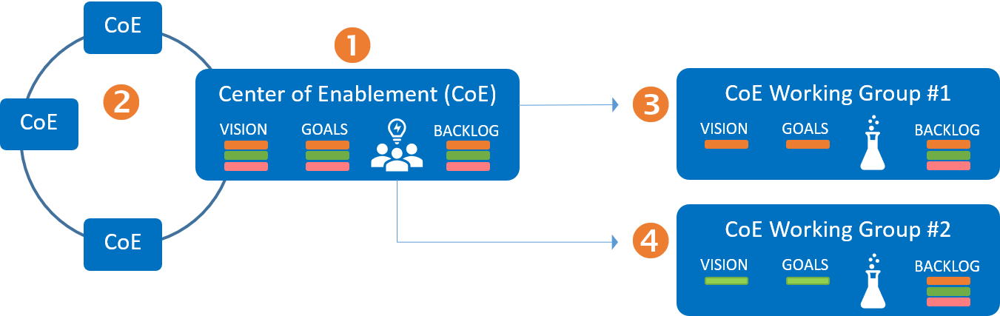

Title: Why can I not just create a working group?
Date: 2021-12-17 13:13
Category: Posts
Tags: ceremony, devops
Slug: ceremony-focus-single-source
Author: Willy-Peter Schaub
Summary: It all depends on the context - [CoE] Working Group

When we launched our [Center of Enablement](/ceremony-center-of-enablement.html) (CoE), [Dojo](/dojo-events.html), [Townhall](/townhall.html), [Working Group](../ceremony-working-group.html), and [Community of Practice](/ceremony-community-of-practice.html) (CoP) ceremonies, we triggered vibrant collaboration (which is good) and created confusion (which is bad) with working groups. In the [An overview of our key collaboration ceremonies](/ceremony-overview.html) we described the difference between the ceremonies, the importance of the terms of reference (why are we here), and the process of creating one or more of the ceremonies.

---

# What is the difference between a working group and a CoE Working group?

A **working group** is a group of people working together to collaborate and achieve specified goals. The lifespan of a working group can last anywhere between minutes to years, although we strongly recommend **the shorter the better** mindset. 

> 
> If you are referring to this generic type of working group, you can spin one up whenever you need to.
>

A **CoE working group** is sponsored by one or more Centers of Enablement, its terms of reference (vision, goals, hypothesis) a subset of and supporting the CoE terms of reference. In other words, there is a strong dependency between a sponsoring and other collaborating CoEs.

>
> If you are referring to the CoE working group, you need a CoE to spin up a short-lived CoE Working Group.
>

 

Think of the CoE as the Ferrari racing team (long-lived) and the CoE Working Group  as the team that performs one of the pit stops (short-lived). The CoE cannot succeed without the CoE Working Group and relies heavily on their feedback to improve.

---

# Let us look at the CoE flow of value

 

**(1)** - A Centre of Enablement (CoE) is created to assemble people from different disciplines to collaborate and enable our organization to shift across multiple disciplines to create a place where the highest standards are maintained. Every CoE is a coalition for change, made of these pillars: 

- Provide thought leadership, vision, and direction.
- Provide good practice and guardrails (aka governance).
- Establish collaboration with key stakeholders and other CoEs to abolish silos.
- Trigger working groups, dojos, and community of practices to implement research, education, and outcomes. 

**(2)** - All CoE synchronize on a regular basis to exchange learnings, failures, and ensure that as a whole, the CoEs bubble up to a common vision for the organization.

 

**(3)** and **(4)** - The CoE triggers one or more CoE working groups, each focused on a subset of the CoE goals, their backlogs linked to he CoE backlog, and their vision supporting the CoE's vision. Every CoE working group is:

- **Short-lived!** - The working group's lifetime is limited to the CoE's lifetime and a maximum of 2 program increments (10 weeks). See FAQ for more details.
- **Laser focused!** - Focus on experiments, (dis)prove hypothesis, make recommendations, and minimal viable products.
- **A slice!** - Take baby steps, focus on a vertical slice, and do **not** try to solve the world's problems.

 

**(5)** and **(6)** - Information flows from the CoE Working Group back to the CoE, where it is vetted and consolidated into the CoE knowledgebase.

**(7)** - Each CoE will synchronize and exchange the learnings from the working groups during the Co

---

# FAQ

## What happens when a CoE is terminated?

When we terminate a CoE, all associated CoE Working Groups, CoE Dojos, and CoE Community of Practices are terminated as well. All learnings, failures, etc. are maintained for future reference.

## What happens when a CoE Working Group's lifetime expires?

We terminate the working group, perform a retrospective, and **optionally** spin up a new working group to complete the work, if and only if it still deemed valuable. THe intentionally limit the lifetime of working groups to keep them focused and energized.

## What happens at a +1 Townhall?

We present the overall health of our collaboration, experimentation, and innovation ecosystem, as well as an update and optional demos by each active CoE.

Any other questions?

