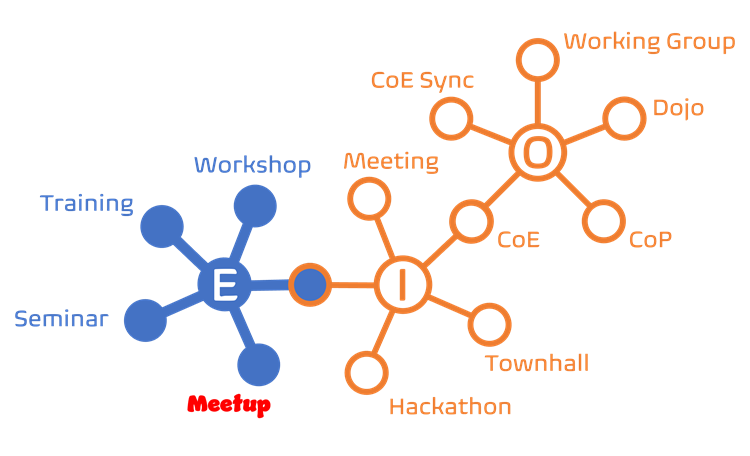
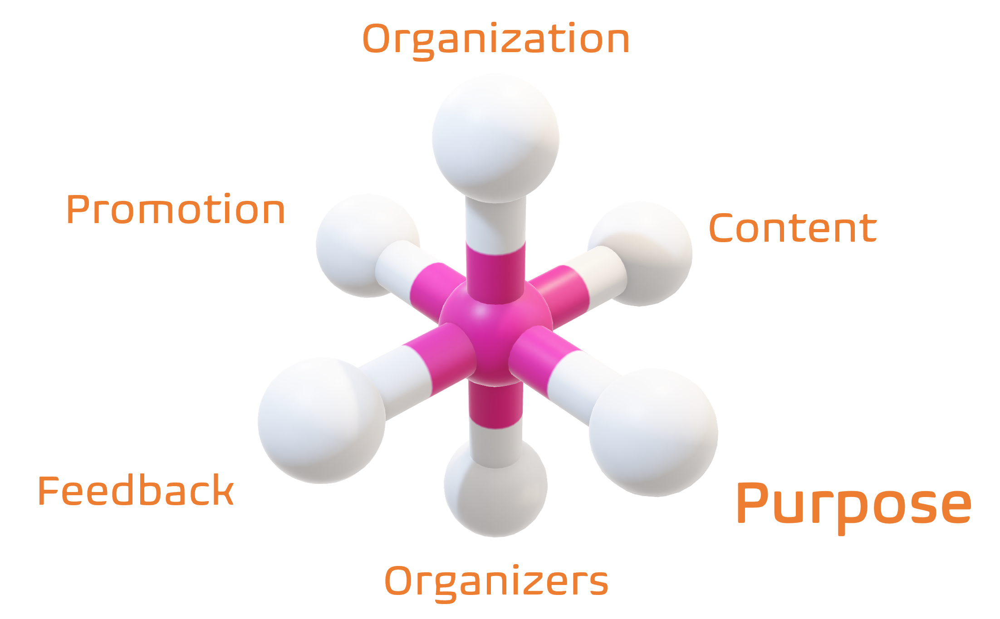

Title: Unleashing the Power of Teamwork: Key Takeaways from Collaboration Ceremonies and Events
Date: 2024-07-10
Category: Posts
Tags: ceremony, devops, posters
Slug: ceremony-learnings
Author: Willy-Peter Schaub
Summary: Fostering a culture of continuous improvement and innovation through events

We are committed to managing several internal initiatives, including hackathons, town halls, and Centers of Enablement (CoE) that further inspire the formation of Communities of Practice (CoP), dojos, and working committees. Additionally, we orchestrate and enjoy external engagements like workshops, training sessions, seminars, and networking events, such as our [DevOps Vancouver Meetup](https://www.meetup.com/DevOps-Vancouver-BC-Canada/). 

> 

You can review [Ceremony Overview](/ceremony-overview.html) for more insight into the internal ceremonies - in this post I will focus on the takeaways from hosting public **meetups**.

>
> **A meetup is a casual event** where individuals with shared interests like DevOps come together to mingle, exchange ideas, connect, or participate in related activities. The term "meetup" gained prominence with [Meetup.com](https://www.meetup.com/home), a site that facilitates the organization and discovery of such events. 
>

# But first, why are these events pivotal?

Events such as technical meetups and communities of practice (CoP) are essential for:

- **Best Practices and Standards** - They aid in setting and spreading industry benchmarks. Our centers of enablement (CoE), for example, Provide guardrails (aka governance).

>
> **What is a guardrail?** 
> A guardrail is likened to the safety barriers on a bridge, serving as a metaphor to guide our engineers in safely and efficiently using our software development lifecycle (SDLC). It represents our commitment to setting standards and governance in a way that empowers rather than dictates. Our team promotes engineering practices and while engineers can disregard these 'guardrails,' doing so often leads to a higher chance of issues, with less support available.
>

- **Community Building** - They cultivate a sense of community and improve job satisfaction.
- **Feedback and Improvement** - Offers a chance for critique and improvement of work.
- **Innovation** - Exposure to diverse thoughts encourages innovative thinking.
- **Inspiration and Motivation** - Witnessing peers' achievements can stimulate personal drive.
- **Knowledge Sharing** - They promote ideas, experiences, and industry trends exchange.
- **Networking Opportunities** - They help build connections with colleagues and leaders.
- **Problem Solving** - They offer venues for tackling challenges collaboratively.
- **Skill Development** - Dojos, workshops and presentations facilitate learning and skill enhancement.
- **Visibility and Recognition** - Participation raises profile and might create leadership chances.

Our events contribute to continuous professional development, continuous learning, and collective progress.

# What is the catch?

Although there are several challenges, typically the advantages of collaboration events surpass issues, such as:
  
> 

- **Cost** - Event planning can incur high expenses, including venue rental, catering, advertising, and speaker honorariums.
- **Logistics** - Arranging the event specifics, such as location, date, time, can be intricate and time-consuming.
- **Low Attendance** - A successful event often depends on a high turnout for effective networking, promotion, and value for hosts and speakers.
- **Risk Management** - It is critical to plan for unexpected issues like cancellations, poor attendance, or emergencies.
- **The Inevitable One** - Handling that one attendee who comes just for the free food or to create continuous interruptions is a known challenge.

# Back to the core topic - our learnings!

TBD

> 

TBD

